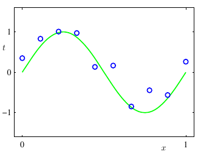
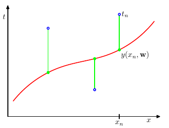
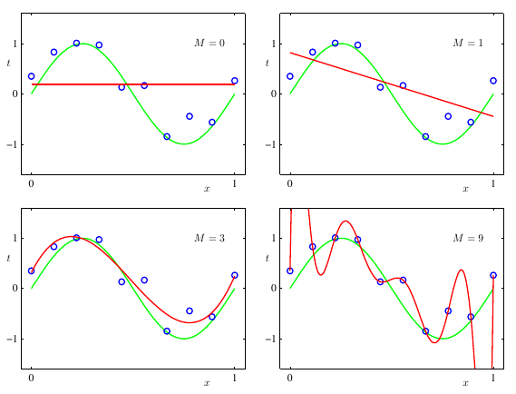
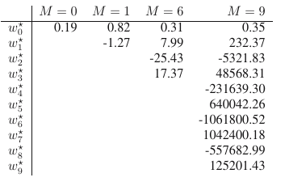
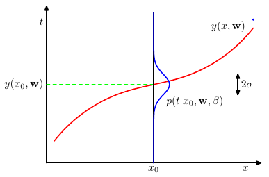
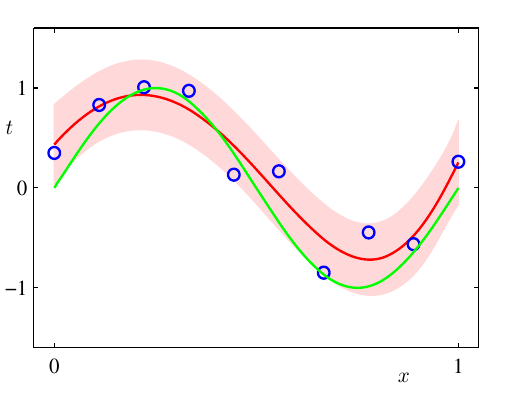
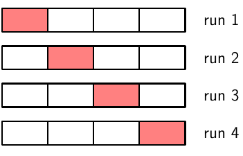
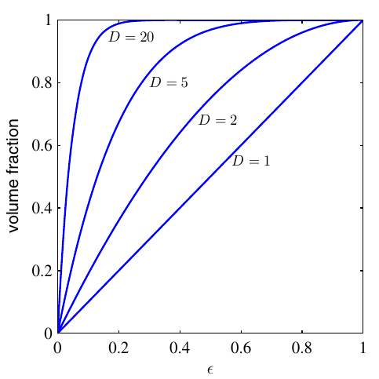
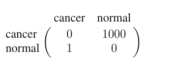
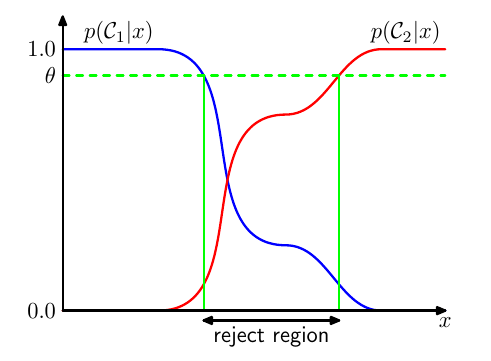

<!-- #! https://zhuanlan.zhihu.com/p/366397578 -->
<!--
 * @Author: ZhangLei mathcoder.zl@gmail.com
 * @Date: 2021-04-19 22:41:22
 * @LastEditors: ZhangLei mathcoder.zl@gmail.com
 * @LastEditTime: 2021-05-20 21:26:47
-->

# PRML学习笔记——第一章

- [PRML学习笔记——第一章](#prml学习笔记第一章)
  - [Introduction](#introduction)
    - [1.1多项式曲线拟合（例子）](#11多项式曲线拟合例子)
      - [Error function](#error-function)
      - [Model selection](#model-selection)
      - [Regularization](#regularization)
    - [1.2概率论（Probability Theory）](#12概率论probability-theory)
      - [1.2.1 Probability densities](#121-probability-densities)
      - [1.2.2 Expectations and covariances](#122-expectations-and-covariances)
      - [1.2.3 Bayesian probability](#123-bayesian-probability)
      - [1.2.4 The Gaussian distribution](#124-the-gaussian-distribution)
      - [1.2.5 Curve fitting re-visited](#125-curve-fitting-re-visited)
      - [1.2.6 Bayes curve fitting](#126-bayes-curve-fitting)
    - [1.3 Model selection](#13-model-selection)
    - [1.4 The curse of Dimensionality](#14-the-curse-of-dimensionality)
    - [1.5 Decision Theory](#15-decision-theory)
      - [1.5.1 Minimizing the misclassification rate](#151-minimizing-the-misclassification-rate)
      - [1.5.2 minimizing the expected loss](#152-minimizing-the-expected-loss)
      - [1.5.3 The reject option](#153-the-reject-option)
      - [1.5.4 Inference and decision](#154-inference-and-decision)
      - [1.5.5 Loss function for regression](#155-loss-function-for-regression)
    - [1.6 Information Theory](#16-information-theory)
      - [1.6.1 Relative entropy and mutual information](#161-relative-entropy-and-mutual-information)

## Introduction

- *training set*（训练集）：具有$N$个元素的集合$\left\{\mathbf{x}_{1}, \ldots, \mathbf{x}_{N}\right\}$，用于调整模型的参数
- *target vector*（目标向量）：用来表示对应的标签 $\mathbf t$
- *training/learning*（训练/学习）：机器学习的算法得到的结果可表示为一个函数$\mathbf y(\mathbf x)$，输入$\mathbf x$ 输出$\mathbf y$，函数$\mathbf y(\mathbf x)$是在训练阶段或者说学习阶段被确定的
- *test set*（测试集）：训练完后的模型用来应用到新的数据集
- *generalization*（泛化性）：能正确识别在训练中未见过样本的能力
- *preprocess*（预处理）：将原始的输入变量变换到某些新的变量空间中。有时候预处理阶段也被称为特征提取（$feature \ extraction$）
- *supervised learning*（监督学习）：应用在有成对的input vectors和target vectors的训练集
- *unsupervised learning*（无监督学习）：training data的input vectors$\mathbf x$并不带有对应target values
- *classification*（分类）：目标是将每个input vector标记上一个有限离散的标签
- *regression*（回归）：输出由一个或多个连续变量组成
- *clustering*（聚类）：在data上去发现一些similar样例的groups
- *density estimation*（密度估计）：在输出空间中去确定data的distribution
- *reinforcement learning*（强化学习）：在给定的情况下，找合适的actions，去maximize reward
- *exploration*（探索）：在一个systerm中尝试新的actions去看看收获
- *exploitaion*（开发）：在一个systerm中利用已知的actions去得到高的reward

### 1.1多项式曲线拟合（例子）

现在假设有包含$x$的$N$个观测点的*training set*，记$\mathbf{x} \equiv\left(x_{1}, \ldots, x_{N}\right)^{\mathrm{T}}$，和对应的*target* $\mathbf{t} \equiv\left(t_1,\ldots,t_N\right)^{\mathrm{T}}$.

<!--  -->

*如图所示，蓝色圆圈代表了10个数据点，是由绿色曲线$sin(2\pi x)$生成的，我们现在的目标就是要在不知道绿色曲线的情况下由一些新的$x$值能预测对应的$t$值。*

现在，我们先使用曲线拟合的方式。
$$
y(x, \mathbf{w}) = w_0+w_1x+w_2x^2+\ldots+w_Mx^M=\sum_{j=0}^Mw_jx^j
$$
其中$M$是多项式的*order*（阶）,需要注意的是尽管$y(x,\mathbf{w})$是关于$x$的非线性函数，但是它是关于$\mathbf w$的线性函数。我们称这样一个关于未知参数是线性的函数为*linear models*（线性模型）。

#### Error function

这些未知系数的值是在training data上fitting多项式函数过程中确定的。具体来说，是通过minimizing一个*error function*（用来measure函数值$y(x,\mathbf{w})$和traning data的$\mathbf t$）得到。

一个简单、广泛使用的error funtion就是SSE（the Sum of the Squares of the Errors），最小化目标为
$$
E(\mathbf{w}) = \frac{1}{2}\sum_{n=1}^N\left\{y(x_n,\mathbf{w})-t_n\right\}^2
$$
`note:`$1/2$仅仅为了稍稍简化求导结果。该Value是一个nonnegative quantity，当且仅当拟合的function穿过每一个training data point时才等于0。

*error function的几何直观即图中绿色垂直的bars的平方和*

由于$E(\mathbf w)$是关于$\mathbf w$的一个二次函数，故可以直接解出closed form的$w^*$。

#### Model selection

剩下还有个问题是怎么选多项式函数的阶(order)，一个*model comparison or model selection*问题。

*通过画出不同order的拟合函数，我们可以看到：在$M=1$ or $M=2$的时候函数拟合在training data point效果很差;在$M=3$时拟合程度较好;随着$M$继续增大，拟合的程度更好，在$M=9$时能够通过每一个training data point，但是这个拟合多项式波动很大且对$sin(2\pi x)$的representation非常poor，这个behaviour就是过拟合（over fitting）*

尽管$sin(2\pi x)$的展开就包括所有的orders，$M=9$应至少会和$M=3$的结果一样好，但是通过将$\mathbf w^*$的系数计算出来看的话会发现当$M=9$的时候，$\mathbf w^*$的结果会变得lage positive和lage negative（是为了要让多项式能正好穿过每个training data points导致的）。直觉上就是更大的$M$使得函数开始调整$\mathbf w^*$来逐渐**迎合**那些target values上的radnom noise。

#### Regularization

一个有趣的实验是当确定一个模型的复杂程度后，over-fitting问题会随着data增加而缓解。一个粗略的启发：data point量不能小于模型可调参数量的若干倍（5或10）。

`note:`但通过model能用的training set大小来决定model的参数量显然是不合适的，更合理的应是依据要求解的problem的complexity来决定model的complexity。

后续会谈到最小二乘法（the least squares approach）去找模型的参数其实就是极大似然（*maximum likelihood*）的一个特例，并且over-fitting能被理解为maximum likelihood的general property。通过引入贝叶斯（Bayesion）的方法，over-fitting就能被避免。在一个Bayesian model中参数的数量是由data set大小自适应的。

但现在我们引入一个正则（Regularization）来控制over-fitting现象。具体的，增加一项关于模型参数的L2 penalty:

$$
\widetilde{E}(\mathbf{w})=\frac{1}{2} \sum_{n=1}^{N}\left\{y\left(x_{n}, \mathbf{w}\right)-t_{n}\right\}^{2}+\frac{\lambda}{2}\|\mathbf{w}\|^{2}
$$

其中$
\|\mathbf{w}\|^{2} \equiv \mathbf{w}^{\mathrm{T}} \mathbf{w}=w_{0}^{2}+w_{1}^{2}+\ldots+w_{M}^{2}
$，$\lambda$是控制SSE和regularization term之间的相对重要性的。

`note：`$w_0$应该在正则项中被省略（包含的话会使得结果会受目标变量的原点选择的影响）或单独作为一个正则项。

现在，error function仍然能用closed form得到minimized解。在统计学上这种方法称*shrinkage*（收缩）方法，因为减少了系数值;正则项二次称*ridge regression*（岭回归）;在神经网络中，该方法称为*weight decay*（权重衰减）。

目前的结果需要通过将一部分数据集从训练集中分离来确定超参（$M、\lambda$），这部分数据集称为*validation set*（验证集）或者*hold-out set*（拿出集），看上去有点浪费有价值的training data?所以引出后面的方法。

### 1.2概率论（Probability Theory）

> The Rules of Probability
> > sum rule $p(X) = \sum_Yp(X,Y)$
> >
> > product rule $p(X,Y) = p(Y|X)p(X)$

从the product tule可以得到conditional probabilities:
$$
p(Y|X) = \frac{p(X|Y)p(Y)}{p(X)}
$$
该公式也被称为Bayes's theorem.若再对分母使用sum rule：
$$
p(X) = \sum_Yp(X|Y)p(Y)
$$
那么Bayes's theorem的分母就是在作normalization，确保条件概率之和为1.

*prior probability*：在观测到的事件发生之前的概率

*posterior probability*：在已知某个事件发生后问的概率

*independent*：若两个变量的joint distribution能够factorizes为marginals的乘积，即$p(X,Y)=p(X)p(Y)$，那么$X$和$Y$就是independent。从the product rule也可得到$p(Y|X)=p(Y).$

#### 1.2.1 Probability densities

如果一个real-valued变量$x$落在区间$(x,x+\delta x)$上的概率由$p(x)\delta x$给出（$\delta x\rightarrow 0$），那么$p(x)$就被称为$x$上的*probability density*。$x$落在区间$(a, b)$的概率：
$$
p(x \in(a, b))=\int_{a}^{b} p(x) \mathrm{d} x .
$$

由于概率的非负性和$x$必须落在real axis上，所以the probability density$p(x)$必须满足：
$$
\begin{aligned}
p(x) & \geqslant 0 \\
\int_{-\infty}^{\infty} p(x) \mathrm{d} x &=1
\end{aligned}
$$

当对随机变量作变量替换的时候需要考虑Jacobian factor.如$x=g(y),$那么$p_x(x)$对应到了$p_y(y)$，注意两者是不同的probability density.原来落在$(x, x+\delta x)$的观测（在$\delta x$足够小的情况下）会转换到$(u,y+\delta y)$上，其中$p_{x}(x) \delta x \simeq p_{y}(y) \delta y,$因此
$$
\begin{aligned}
p_{y}(y) &=p_{x}(x)\left|\frac{\mathrm{d} x}{\mathrm{d} y}\right| \\
&=p_{x}(g(y))\left|g^{\prime}(y)\right| .
\end{aligned}
$$

*cumulative distribution function*：$x$落在区间$(-\infty, z)$的概率,即
$$
P(z)=\int_{-\infty}^z p(x)\mathrm{d}x
$$
满足$P^\prime =p(x)$

连续形式的加法和乘法rules:
$$
\begin{aligned}
    p(x) &= \int p(x,y)\mathrm{d}y\\
    p(x,y)&=p(y|x)p(x)
\end{aligned}

$$

#### 1.2.2 Expectations and covariances

*expectation*是对一些function$f(x)$在一个probability distribution $p(x)$下的加权和（weighted sum），用$\mathbb{E}[f]$表示。对于离散的distribution，
$$
\mathbb{E}[f] = \sum_x p(x)f(x)
$$
对于连续的distribution，
$$
\mathbb{E}[f] = \int p(x)f(x)\mathrm{d}x
$$
对于从probability distribution中给定有限数量的$N$个点的情况，Expectation可以用这些有限个点的求和来近似：
$$
\mathbb{E}[f]\simeq \frac{1}{N}\sum_{n=1}^Nf(x_N)
$$
该近似会在极限$N\rightarrow \infty$准确成立。

某些时候我们会考虑对有多个变量的函数求期望，该case下使用下标去指明哪个变量被average over，例如$\mathbb{E}_x[f(x,y)]$表示函数$f(x,y)$关于$x$的分布求期望。注意：$\mathbb{E}_x[f(x,y)]$会是关于$y$的函数。

我们也能对一个conditional distribution求*conditional expectation*：
$$
\mathbb{E}_x[f|y] = \sum_x p(x|y)f(y)
$$
连续形式类似。

函数$f(x)$的variance被定义为：
$$
    \mathrm{var}[f] = \mathbb{E}\left[(f(x)-\mathbb{E}[f(x)])^2\right]
$$
用来衡量$f(x)$在它的均值附近的变化性大小。展开平方项，variance能被写作：
$$
\mathrm{var}[f] = \mathbb{E}[f(x)^2] - \mathbb{E}[f(x)]^2
$$

对于两个随机变量，*covariance*被定义为：
$$
\begin{aligned}
\operatorname{cov}[x, y] &=\mathbb{E}_{x, y}[\{x-\mathbb{E}[x]\}\{y-\mathbb{E}[y]\}] \\
&=\mathbb{E}_{x, y}[x y]-\mathbb{E}[x] \mathbb{E}[y]
\end{aligned}
$$
表示$x$和$y$在多大程度上会一起变化。
如果$x$和$y$是independent，那么它们的covariance就是0。

在随机变量$x$和$y$是两个向量的case下，covariance是一个matrix：
$$
\begin{aligned}
\operatorname{cov}[\mathbf{x}, \mathbf{y}] &=\mathbb{E}_{\mathbf{x}, \mathbf{y}}\left[\{\mathbf{x}-\mathbb{E}[\mathbf{x}]\}\left\{\mathbf{y}^{\mathrm{T}}-\mathbb{E}\left[\mathbf{y}^{\mathrm{T}}\right]\right\}\right] \\
&=\mathbb{E}_{\mathbf{x}, \mathbf{y}}\left[\mathbf{x} \mathbf{y}^{\mathrm{T}}\right]-\mathbb{E}[\mathbf{x}] \mathbb{E}\left[\mathbf{y}^{\mathrm{T}}\right]
\end{aligned}
$$
考虑向量$\mathbf{x}$的各个分量之间的covariance，$\operatorname{cov}[\mathbf{x}]\equiv\operatorname{cov}[\mathbf{x},\mathbf{x}].$

#### 1.2.3 Bayesian probability

前面部分的都是通过随机、可重复事件的frequencies来考察probabilities，这是经典的或者说是频率学派关于概率的观点。现在我们转向更genaral的Bayesian视角，probability提供的是不确定性的一个定量描述。

在观测data之前，我们有一个关于模型参数$\mathbf{w}$的一个先验，表示为$p(\mathbf{w})$，观测数据$\mathcal{D}=\left\{t_{1}, \ldots, t_{N}\right\}$的影响通过条件概率$p(\mathcal{D}|\mathbf{w})$表示。由Bayes's theorem，有
$$
p(\mathbf{w}|\mathcal{D}) = \frac{p(\mathcal{D}|\mathbf{w})p(\mathbf{w})}{p(\mathcal{D})}
$$
如此就可以在观测到$\mathcal{D}$后用后验$p(\mathbf{w}|\mathcal{D})$来evaluate $\mathbf{w}$的不确定性。

`note：`注意这里Bayesian方法是把$\mathbf{w}$看作一个变量，估计出的是一个confidence，而传统的frequentist是将$\mathbf{w}$看作一个fixed的量，用estimator去估计value.

观察等式的右边项中$p(\mathcal{D}|\mathbf{w})$，可以看作关于$\mathbf{w}$的函数，称作*likelihood function*，表达了在不同的$\mathbf{w}$下观测数据$\mathcal{D}$发生的可能性。

`note：`这里的likelihood并不是关于$\mathbf{w}$的probalility distribution，因此对它关于$\mathbf{w}$作积分也不一定就是1.

有了likelihood的定义，我们能够将Bayes' theorem表述如下：
$$
\text { posterior } \propto \text { likelihood } \times \text { prior }
$$

Frequentist和Bayesian都认为likelihood function $p(\mathcal{D}|\mathbf{w})$非常重要。
1. 对于frequentist，常用*maximum likelihood*去找一个$\mathbf{w}$能够使likelihood function $p(\mathcal{D}|\mathbf{w})$最大。在machine learning中，将负对数似然（**NLL**）用作*error function*。
1. Frequentist用*bootstrap*（自助法）确定error bars.假设origin data有$N$个data point $\mathbf{X}=\{\mathbf{x_1},\ldots,\mathbf{x}_N\}$，现从$\mathbf{X}$中有放回的抽取$N$个data points生成一个新的data set $\mathbf{X}_B$ （注意有一部分data point出现多次，有意部分可能未出现）。这样重复$L$次就能够生成$L$个size是$N$的data sets.那么参数估计的准确性就能从预测在这些bootstrap数据上的差异性得到。

#### 1.2.4 The Gaussian distribution

Gaussian distribution 定义:
$$
\mathcal{N}\left(x \mid \mu, \sigma^{2}\right)=\frac{1}{\left(2 \pi \sigma^{2}\right)^{1 / 2}} \exp \left\{-\frac{1}{2 \sigma^{2}}(x-\mu)^{2}\right\}
$$

对于$D-$dimensional向量$\mathbf{x}$，
Gaossian distribution为：
$$
\mathcal{N}(\mathbf{x} \mid \boldsymbol{\mu}, \mathbf{\Sigma})=\frac{1}{(2 \pi)^{D / 2}} \frac{1}{|\mathbf{\Sigma}|^{1 / 2}} \exp \left\{-\frac{1}{2}(\mathbf{x}-\boldsymbol{\mu})^{\mathrm{T}} \mathbf{\Sigma}^{-1}(\mathbf{x}-\boldsymbol{\mu})\right\}
$$
其中$D-$dimensional想量$\mathbf{\mu}$为均值，$D\times D$matrix的$\mathbf{\Sigma}$是covariance，$|\mathbf{\Sigma}|$是对应的行列式。

对于一个观测数据$\mathbf{x}=\left(x_{1}, \ldots, x_{N}\right)^{\mathrm{T}}$，其中的$x$都是scaler，假设这些观测都是independently从Gaussian distribution中抽取出来的，可以描述成i.i.d(*independent and indentically distributed*)，那么
$$
p\left(\mathbf{x} \mid \mu, \sigma^{2}\right)=\prod_{n=1}^{N} \mathcal{N}\left(x_{n} \mid \mu, \sigma^{2}\right) .
$$
就是这个该数据的likelihood function.

为了便于后续的分析我们对这个likelihood进行取logarithm（并不影响其最大的解）。
$$
\ln p\left(\mathbf{x} \mid \mu, \sigma^{2}\right)=-\frac{1}{2 \sigma^{2}} \sum_{n=1}^{N}\left(x_{n}-\mu\right)^{2}-\frac{N}{2} \ln \sigma^{2}-\frac{N}{2} \ln (2 \pi)
$$
关于$\mu$求maximizing，得到的就是$\mu$的likelihood solution：
$$
\mu_{\mathrm{ML}}=\frac{1}{N} \sum_{n=1}^{N} x_{n}
$$
其实也就是*sample mean*，相似地，可以得到$\sigma^2$的likelihood solution：
$$
\sigma_{\mathrm{ML}}^{2}=\frac{1}{N} \sum_{n=1}^{N}\left(x_{n}-\mu_{\mathrm{ML}}\right)^{2}
$$
也就是*sample variance*

`note：`maximum likelihood方法的limitation：估计有*bias*（也就引起了over-fitting）。可以对上面的估计求期望来分析：
$$
\begin{aligned}
\mathbb{E}\left[\mu_{\mathrm{ML}}\right] &=\mu \\
\mathbb{E}\left[\sigma_{\mathrm{ML}}^{2}\right] &=\left(\frac{N-1}{N}\right) \sigma^{2}
\end{aligned}
$$
显然，variance的估计是underestimate了。

#### 1.2.5 Curve fitting re-visited

先作个**假设**：target variable $t$关于model得到的$y$服从Gassian distribution（target中的noise服从$\mathcal{N}\left(0, 1\right)$）。因此，
$$
p(t \mid x, \mathbf{w}, \beta)=\mathcal{N}\left(t \mid y(x, \mathbf{w}), \beta^{-1}\right)
$$
这里面的variance用了$\beta^{-1}$来表示，这个指标代表了估计的precision（为了与后面章节一致）。
从而likelihood function为：
$$
p(\mathbf{t} \mid \mathbf{x}, \mathbf{w}, \beta)=\prod_{n=1}^{N} \mathcal{N}\left(t_{n} \mid y\left(x_{n}, \mathbf{w}\right), \beta^{-1}\right) .
$$

*红色的curve代表了model fit得到的结果，而真实的$t$满足蓝色curve表示的distribution。这里从直观上也能理解$\beta$代表precision，$\beta$越大，$2\sigma$越小，$t$也就离预测结果越接近*

对于上面那个式子，依然是作logarithm：

$$
\ln p(\mathbf{t} \mid \mathbf{x}, \mathbf{w}, \beta)=-\frac{\beta}{2} \sum_{n=1}^{N}\left\{y\left(x_{n}, \mathbf{w}\right)-t_{n}\right\}^{2}+\frac{N}{2} \ln \beta-\frac{N}{2} \ln (2 \pi)
$$

把这个看成关于$\mathbf{w}$的函数，求出的极值其实就是minimizing the *sum-of-squares error function*的结果。也就是说*sum-of-squares error function*的解是基于Gaussian noise distribution假设的MLE结果。

同样的可以解出$\beta_{ML}$:

$$
\frac{1}{\beta_{\mathrm{ML}}}=\frac{1}{N} \sum_{n=1}^{N}\left\{y\left(x_{n}, \mathbf{w}_{\mathrm{ML}}\right)-t_{n}\right\}^{2}
$$

解完这两个之后，我们就能去预测new point，并且因为我们有一个probabilistic model，所以能预测一个***distribution***，rather than a point estimate:

$$
p\left(t \mid x, \mathbf{w}_{\mathrm{ML}}, \beta_{\mathrm{ML}}\right)=\mathcal{N}\left(t \mid y\left(x, \mathbf{w}_{\mathrm{ML}}\right), \beta_{\mathrm{ML}}^{-1}\right) .
$$

---

现在进一步的加入Bayesian方法，引入一个关于多项式的系数$\mathbf{w}$的prior distribution。简单起见，仍然假设Gaussian的先验：
$$
p(\mathbf{w} \mid \alpha)=\mathcal{N}\left(\mathbf{w} \mid \mathbf{0}, \alpha^{-1} \mathbf{I}\right)=\left(\frac{\alpha}{2 \pi}\right)^{(M+1) / 2} \exp \left\{-\frac{\alpha}{2} \mathbf{w}^{\mathrm{T}} \mathbf{w}\right\}
$$
其中的$\alpha$是超参，$M$阶多项式有$M+1$个element of $\mathbf{w}$。使用Bayes' theorem（后验正比于先验和likelihood的乘积）:
$$
p(\mathbf{w} \mid \mathbf{x}, \mathbf{t}, \alpha, \beta) \propto p(\mathbf{t} \mid \mathbf{x}, \mathbf{w}, \beta) p(\mathbf{w} \mid \alpha) .
$$

现在是通过*maximum posterior*（**MAP**）来确定$\mathbf{w}$，negative-logarithm转化后就是minimum
$$
\frac{\beta}{2} \sum_{n=1}^{N}\left\{y\left(x_{n}, \mathbf{w}\right)-t_{n}\right\}^{2}+\frac{\alpha}{2} \mathbf{w}^{\mathrm{T}} \mathbf{w}
$$

其实这个也等价于加了regular的SSE（$\lambda=\alpha / \beta$）.

#### 1.2.6 Bayes curve fitting

前面尽管我们加入了$\mathbf{w}$的prior，但是我们对于$\mathbf{w}$仍然是point estimate，与真正的Bayes方法还有一定差距.完全的Bayesian方法其实就是不断的应用product rule和sum rule.

在curve fitting问题中，目标就是已知training data $\mathbf{x}$和$\mathbf{t}$,再给新的$x$，预测出对应的$t.$也就是去evaluate distribution $p(t|x,\mathbf{x},\mathbf{t}).$(先假设$\alpha$和$\beta$是fixed和事先已知的)

前面说的'*完全的Bayesian方法其实就是不断的应用product rule和sum rule.*'那么现在就应用在这个$p(t|x,\mathbf{x},\mathbf{t}).$上面：
$$
p(t \mid x, \mathbf{x}, \mathbf{t})=\int p(t \mid x, \mathbf{w}) p(\mathbf{w} \mid \mathbf{x}, \mathbf{t}) \mathrm{d} \mathbf{w}
$$

`note：`直觉上$p(t|x,\mathbf{w})$是一个模型，而$\mathbf{w}$是一个随机变量，满足一个distribution。也就是说有无穷多个模型，通过对$\mathbf{w}$积分，来综合考虑所有模型的预测结果。

对于这个probability，可以分析出它的distribution是$p(t \mid x, \mathbf{x}, \mathbf{t})=\mathcal{N}\left(t \mid m(x), s^{2}(x)\right)$,其中

$$
\begin{aligned}
m(x) &=\beta \boldsymbol{\phi}(x)^{\mathrm{T}} \mathbf{S} \sum_{n=1}^{N} \boldsymbol{\phi}\left(x_{n}\right) t_{n} \\
s^{2}(x) &=\beta^{-1}+\phi(x)^{\mathrm{T}} \mathbf{S} \phi(x) .
\end{aligned}\\
\mathbf{S}^{-1}=\alpha \mathbf{I}+\beta \sum_{n=1}^{N} \phi\left(x_{n}\right) \phi(x)^{\mathrm{T}}
$$

vector $\phi_i(x)=x^i$ for $i=0,\ldots,M.$

*从图中的红curve是预测的mean，红region是$\pm\sigma$区域.*

### 1.3 Model selection

在实际中，我们需要找最好的hyper parameter或者model能在new data上performance最好，所以往往会在一个independent data上compare，即*validation set.*由于现实中data的limited和宝贵，所以常常会用*cross-validation*

*首先将data分成$S$ group，然后选$S-1$ group来train，剩下一个evaluation。如此重复$S$次，使得所有的groups都被evalue过，最终的performance scores就是这些evaluation的average.*

但是仍然有个很大的问题：当evalue次数多的时候会造成巨大的计算量（尤其是在model比较complex的时候）。故又有新的方法（*information criteria*）是只依赖training data去measure的并且不受over-fitting的bias的影响。例如AIC、BIC。

### 1.4 The curse of Dimensionality

*先举一个直观的例子。考虑在$D$维空间中的一个radius为$r$的sphere，其volume为$V_D(r)=K_Dr^D$。其中$K_D$只依赖于$D$。那么可以求出radius为$r-\epsilon$的sphere和radius为$r$的sphere之间的volume占较大sphere的volume的比为$1-(1-\epsilon)^D$。当$D$变得很大时，sphere的volume几乎都集中在了那一个thin shell内，上图所示。*

如果把这个类比到$D$维空间中的一个Gaussian distribution，那么probability mass（=probability density x volume）都集中在某个thin shell内。所以往往data的distribution是高维空间中的一个低维manifold。

### 1.5 Decision Theory

前面的probability theory给出的是概率而不是决策，在实际中，我们最终的目标往往是给出一个判断来采取具体的行动。例如，依据X-ray image判断病人是否得癌症。我们需要根据model给出的癌症概率来assign 患癌or不患癌这个tag。这就是Decision

#### 1.5.1 Minimizing the misclassification rate

假设我们目标是让误分类尽可能少，用式子表示就是
$$
\begin{aligned}
p(\text { mistake }) &=p\left(\mathbf{x} \in \mathcal{R}_{1}, \mathcal{C}_{2}\right)+p\left(\mathbf{x} \in \mathcal{R}_{2}, \mathcal{C}_{1}\right) \\
&=\int_{\mathcal{R}_{1}} p\left(\mathbf{x}, \mathcal{C}_{2}\right) \mathrm{d} \mathbf{x}+\int_{\mathcal{R}_{2}} p\left(\mathbf{x}, \mathcal{C}_{1}\right) \mathrm{d} \mathbf{x} .
\end{aligned}
$$
其中的$\mathcal{R_k}$代表把input space划分给$C_k$类的region(*decision regions*)。显然，当$p(\mathbf{x}, \mathcal{C}_1)>p(\mathbf{x}, \mathcal{C}_2)$时，应把$\mathbf{x}$ assign给$\mathcal{C}_1$类。又$p(\mathbf{x},\mathcal{C}_k)=p(\mathcal{C}_k|\mathbf{x})p(\mathbf{x})$，所以minimize mistake概率就是将$\mathbf{x}$ assign给posterior最大的class  ( $p(\mathbf{x})$是common to every class).同样可以推广到多分类中。

#### 1.5.2 minimizing the expected loss

许多情况下，我们目标并没有那么简单。考虑一个例子，如果一个病人被误诊为癌症，那么他将会收到压力还有可能需要进一步确诊。如果一个病人得了癌症却没有诊断出来，那么可能就会因为缺少治疗而死去。同样都是misclassification，但是他们带来的后果差距很大。我们更关注于减少第二个错误情况的发生，就算会增加第一个错误的出现。

如图，我们可以用一个*loss matrix*来表示misclassification的后果。行代表实际类别，列代表预测的类别。

有了这个*loss matrix*后，我们的目标就变成了minimize
$$
\mathbb{E}[L]=\sum_{k} \sum_{j} \int_{\mathcal{R}_{j}} L_{k j} p\left(\mathbf{x}, \mathcal{C}_{k}\right) \mathrm{d} \mathbf{x}
$$

这样，能minimize $\sum_{k} L_{k j} p\left(\mathcal{C}_{k} \mid \mathbf{x}\right)$的$j$就是decision.

#### 1.5.3 The reject option

*当最大的posterior probability仍然比1还小很多的时候，往往会产生classification error。若我们对这些不确定的样例不给结果反而可以减少错误的发生，这部分就称为reject regions。我们可以设置一个阈值$\theta$，小于$\theta$的时候model不做decision，而是交给人类专家。*

#### 1.5.4 Inference and decision

我们把classification problem分为两个stage：*Inference*：用training data去learn $p(\mathcal{C_k|\mathbf{x}})$.*Decision*：使用posterior去class assignments。

我们可以将解Decision problem的方法分成三类：

1. 用Beyas' theorem：
   $$p\left(\mathcal{C}_{k} \mid \boldsymbol{x}\right)=\frac{p\left(\boldsymbol{x} \mid \mathcal{C}_{k}\right) p\left(\mathcal{C}_{k}\right)}{p(\boldsymbol{x})}$$
    作为inference stage，等价地可以直接对联合概率$p(\mathbf{x}, \mathcal{C}_k)$进行建模。得到posterior后就可以使用decision theory去确定new $x$的类别。显式或隐式地对input和output建模的方法称为***generative models***，因为通过采样可以得到input space上的合成数据。

2. 首先直接解得posterior $p\left(\mathcal{C}_{k} \mid \boldsymbol{x}\right)$，然后使用decision theory去assign新的$\mathbf{x}$一个class。这种直接得到posterior的方法称为***discriminative models***.
3. 找一个函数$f(\mathbf{x})$（*discriminant function*），能够直接将input $x$映射到一个class label。

对比这三种方法：方法1要求解的东西最多，需要大量的训练数据。但由于能够求出$p(\mathcal{x})$，所以对于检测model中的低概率数据点很有用，可以用于*outlier detection of novelty detection*.方法2相比方法1，减小了计算量，这在我们只想要分类的决策时很有用。使用方法3的时候，我们没有求解posterior，但是很多情况下都需要用到：

- Minimizing risk：在*loss matrix*经常变化的时候（金融应用常见）若求除了posterior，只需在decision阶段重新计算即可。
- Reject option：给定reject比例，利用posterior能够得到最小误分类的拒绝标准。
- compensating for class priors：在类别不平衡的时候，我们可以通过修改training data来满足条件，同时修改posterior来补偿这种data修改。
- combining models：假设有两个model分别是使用病人的blood和X-ray image作为data（$\mathbf{x}_B$、$\mathbf{x}_I$）。那么可以利用posterior组合这两个模型：
  $$
  \begin{aligned}
    p\left(\mathcal{C}_{k} \mid \boldsymbol{x}_{I}, \boldsymbol{x}_{B}\right) & \propto p\left(\boldsymbol{x}_{I}, \boldsymbol{x}_{B} \mid \mathcal{C}_{k}\right) p\left(\mathcal{C}_{k}\right) \\
    & \propto p\left(\boldsymbol{x}_{I} \mid \mathcal{C}_{k}\right) p\left(\boldsymbol{x}_{B} \mid \mathcal{C}_{k}\right) p\left(\mathcal{C}_{k}\right) \\
    & \propto \frac{p\left(\mathcal{C}_{k} \mid \boldsymbol{x}_{I}\right) p\left(\mathcal{C}_{k} \mid \boldsymbol{x}_{B}\right)}{p\left(\mathcal{C}_{k}\right)}
    \end{aligned}
  $$

#### 1.5.5 Loss function for regression

现在考虑一个回归问题，对于每一个input $\mathbf{x}$都有个对于$t$的具体估计$y(\mathbf{x})$，引入一个loss $L(t,y(\mathbf{x}))$，那么期望loss：
$$
\mathbb{E}[L]=\iint L(t, y(\mathbf{x})) p(\mathbf{x}, t) \mathrm{d} \mathbf{x} \mathrm{d} t
$$

当$L$是最常见的square loss的时候，
$$
\mathbb{E}[L]=\iint\{y(\boldsymbol{x})-t\}^{2} p(\boldsymbol{x}, t) \mathrm{d} \boldsymbol{x} \mathrm{d} t
$$
我们的目标是求$y(\mathbf{x})$，可以形式化的使用变分：
$$
\frac{\delta \mathbb{E}[L]}{\delta y(\boldsymbol{x})}=2 \int\{y(\boldsymbol{x})-t\} p(\boldsymbol{x}, t) \mathrm{d} t=0
$$
由此解得：
$$
y(\boldsymbol{x})=\frac{\int t p(\boldsymbol{x}, t) \mathrm{d} t}{p(\boldsymbol{x})}=\int t p(t \mid \boldsymbol{x}) \mathrm{d} t=\mathbb{E}_{t}[t \mid \boldsymbol{x}]
$$
这是在$\mathbf{x}$的条件下$t$的条件均值,被称为回归函数(regression function).

在知道最优解的情况下，我们可以把loss拆分：
$$
\begin{aligned}
\{y(\boldsymbol{x})-t\}^{2}=&\{y(\boldsymbol{x})-\mathbb{E}[t \mid \boldsymbol{x}]+\mathbb{E}[t \mid \boldsymbol{x}]-t\}^{2} \\
&=\{y(\boldsymbol{x})-\mathbb{E}[t \mid \boldsymbol{x}]\}^{2}+2\{y(\boldsymbol{x})-\mathbb{E}[t \mid \boldsymbol{x}]\}\{\mathbb{E}[t \mid \boldsymbol{x}]-t\} \\
&+\{\mathbb{E}[t \mid \boldsymbol{x}]-t\}^{2}
\end{aligned}\\
\mathbb{E}[L]=\int\{y(\boldsymbol{x})-\mathbb{E}[t \mid \boldsymbol{x}]\}^{2} p(\boldsymbol{x}) \mathrm{d} \boldsymbol{x}+\int \operatorname{var}[t \mid \boldsymbol{x}] p(\boldsymbol{x}) \mathrm{d} \boldsymbol{x}
$$
第一项就是求解的$y(\mathbf(x))$要满足的目标，第二项与model无关，是target内在的变化，可以看作noise.

同分类问题，我们也可以用三种方法来解回归问题：

1. 首先求解inference问题：确定joint distribution $p(\mathbf{x}, t)$，然后normalize得到$p(t|\mathbf{x})$（posterior），最后可以marginalize求出$\mathbb{E}_t[t|\mathbf{x}]$
2. 首先求解inference问题：求出posterior $p(\mathbf{x}, t)$，然后marginalize得到$\mathbb{E}_t[t|\mathbf{x}]$
3. 直接由training data找一个regression function $y(\mathbf{x})$

### 1.6 Information Theory

我们首先定义*information* $h(x)$，它代表某个事件发生后的'degree of surprise'。有这样的性质：关于事件发生概率负相关，满足$h(x, y) = h(x) + h(y)$。所以最终给出的定义是：
$$
h(x) = -\log p(x).
$$
现在考虑关于随机变量$x$求期望，得到的就是*entropy*:
$$
\mathrm{H}[\mathbf{x}]=-\int p(\mathbf{x}) \ln p(\mathbf{x}) \mathrm{d} \mathbf{x}
$$
其中，当$p(x)=0$时，entropy定义为0.

*Conditional entropy:*
$$
\mathrm{H}[\mathbf{y} \mid \mathbf{x}]=-\iint p(\mathbf{y}, \mathbf{x}) \ln p(\mathbf{y} \mid \mathbf{x}) \mathrm{d} \mathbf{y} \mathrm{d} \mathbf{x}.
$$
并且有：
$$
\mathrm{H}[\mathbf{x}, \mathbf{y}]=\mathrm{H}[\mathbf{y} \mid \mathbf{x}]+\mathrm{H}[\mathbf{x}]
$$

#### 1.6.1 Relative entropy and mutual information

如果未知$p(x)$的distribution，用$q(x)$去approximate.那么我们可以用这两者间相差的平均信息编码长度来衡量这两个distribution有多similar，从而提供一个优化的方向：

$$
\begin{aligned}
\mathrm{KL}(p \| q) &=-\int p(\mathbf{x}) \ln q(\mathbf{x}) \mathrm{d} \mathbf{x}-\left(-\int p(\mathbf{x}) \ln p(\mathbf{x}) \mathrm{d} \mathbf{x}\right) \\
&=-\int p(\mathbf{x}) \ln \left\{\frac{q(\mathbf{x})}{p(\mathbf{x})}\right\} \mathrm{d} \mathbf{x}
\end{aligned}
$$
这就是著名的*relative entropy* or *KL divergence.*

实际中，我们并不知道$p(x)$的distribution，也就无法计算KL divergence，但我们可以通过从$\mathbf{x}$中sample来近似得到KL divergence：
$$
\mathrm{KL}(p \| q) \simeq \frac{1}{N}\sum_{n=1}^{N}\left\{-\ln q\left(\mathbf{x}_{n} \mid \boldsymbol{\theta}\right)+\ln p\left(\mathbf{x}_{n}\right)\right\}
$$

现在考虑一个disjoint distribution $p(x, y)$，当$x$和$y$是independent的时候有$p(x,y)=p(x)p(y)$，如果不independent我们可以利用KL divergence来衡量它们之间有多依赖。这也就是*mutual information*:
$$
\begin{aligned}
\mathrm{I}[\mathbf{x}, \mathbf{y}] & \equiv \mathrm{KL}(p(\mathbf{x}, \mathbf{y}) \| p(\mathbf{x}) p(\mathbf{y})) \\
&=-\iint p(\mathbf{x}, \mathbf{y}) \ln \left(\frac{p(\mathbf{x}) p(\mathbf{y})}{p(\mathbf{x}, \mathbf{y})}\right) \mathrm{d} \mathbf{x} \mathrm{d} \mathbf{y}
\end{aligned}
$$
mutual information 和 conditional entropy的关系：
$$
\mathrm{I}[\mathbf{x}, \mathbf{y}]=\mathrm{H}[\mathbf{x}]-\mathrm{H}[\mathbf{x} \mid \mathbf{y}]=\mathrm{H}[\mathbf{y}]-\mathrm{H}[\mathbf{y} \mid \mathbf{x}]
$$

<!-- ---

**转载请注明出处，欢迎讨论交流。**

---

[我的Github](https://github.com/zhanglei1172)

[我的知乎](https://www.zhihu.com/people/zhang-lei-17-51)

我的Gmail：mathcoder.zl@gmail.com -->

