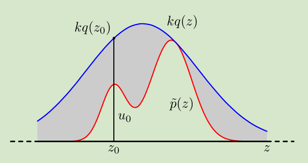
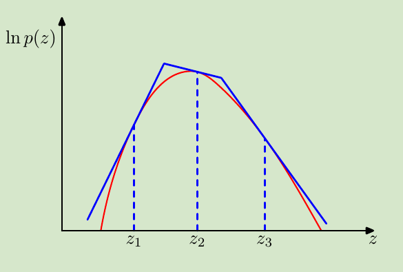

<!--
 * @Author: ZhangLei mathcoder.zl@gmail.com
 * @Date: 2021-05-24 08:53:58
 * @LastEditors: ZhangLei mathcoder.zl@gmail.com
 * @LastEditTime: 2021-05-25 10:32:51
-->

# PRML学习笔记——第十一章

- [PRML学习笔记——第十一章](#prml学习笔记第十一章)
  - [Sampling Methods](#sampling-methods)
    - [11.1 Basic Sampling Algorithms](#111-basic-sampling-algorithms)
      - [11.1.1 Standard distributions](#1111-standard-distributions)
      - [11.1.2 Rejection sampling](#1112-rejection-sampling)
      - [11.1.3 Adaptive rejection sampling](#1113-adaptive-rejection-sampling)
      - [11.1.4 Importance sampling](#1114-importance-sampling)
      - [11.1.5 Sampling-importance-resampling](#1115-sampling-importance-resampling)
    - [11.2 Markov Chain Monte Carlo](#112-markov-chain-monte-carlo)
      - [11.2.1 Markov chains](#1121-markov-chains)
      - [11.2.2 The Metropolis-Hastings algorithm](#1122-the-metropolis-hastings-algorithm)
    - [11.3 Gibbs Sampling](#113-gibbs-sampling)

## Sampling Methods

大多数的情况,evaluate posterior都需要求一个期望:
$$\mathbb{E}[f]=\int f(\mathbf{z}) p(\mathbf{z}) \mathrm{d} \mathbf{z}$$
实际中由于这个积分intractable或者计算复杂度高,我们需要用近似:
$$\widehat{f}=\frac{1}{L} \sum_{l=1}^{L} f\left(\mathbf{z}^{(l)}\right)$$
其中的$\mathbf{z}^{(l)}$是从$p(\mathbf{z})$中sample来的.

这样问题就变成了如何从一个指定distribution中draw sample.

### 11.1 Basic Sampling Algorithms

这一节中都假设已经有能够生成均匀分布(0,1)上的随机数接口.

#### 11.1.1 Standard distributions

假设我们现在想从(0,1)均匀分布的$z$得到目标分布$y$,$y=f(x)$,$f(\cdot)$就是我们需要找的function.

因为:
$$p(y)=p(z)\left|\frac{d z}{d y}\right|$$
其中$p(z)=1$,我们对两边积分有:
$$z=h(y) \equiv \int_{-\infty}^{y} p(\widehat{y}) \mathrm{d} \widehat{y}$$
因此$h^{-1}$就是要找的函数,也就是cdf的反函数.

#### 11.1.2 Rejection sampling

现在假设需要sample的distribution是$p(\mathbf{x})$,
$$p(z)=\frac{1}{Z_{p}} \widetilde{p}(z)$$
其中$\widetilde{p}$ 容易evaluate,$Z_p$是normalize 系数.

现在构造一个simple distribution $q(z)$,被称为*proposal distribution*.引入一个constant $k$满足对所有的$z$,有$k q(z) \geqslant \widetilde{p}(z)$.

*如图所示,现在从simple distribution $q(z)$ sample,并且生成一个随机数,如果随机数落在$[0,\widetilde{p}(z)/kq(z)]$之间,就accept这个sample,否则就reject sample*

这样的sample方式容易看出需要$kq(z)$与$p(z)$越接近,sample效率越高.

#### 11.1.3 Adaptive rejection sampling

由于rejection sampling需要满足$k q(z) \geqslant \widetilde{p}(z)$对所有$z$都成立.构造难度大.现在使用一种动态调整的$q(z)$.

在每次被reject的sample上,修改$\ln kq(z)$为$\ln p(z)$的切线,这样只要$\ln p(x)$是concave的,就能满足大于等于的条件,并且可以refine原来的proposal distribution.

`note:`这里的*proposal distribution*是piecewise.

#### 11.1.4 Importance sampling

很多时候我们只需要得到期望,而不是真正sample的value,这个时候
$$\mathbb{E}[f] \simeq \sum_{l=1}^{L} p\left(\mathbf{z}^{(l)}\right) f\left(\mathbf{z}^{(l)}\right)$$
不需要reject sample,而是给每个sample一个weight.
$$\begin{aligned}
\mathbb{E}[f] &=\int f(\mathbf{z}) p(\mathbf{z}) \mathrm{d} \mathbf{z} \\
&=\frac{Z_{q}}{Z_{p}} \int f(\mathbf{z}) \widetilde{\underline{p}(\mathbf{z})}{\widetilde{q}(\mathbf{z})} q(\mathbf{z}) \mathrm{d} \mathbf{z} \\
& \simeq \frac{Z_{q}}{Z_{p}} \frac{1}{L} \sum_{l=1}^{L} \widetilde{r}_{l} f\left(\mathbf{z}^{(l)}\right)
\end{aligned}$$
同样的,系数可以表示:
$$\begin{aligned}
\frac{Z_{p}}{Z_{q}} &=\frac{1}{Z_{q}} \int \tilde{p}(\mathbf{z}) \mathrm{d} \mathbf{z}=\int \frac{\widetilde{p}(\mathbf{z})}{\widetilde{q}(\mathbf{z})} q(\mathbf{z}) \mathrm{d} \mathbf{z} \\
& \simeq \frac{1}{L} \sum_{l=1}^{L} \widetilde{r}_{l}
\end{aligned}$$
最终
$$\begin{array}{l}
\mathbb{E}[f] \simeq \sum_{l=1}^{L} w_{l} f\left(\mathbf{z}^{(l)}\right)\\
w_{l}=\frac{\tilde{r}_{l}}{\sum_{m} \widetilde{r}_{m}}=\frac{\tilde{p}\left(\mathbf{z}^{(l)}\right) / q\left(\mathbf{z}^{(l)}\right)}{\sum_{m} \widetilde{p}\left(\mathbf{z}^{(m)}\right) / q\left(\mathbf{z}^{(m)}\right)} .
\end{array}$$
这个方法的问题在于当$p(z)$只在一个非常小的区域有significant value(尤其在high dimension)时,q(z)只要较小概率,会导致近似误差很大.

#### 11.1.5 Sampling-importance-resampling

这个方法分两步:

1. 从$q(\mathbf{z})$中draw $L$个samples $\mathbf{Z}^{(1)}, \ldots, \mathbf{z}^{(L)}$.
2. 通过importance sample中的$w$计算公式得到每个sample的weight,并根据weight来从这$L$个离散samples $\mathbf{Z}^{(1)}, \ldots, \mathbf{z}^{(L)}$中draw $L$个samples

### 11.2 Markov Chain Monte Carlo

#### 11.2.1 Markov chains

Markov chains的基本性质就是无后效性(一种条件独立属性):
$$p\left(\mathbf{z}^{(m+1)} \mid \mathbf{z}^{(1)}, \ldots, \mathbf{z}^{(m)}\right)=p\left(\mathbf{z}^{(m+1)} \mid \mathbf{z}^{(m)}\right)$$
定义一个*Transition probability*:
$$T_{m}\left(\mathbf{z}^{(m)}, \mathbf{z}^{(m+1)}\right) \equiv p\left(\mathbf{z}^{(m+1)} \mid \mathbf{z}^{(m)}\right)$$
要让sample在前一次和后一次是服从同样的target distribution就得满足:
$$p^{\star}(\mathbf{z})=\sum_{\mathbf{z}^{\prime}} T\left(\mathbf{z}^{\prime}, \mathbf{z}\right) p^{\star}\left(\mathbf{z}^{\prime}\right)$$
但这个式子中有求和(积分),不方便实际使用,一般使用一个充分(不必要)条件,即*detailed balance*:
$$p^{\star}(\mathbf{z}) T\left(\mathbf{z}, \mathbf{z}^{\prime}\right)=p^{\star}\left(\mathbf{z}^{\prime}\right) T\left(\mathbf{z}^{\prime}, \mathbf{z}\right)$$

#### 11.2.2 The Metropolis-Hastings algorithm

为了满足detailed balance条件,我们构造一个接受率:
$$A_{k}\left(\mathbf{z}^{\star}, \mathbf{z}^{(\tau)}\right)=\min \left(1, \frac{\tilde{p}\left(\mathbf{z}^{\star}\right) q_{k}\left(\mathbf{z}^{(\tau)} \mid \mathbf{z}^{\star}\right)}{\widetilde{p}\left(\mathbf{z}^{(\tau)}\right) q_{k}\left(\mathbf{z}^{\star} \mid \mathbf{z}^{(\tau)}\right)}\right) .$$
每次在draw下一个sample后,都以$A_k$的概率决定是否接受为新的sample,若没有接受,则重复使用上一个sample而不是discard.

### 11.3 Gibbs Sampling

> 1. Initialize $\left\{z_{i}: i=1, \ldots, M\right\}$
> 2. For $\tau=1, \ldots, T$ :
> - Sample $z_{1}^{(\tau+1)} \sim p\left(z_{1} \mid z_{2}^{(\tau)}, z_{3}^{(\tau)}, \ldots, z_{M}^{(\tau)}\right)$.
$-$ Sample $z_{2}^{(\tau+1)} \sim p\left(z_{2} \mid z_{1}^{(\tau+1)}, z_{3}^{(\tau)}, \ldots, z_{M}^{(\tau)}\right) .$
> - Sample $z_{j}^{(\tau+1)} \sim p\left(z_{j} \mid z_{1}^{(\tau+1)}, \ldots, z_{j-1}^{(\tau+1)}, z_{j+1}^{(\tau)}, \ldots, z_{M}^{(\tau)}\right)$
> - Sample $z_{M}^{(\tau+1)} \sim p\left(z_{M} \mid z_{1}^{(\tau+1)}, z_{2}^{(\tau+1)}, \ldots, z_{M-1}^{(\tau+1)}\right) .$

Gibbs sampling是MH sampling的一种特例:
$$A\left(\mathbf{z}^{\star}, \mathbf{z}\right)=\frac{p\left(\mathbf{z}^{\star}\right) q_{k}\left(\mathbf{z} \mid \mathbf{z}^{\star}\right)}{p(\mathbf{z}) q_{k}\left(\mathbf{z}^{\star} \mid \mathbf{z}\right)}=\frac{p\left(z_{k}^{\star} \mid \mathbf{z}_{\backslash k}^{\star}\right) p\left(\mathbf{z}_{\backslash k}^{\star}\right) p\left(z_{k} \mid \mathbf{z}_{\backslash k}^{\star}\right)}{p\left(z_{k} \mid \mathbf{z}_{\backslash k}\right) p\left(\mathbf{z}_{\backslash k}\right) p\left(z_{k}^{\star} \mid \mathbf{z}_{\backslash k}\right)}=1$$
可以看到是一种接收率始终是1的MH sampling.