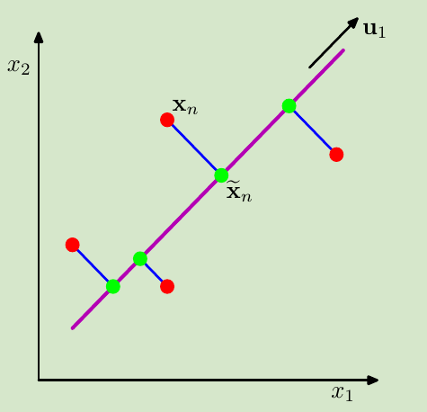

<!--
 * @Author: ZhangLei mathcoder.zl@gmail.com
 * @Date: 2021-05-26 08:57:14
 * @LastEditors: ZhangLei mathcoder.zl@gmail.com
 * @LastEditTime: 2021-05-26 10:56:57
-->

# PRML学习笔记——第十二章

- [PRML学习笔记——第十二章](#prml学习笔记第十二章)
  - [Continuous Latent Variables](#continuous-latent-variables)
    - [12.1 Principal Component Analysis](#121-principal-component-analysis)
      - [12.1.1 Maximum variance formulation](#1211-maximum-variance-formulation)
      - [12.1.3 Applications of PCA](#1213-applications-of-pca)

## Continuous Latent Variables

### 12.1 Principal Component Analysis

*图示是将2dim的red point project到1dim的red point.PCA有两种定义,一种是最大化project后的variance即图中red point的variance.还有一种是最小化projection error,即图中蓝色线长度和.*

#### 12.1.1 Maximum variance formulation

设我们的project vector(只考虑投影到1dim)是$\mathbf{u}$,则投影后的variance为:
$$\frac{1}{N} \sum_{n=1}^{N}\left\{\mathbf{u}_{1}^{\mathrm{T}} \mathbf{x}_{n}-\mathbf{u}_{1}^{\mathrm{T}} \overline{\mathbf{x}}\right\}^{2}=\mathbf{u}_{1}^{\mathrm{T}} \mathbf{S} \mathbf{u}_{1}$$
其中$\mathbf{S}$是原始data的variance:
$$\mathbf{S}=\frac{1}{N} \sum_{n=1}^{N}\left(\mathbf{x}_{n}-\overline{\mathbf{x}}\right)\left(\mathbf{x}_{n}-\overline{\mathbf{x}}\right)^{\mathrm{T}} .$$
我们现在想要maximize这个投影后variance,由于project vector只有方向有用,需要加上限制$\mathbf{u}_{1}^{\mathrm{T}} \mathbf{u}_{1}=1$.可以用Lagrange multiplier:
$$\mathbf{u}_{1}^{\mathrm{T}} \mathbf{S} \mathbf{u}_{1}+\lambda_{1}\left(1-\mathbf{u}_{1}^{\mathrm{T}} \mathbf{u}_{1}\right)$$
那么必要条件:$\mathbf{S u}_{1}=\lambda_{1} \mathbf{u}_{1}$说明$\lambda$是$S$的eigenvalue,要让$\mathbf{u}_{1}^{\mathrm{T}} \mathbf{S} \mathbf{u}_{1}=\lambda_{1}$达到最大,也就成了找最大eigenvector的问题.

当需要投影到$M$维空间时,只需要依次从大到小找eigenvalue对应的vector就可以了.

#### 12.1.3 Applications of PCA

