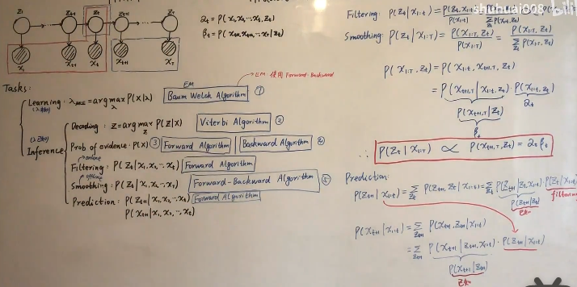
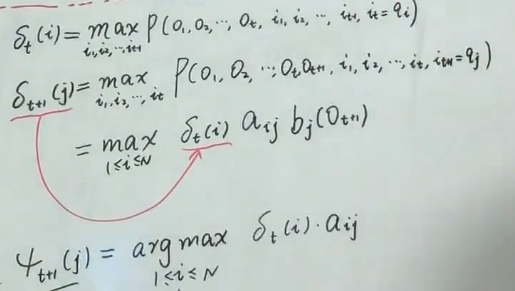

<!--
 * @Author: ZhangLei mathcoder.zl@gmail.com
 * @Date: 2021-05-27 16:26:54
 * @LastEditors: ZhangLei mathcoder.zl@gmail.com
 * @LastEditTime: 2021-05-28 20:44:52
-->

# PRML学习笔记——第十三章

1. [PRML学习笔记——第十三章](#prml学习笔记第十三章)
   1. [Sequential Data](#sequential-data)
      1. [13.1 Markov Models](#131-markov-models)
         1. [13.2 Hidden Markov Models](#132-hidden-markov-models)
         2. [13.2.1 Maximum likelihood for the HMM](#1321-maximum-likelihood-for-the-hmm)
         3. [13.2.2 The forward-backward algorithm](#1322-the-forward-backward-algorithm)
         4. [13.2.5 The Viterbi algorithm](#1325-the-viterbi-algorithm)
         5. [13.3. Linear Dynamical Systems](#133-linear-dynamical-systems)

## Sequential Data

### 13.1 Markov Models

Markov性指未来的状态只和当前的状态有关,与过去无关.如果$p(\mathbf{x}_n|\mathbf{x}_{n-1})$对于所有$n$来说都相等,那么model就被成为*homogeneous* Markov chain.

#### 13.2 Hidden Markov Models

HMM引入了一个(discrete) latent variable $\mathbf{z}$,对于单个time slice来看,$p(\mathbf{x}|\mathbf{z})$就是一个mixture model.

HMM中的$p(\mathbf{z}_n|\mathbf{z}_{n-1})$被称为transition probability,可以用一个matrix $\mathbf{A}$表示(这里考虑的都是齐次markov,即所有$\mathbf{A}$都是相同的):
$$p\left(\mathbf{z}_{n} \mid \mathbf{z}_{n-1, \mathbf{A}}\right)=\prod_{k=1}^{K} \prod_{j=1}^{K} A_{j k}^{z_{n-1, j} z_{n k}}$$
当考虑第一个$\mathbf{z}$时:
$$p\left(\mathbf{z}_{1} \mid \boldsymbol{\pi}\right)=\prod_{k=1}^{K} \pi_{k}^{z_{1 k}}$$
$p(\mathbf{x}_n|\mathbf{z}_n)$被称为emission probability:
$$p\left(\mathbf{x}_{n} \mid \mathbf{z}_{n}, \boldsymbol{\phi}\right)=\prod_{k=1}^{K} p\left(\mathbf{x}_{n} \mid \boldsymbol{\phi}_{k}\right)^{z_{n k}}$$
整个概率图的joint distribution可以表示成:
$$p(\mathbf{X}, \mathbf{Z} \mid \boldsymbol{\theta})=p\left(\mathbf{z}_{1} \mid \boldsymbol{\pi}\right)\left[\prod_{n=2}^{N} p\left(\mathbf{z}_{n} \mid \mathbf{z}_{n-1}, \mathbf{A}\right)\right] \prod_{m=1}^{N} p\left(\mathbf{x}_{m} \mid \mathbf{z}_{m}, \boldsymbol{\phi}\right)$$
其中$\boldsymbol{\theta}=\{\boldsymbol{\pi}, \mathbf{A}, \boldsymbol{\phi}\}$就是model的参数.

#### 13.2.1 Maximum likelihood for the HMM

这节考虑Learning问题,如何求解得到最优的$\theta$.

$$p(\mathbf{X} \mid \boldsymbol{\theta})=\sum_{\mathbf{Z}} p(\mathbf{X}, \mathbf{Z} \mid \boldsymbol{\theta})$$
可以看到如果直接使用MLE,上式会出现在log内,无法得到closed-form solution.所以采用EM.

- E-step:已知初始的$\theta^{old}$,来求posterior $p\left(\mathbf{Z} \mid \mathbf{X}, \boldsymbol{\theta}^{\text {old }}\right)$.

- M-step:求$Q\left(\boldsymbol{\theta}, \boldsymbol{\theta}^{\text {old }}\right)=\sum_{\mathbf{Z}} p\left(\mathbf{Z} \mid \mathbf{X}, \boldsymbol{\theta}^{\text {old }}\right) \ln p(\mathbf{X}, \mathbf{Z} \mid \boldsymbol{\theta}) .$式达到最大的$\theta$.
  $$\begin{aligned}
    Q\left(\boldsymbol{\theta}, \boldsymbol{\theta}^{\text {old }}\right)=& \sum_{k=1}^{K} \gamma\left(z_{1 k}\right) \ln \pi_{k}+\sum_{n=2}^{N} \sum_{j=1}^{K} \sum_{k=1}^{K} \xi\left(z_{n-1, j}, z_{n k}\right) \ln A_{j k} \\
    &+\sum_{n=1}^{N} \sum_{k=1}^{K} \gamma\left(z_{n k}\right) \ln p\left(\mathbf{x}_{n} \mid \boldsymbol{\phi}_{k}\right)
    \end{aligned}$$

其中上面的E-step求解了posterior用于下面的M-step算$Q$,但这个maximize问题其实可以用joint替换posterior不影响结果.实际使用的是joint distribution.(但这里并未给出计算方法,直接展开计算复杂度是指数级的,需要使用Forward-backward降低为关于长度的线性复杂度,涉及到evaluating问题)

#### 13.2.2 The forward-backward algorithm

这节就是讲evaluation问题.
定义:
$$\begin{aligned}
\alpha\left(\mathbf{z}_{n}\right) & \equiv p\left(\mathbf{x}_{1}, \ldots, \mathbf{x}_{n}, \mathbf{z}_{n}\right) \\
\beta\left(\mathbf{z}_{n}\right) & \equiv p\left(\mathbf{x}_{n+1}, \ldots, \mathbf{x}_{N} \mid \mathbf{z}_{n}\right) .
\end{aligned}$$
那么posterior能用$\alpha,\beta$表示:
$$\gamma\left(\mathbf{z}_{n}\right)=\frac{p\left(\mathbf{x}_{1}, \ldots, \mathbf{x}_{n}, \mathbf{z}_{n}\right) p\left(\mathbf{x}_{n+1}, \ldots, \mathbf{x}_{N} \mid \mathbf{z}_{n}\right)}{p(\mathbf{X})}=\frac{\alpha\left(\mathbf{z}_{n}\right) \beta\left(\mathbf{z}_{n}\right)}{p(\mathbf{X})}\\
\begin{array}{l}
\xi\left(\mathbf{z}_{n-1}, \mathbf{z}_{n}\right)=p\left(\mathbf{z}_{n-1}, \mathbf{z}_{n} \mid \mathbf{X}\right) \\
=\frac{p\left(\mathbf{X} \mid \mathbf{z}_{n-1}, \mathbf{z}_{n}\right) p\left(\mathbf{z}_{n-1}, \mathbf{z}_{n}\right)}{p(\mathbf{X})} \\
=\frac{p\left(\mathbf{x}_{1}, \ldots, \mathbf{x}_{n-1} \mid \mathbf{z}_{n-1}\right) p\left(\mathbf{x}_{n} \mid \mathbf{z}_{n}\right) p\left(\mathbf{x}_{n+1}, \ldots, \mathbf{x}_{N} \mid \mathbf{z}_{n}\right) p\left(\mathbf{z}_{n} \mid \mathbf{z}_{n-1}\right) p\left(\mathbf{z}_{n-1}\right)}{p(\mathbf{X})} \\
=\frac{\alpha\left(\mathbf{z}_{n-1}\right) p\left(\mathbf{x}_{n} \mid \mathbf{z}_{n}\right) p\left(\mathbf{z}_{n} \mid \mathbf{z}_{n-1}\right) \beta\left(\mathbf{z}_{n}\right)}{p(\mathbf{X})}
\end{array}$$
现在问题是怎么求$\alpha,\beta$,这两个可以递归的求解:
$$\alpha\left(\mathbf{z}_{n}\right)=p\left(\mathbf{x}_{n} \mid \mathbf{z}_{n}\right) \sum_{\mathbf{z}_{n-1}} \alpha\left(\mathbf{z}_{n-1}\right) p\left(\mathbf{z}_{n} \mid \mathbf{z}_{n-1}\right)\\
\beta\left(\mathbf{z}_{n}\right)=\sum_{\mathbf{z}_{n+1}} \beta\left(\mathbf{z}_{n+1}\right) p\left(\mathbf{x}_{n+1} \mid \mathbf{z}_{n+1}\right) p\left(\mathbf{z}_{n+1} \mid \mathbf{z}_{n}\right)
$$
这样就只需要按顺序把$\alpha,\beta$都解完就好了.

#### 13.2.5 The Viterbi algorithm

这节就是讲decoding问题.

其中$\psi$是用来记录路径(每个$\mathbf{z}_n$选择的状态).

#### 13.3. Linear Dynamical Systems

