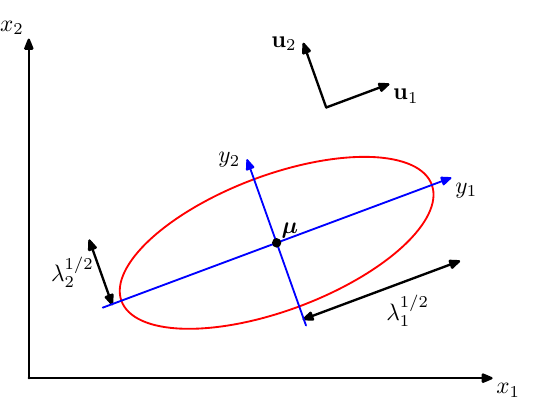
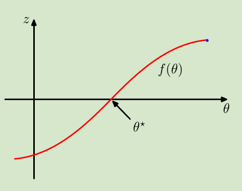
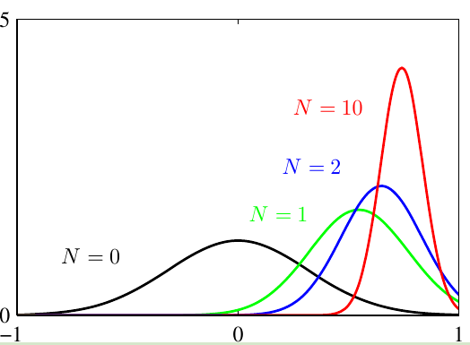
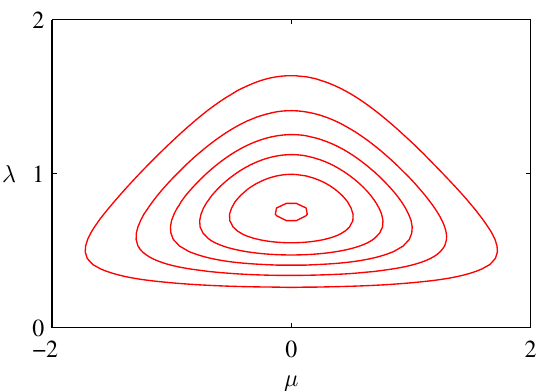
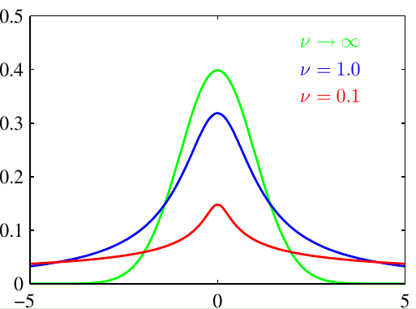
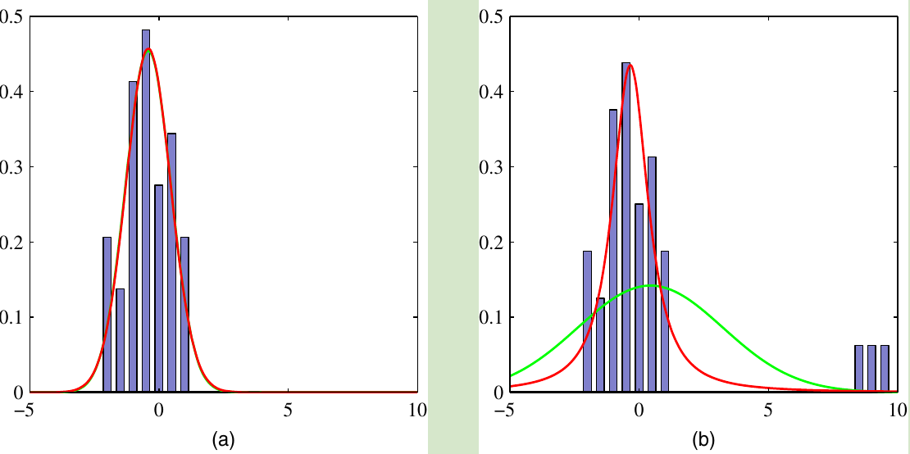
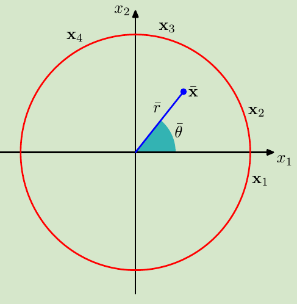
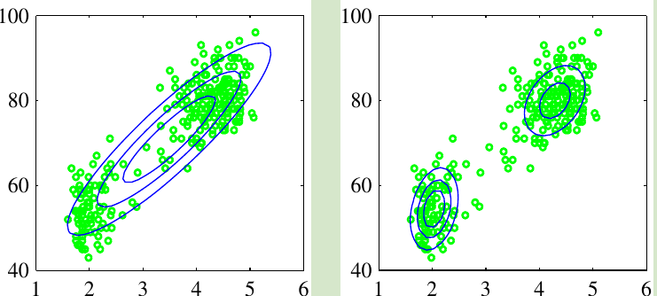

<!-- #! https://zhuanlan.zhihu.com/p/369442613 -->

<!--
 * @Author: ZhangLei mathcoder.zl@gmail.com
 * @Date: 2021-04-28 16:11:53
 * @LastEditors: ZhangLei mathcoder.zl@gmail.com
 * @LastEditTime: 2021-05-20 21:34:01
-->

# PRML学习笔记——第二章

- [PRML学习笔记——第二章](#prml学习笔记第二章)
  - [Probability Distributions](#probability-distributions)
    - [2.1 Binary Variable](#21-binary-variable)
      - [2.1.1 The beta distribution](#211-the-beta-distribution)
    - [2.2 Multinomial Variable](#22-multinomial-variable)
      - [2.2.1 The Dirichlet distribution](#221-the-dirichlet-distribution)
    - [2.3 The Gaussian Distribution](#23-the-gaussian-distribution)
      - [2.3.1 Conditional Gaussian distributions](#231-conditional-gaussian-distributions)
      - [2.3.2 Marginal Gaussian distribution](#232-marginal-gaussian-distribution)
      - [2.3.3 Bayes&#39; theorem for Gaussian variable](#233-bayes-theorem-for-gaussian-variable)
      - [2.3.4 Maximum likelihood for the Gaussian](#234-maximum-likelihood-for-the-gaussian)
      - [2.3.5 Sequential estimation](#235-sequential-estimation)
      - [2.3.6 Bayesian inference for the Gaussian](#236-bayesian-inference-for-the-gaussian)
      - [2.3.7 Student’s t-distribution](#237-students-t-distribution)
      - [2.3.8 Periodic variables](#238-periodic-variables)
      - [2.3.9 Mixtures of Gaussians](#239-mixtures-of-gaussians)
    - [2.4 The Exponential Family](#24-the-exponential-family)
      - [2.4.1 Maximum likelihood and sufficient statistics](#241-maximum-likelihood-and-sufficient-statistics)
      - [2.4.2 Conjugate priors](#242-conjugate-priors)
      - [2.4.3 Noninformative priors](#243-noninformative-priors)
    - [2.5 Nonparametric Methods](#25-nonparametric-methods)
      - [2.5.1 Kernel density estimators](#251-kernel-density-estimators)
      - [2.5.2 Nearest-neighbour methods](#252-nearest-neighbour-methods)

## Probability Distributions

在第一章中已经强调了概率在机器学习中的重要性，本章会对一些特别的概率分布exploration。

### 2.1 Binary Variable

对于一个bianary random variable $x\in \{0,1\}$，我们denote该事件的probability：

$$
p(x=1|\mu) = \mu
$$

因此我们可以得出*bernouli distribution*:

$$
Bern(x|\mu) = \mu ^x(1-\mu)^{1-x}
$$

容易得出：

$$
\begin{aligned}
    \mathbb{E}[x] &=\mu \\
    \operatorname{var}[x] &= \mu(1-\mu)
\end{aligned}
$$

假设有数据集$\mathcal{D}=\{x_1,\ldots,x_N\}$，并且满足*i.i.d*于bernouli distribution，那么

$$
p(\mathcal{D} \mid \mu)=\prod_{n=1}^{N} p\left(x_{n} \mid \mu\right)=\prod_{n=1}^{N} \mu^{x_{n}}(1-\mu)^{1-x_{n}}
$$

就是likelihood，现在就可以通过maximize likelihood来得到$\mu$的似然解：

$$
\mu_{ML}=\frac{1}{N} \sum_{n=1}^N x_n
$$

也即样本均值。

当这个binary event重复$N$次的时候，我们会得到*binomial distribution*：

$$
\operatorname{Bin}(m \mid N, \mu)=\left(\begin{array}{l}
N \\
m
\end{array}\right) \mu^{m}(1-\mu)^{N-m}
$$

#### 2.1.1 The beta distribution

Beta distribution:

$$
\operatorname{Beta}(\mu \mid a, b)=\frac{\Gamma(a+b)}{\Gamma(a) \Gamma(b)} \mu^{a-1}(1-\mu)^{b-1}
$$

mean 和 variance：

$$
\begin{aligned}
\mathbb{E}[\mu] &=\frac{a}{a+b} \\
\operatorname{var}[\mu] &=\frac{a b}{(a+b)^{2}(a+b+1)} .
\end{aligned}
$$

由于具有conjugacy性质，所以它的posterior distribution：

$$
p(\mu \mid m, l, a, b) \propto \mu^{m+a-1}(1-\mu)^{l+b-1}
$$

其中的$m$是发生$x=1$的事件次数，$l=N-m$.可以看到prior和posterior具有相同的$\mu$形式，只是系数不同（系数可以单独通过normalization得到）。从这个式子中我们也能知道每多观测一次事件，只需要多乘一项$\mu$或者$1-\mu$，再进行normalization。这也就能够进行sequential的预测，避免每更新一次观测就要重新考虑所有data。

如果我们的目标是尽可能好的预测下一次$x$的结果，那么就是在预测：

$$
p(x=1 \mid \mathcal{D})=\int_{0}^{1} p(x=1 \mid \mu) p(\mu \mid \mathcal{D}) \mathrm{d} \mu=\int_{0}^{1} \mu p(\mu \mid \mathcal{D}) \mathrm{d} \mu=\mathbb{E}[\mu \mid \mathcal{D}]
$$

得到:

$$
p(x=1 \mid \mathcal{D})=\frac{m+a}{m+a+l+b}
$$

该式表明了当实验次数足够多（$m,l\rightarrow \infty$）的时候，结果就是极大似然估计。对于有限的数据集，$\mu$的估计就是在prior和极大似然估计之间。

### 2.2 Multinomial Variable

现在将binary variable推广到多个变量，假设一共有$K$个state，事件$\mathbf{x}=\{0,\ldots , 1,\ldots ,0\}$，就denote第$k$个state($x_k = 1$)。

multinomial distribution定义：

$$
\operatorname{Mult}\left(m_{1}, m_{2}, \ldots, m_{K} \mid \boldsymbol{\mu}, N\right)=\left(\begin{array}{c}
N \\
m_{1} m_{2} \ldots m_{K}
\end{array}\right) \prod_{k=1}^{K} \mu_{k}^{m_{k}}
$$

其中的$m_k$满足约束：

$$
\sum_{k=1}^{K} m_{k}=N
$$

#### 2.2.1 The Dirichlet distribution

Multinomial distribution的conjugate  prior distribution是*Dirichlet distribution*：

$$
\operatorname{Dir}(\boldsymbol{\mu} \mid \boldsymbol{\alpha})=\frac{\Gamma\left(\alpha_{0}\right)}{\Gamma\left(\alpha_{1}\right) \cdots \Gamma\left(\alpha_{K}\right)} \prod_{k=1}^{K} \mu_{k}^{\alpha_{k}-1}
$$

其中$0 \leqslant \mu_{k} \leqslant 1 \text { and } \sum_{k} \mu_{k}=1 \text{ , } \alpha_{0}=\sum_{k=1}^{K} \alpha_{k}$.

通过Bayes定理，可以得到同是Dirichlet distribution的posterior：

$$
p(\boldsymbol{\mu} \mid \mathcal{D}, \boldsymbol{\alpha}) \propto p(\mathcal{D} \mid \boldsymbol{\mu}) p(\boldsymbol{\mu} \mid \boldsymbol{\alpha}) \propto \prod_{k=1}^{K} \mu_{k}^{\alpha_{k}+m_{k}-1} .
$$

### 2.3 The Gaussian Distribution

$$
\mathcal{N}(\mathbf{x} \mid \boldsymbol{\mu}, \mathbf{\Sigma})=\frac{1}{(2 \pi)^{D / 2}} \frac{1}{|\mathbf{\Sigma}|^{1 / 2}} \exp \left\{-\frac{1}{2}(\mathbf{x}-\boldsymbol{\mu})^{\mathrm{T}} \mathbf{\Sigma}^{-1}(\mathbf{x}-\boldsymbol{\mu})\right\}
$$

其中唯一依赖$\mathbf{x}$的项是

$$
\Delta^{2}=(\mathbf{x}-\boldsymbol{\mu})^{\mathrm{T}} \boldsymbol{\Sigma}^{-1}(\mathbf{x}-\boldsymbol{\mu})
$$

这个$\Delta$被称为*Mahalanobis distance*(马氏距离)。

`note:`当$\Sigma$是identity matrix时，这个距离就也就是Euclidean distance

不失一般性，将$\Sigma$假定为symmetric matrix，那么可以做特征值分解：

$$
\boldsymbol{\Sigma} \mathbf{u}_{i}=\lambda_{i} \mathbf{u}_{i}
$$

我们选择orthonormal的$\mathbf{u}$，有(写成分块矩阵再左右乘上$U^{\mathrm{T}}$、$U$可证)：

$$
\boldsymbol{\Sigma}=\sum_{i=1}^{D} \lambda_{i} \mathbf{u}_{i} \mathbf{u}_{i}^{\mathrm{T}}
$$

那么二次型变为：

$$
\Delta^{2}=\sum_{i=1}^{D} \frac{y_{i}^{2}}{\lambda_{i}}
$$

其中$y_{i}=\mathbf{u}_{i}^{\mathrm{T}}(\mathbf{x}-\boldsymbol{\mu})$.

显然，如果考虑空间中等概率密度的区域，二维情况就是一个椭圆线。

*原来的$\mathbf{x}$经过shift、rotate得到normalize后的变量$\mathbf{y}$，有$\mathbf{y}=\mathbf{U}(\mathbf{x}-\boldsymbol{\mu})$*

现在考虑从$\mathbf{x}$到$\mathbf{y}$的坐标变换，得到一个Jacobian matrix $\mathbf{J}$：

$$
J_{i j}=\frac{\partial x_{i}}{\partial y_{j}}=U_{i j}
$$

因此Jacobian matrix的行列式：

$$
|\mathbf{J}|^{2}=\left|\mathbf{U}^{\mathrm{T}}\right|^{2}=\left|\mathbf{U}^{\mathrm{T}}\right||\mathbf{U}|=\left|\mathbf{U}^{\mathrm{T}} \mathbf{U}\right|=|\mathbf{I}|=1
$$

$$
|\mathbf{J}| = 1.
$$

同时Covariance matrix的determinant能被写成：

$$
|\boldsymbol{\Sigma}|^{1 / 2}=\prod_{j=1}^{D} \lambda_{j}^{1 / 2}
$$

因此在$\mathbf{y}$的坐标系下的Gaussian distribution为

$$
p(\mathbf{y})=p(\mathbf{x})|\mathbf{J}|=\prod_{j=1}^{D} \frac{1}{\left(2 \pi \lambda_{j}\right)^{1 / 2}} \exp \left\{-\frac{y_{j}^{2}}{2 \lambda_{j}}\right\}
$$

#### 2.3.1 Conditional Gaussian distributions

首先我们把变量划分为$a, b$两个子集，将多维高斯分布用分块矩阵来表示。

$$
\mathbf{x}=\left(\begin{array}{l}
\mathbf{x}_{a} \\
\mathbf{x}_{b}
\end{array}\right)
$$

$$
\boldsymbol{\mu}=\left(\begin{array}{l}
\boldsymbol{\mu}_{a} \\
\boldsymbol{\mu}_{b}
\end{array}\right)
$$

$$
\boldsymbol{\Sigma}=\left(\begin{array}{ll}
\boldsymbol{\Sigma}_{a a} & \boldsymbol{\Sigma}_{a b} \\
\boldsymbol{\Sigma}_{b a} & \boldsymbol{\Sigma}_{b b}
\end{array}\right)
$$

记 *precision matrix*:

$$
\boldsymbol{\Lambda} \equiv \boldsymbol{\Sigma}^{-1}
$$

也就有：

$$
\boldsymbol{\Lambda}=\left(\begin{array}{ll}
\boldsymbol{\Lambda}_{a a} & \boldsymbol{\Lambda}_{a b} \\
\boldsymbol{\Lambda}_{b a} & \boldsymbol{\Lambda}_{b b}
\end{array}\right)
$$

`note:`这里的$\Lambda_{aa}$并不是简单的等于$\Sigma_{aa}^{-1}$.

一个重要的性质是：joint Gaussian distribution对应的marginal和conditional distribution都是Gaussian distribution.

现在将Gaussian distribution的指数项用分块矩阵表示：

$$
\begin{aligned}
-\frac{1}{2} &(\mathbf{x}-\boldsymbol{\mu})^{\mathrm{T}} \boldsymbol{\Sigma}^{-1}(\mathbf{x}-\boldsymbol{\mu})=\\
&-\frac{1}{2}\left(\mathbf{x}_{a}-\boldsymbol{\mu}_{a}\right)^{\mathrm{T}} \boldsymbol{\Lambda}_{a a}\left(\mathbf{x}_{a}-\boldsymbol{\mu}_{a}\right)-\frac{1}{2}\left(\mathbf{x}_{a}-\boldsymbol{\mu}_{a}\right)^{\mathrm{T}} \boldsymbol{\Lambda}_{a b}\left(\mathbf{x}_{b}-\boldsymbol{\mu}_{b}\right) \\
&-\frac{1}{2}\left(\mathbf{x}_{b}-\boldsymbol{\mu}_{b}\right)^{\mathrm{T}} \boldsymbol{\Lambda}_{b a}\left(\mathbf{x}_{a}-\boldsymbol{\mu}_{a}\right)-\frac{1}{2}\left(\mathbf{x}_{b}-\boldsymbol{\mu}_{b}\right)^{\mathrm{T}} \boldsymbol{\Lambda}_{b b}\left(\mathbf{x}_{b}-\boldsymbol{\mu}_{b}\right)
\end{aligned}
$$

对于一个general的Gaussian distribution，它的指数项为：

$$
-\frac{1}{2}(\mathbf{x}-\boldsymbol{\mu})^{\mathrm{T}} \boldsymbol{\Sigma}^{-1}(\mathbf{x}-\boldsymbol{\mu})=-\frac{1}{2} \mathbf{x}^{\mathrm{T}} \boldsymbol{\Sigma}^{-1} \mathbf{x}+\mathbf{x}^{\mathrm{T}} \boldsymbol{\Sigma}^{-1} \boldsymbol{\mu}+\text { const }
$$

`note:`对于求conditional probability $p(\mathbf{x}_a | \mathbf{x}_b)$，$\mathbf{x}_b$被看作一个constant.

如此就能通过比较系数来得出未知数：

$$
\boldsymbol{\Sigma}_{a \mid b}=\mathbf{\Lambda}_{a a}^{-1}\\
\begin{aligned}
\boldsymbol{\mu}_{a \mid b} &=\boldsymbol{\Sigma}_{a \mid b}\left\{\boldsymbol{\Lambda}_{a a} \boldsymbol{\mu}_{a}-\boldsymbol{\Lambda}_{a b}\left(\mathbf{x}_{b}-\boldsymbol{\mu}_{b}\right)\right\} \\
&=\boldsymbol{\mu}_{a}-\boldsymbol{\Lambda}_{a a}^{-1} \boldsymbol{\Lambda}_{a b}\left(\mathbf{x}_{b}-\boldsymbol{\mu}_{b}\right)
\end{aligned}
$$

现在利用一个恒等式结果：

$$
\left(\begin{array}{cc}
\mathbf{A} & \mathbf{B} \\
\mathbf{C} & \mathbf{D}
\end{array}\right)^{-1}=\left(\begin{array}{cc}
\mathbf{M} & -\mathbf{M B D}^{-1} \\
-\mathbf{D}^{-1} \mathbf{C M} & \mathbf{D}^{-1}+\mathbf{D}^{-1} \mathbf{C M B D}^{-1}
\end{array}\right)
$$

其中$\mathbf{M}=\left(\mathbf{A}-\mathbf{B D}^{-1} \mathbf{C}\right)^{-1}$被成为*Schur complement*（舒尔补）.可以得到：

$$
\begin{aligned}
\boldsymbol{\Lambda}_{a a} &=\left(\boldsymbol{\Sigma}_{a a}-\boldsymbol{\Sigma}_{a b} \boldsymbol{\Sigma}_{b b}^{-1} \boldsymbol{\Sigma}_{b a}\right)^{-1} \\
\boldsymbol{\Lambda}_{a b} &=-\left(\boldsymbol{\Sigma}_{a a}-\boldsymbol{\Sigma}_{a b} \boldsymbol{\Sigma}_{b b}^{-1} \boldsymbol{\Sigma}_{b a}\right)^{-1} \boldsymbol{\Sigma}_{a b} \boldsymbol{\Sigma}_{b b}^{-1}
\end{aligned}
$$

所以conditional distribution的结果用mean和covariance表示就是：

$$
\begin{aligned}
\boldsymbol{\mu}_{a \mid b} &=\boldsymbol{\mu}_{a}+\boldsymbol{\Sigma}_{a b} \boldsymbol{\Sigma}_{b b}^{-1}\left(\mathbf{x}_{b}-\boldsymbol{\mu}_{b}\right) \\
\boldsymbol{\Sigma}_{a \mid b} &=\boldsymbol{\Sigma}_{a a}-\boldsymbol{\Sigma}_{a b} \boldsymbol{\Sigma}_{b b}^{-1} \boldsymbol{\Sigma}_{b a} .
\end{aligned}
$$

#### 2.3.2 Marginal Gaussian distribution

前面得到了joint distribution是gaussian distribution时的conditional distribution，现在：

$$
p\left(\mathbf{x}_{a}\right)=\int p\left(\mathbf{x}_{a}, \mathbf{x}_{b}\right) \mathrm{d} \mathbf{x}_{b}
$$

同样的，关注指数项的二次型：

$$
-\frac{1}{2} \mathbf{x}_{b}^{\mathrm{T}} \boldsymbol{\Lambda}_{b b} \mathbf{x}_{b}+\mathbf{x}_{b}^{T} \mathbf{m}=-\frac{1}{2}\left(\mathbf{x}_{b}-\mathbf{\Lambda}_{b b}^{-1} \mathbf{m}\right)^{\mathrm{T}} \boldsymbol{\Lambda}_{b b}\left(\mathbf{x}_{b}-\mathbf{\Lambda}_{b b}^{-1} \mathbf{m}\right)+\frac{1}{2} \mathbf{m}^{\mathrm{T}} \boldsymbol{\Lambda}_{b b}^{-1} \mathbf{m}
$$

其中$\mathbf{m}=\mathbf{\Lambda}_{b b} \boldsymbol{\mu}_{b}-\mathbf{\Lambda}_{b a}\left(\mathbf{x}_{a}-\boldsymbol{\mu}_{a}\right)$.
等式右边第一项是dependent $\mathbf{x}_b$，第二项independent $\mathbf{x}_b$(但dependent $\mathbf{x}_a$)，由于积分在$\mathbf{x}_b$上，所以只需考虑这个积分形式：

$$
\int \exp \left\{-\frac{1}{2}\left(\mathbf{x}_{b}-\mathbf{\Lambda}_{b b}^{-1} \mathbf{m}\right)^{\mathrm{T}} \boldsymbol{\Lambda}_{b b}\left(\mathbf{x}_{b}-\mathbf{\Lambda}_{b b}^{-1} \mathbf{m}\right)\right\} \mathrm{d} \mathbf{x}_{b}
$$

而这个积分里面相当于是未normalize的Gaussian distribution，那么积分结果就是这个normalize系数的倒数（会成为marginal distribution的系数项）。又由于确定Gaussian distribution只需要考虑指数项：

$$
\begin{aligned}
\frac{1}{2}\left[\boldsymbol{\Lambda}_{b b}\right.&\left.\boldsymbol{\mu}_{b}-\boldsymbol{\Lambda}_{b a}\left(\mathbf{x}_{a}-\boldsymbol{\mu}_{a}\right)\right]^{\mathrm{T}} \mathbf{\Lambda}_{b b}^{-1}\left[\boldsymbol{\Lambda}_{b b} \boldsymbol{\mu}_{b}-\boldsymbol{\Lambda}_{b a}\left(\mathbf{x}_{a}-\boldsymbol{\mu}_{a}\right)\right] \\
&-\frac{1}{2} \mathbf{x}_{a}^{\mathrm{T}} \boldsymbol{\Lambda}_{a a} \mathbf{x}_{a}+\mathbf{x}_{a}^{\mathrm{T}}\left(\boldsymbol{\Lambda}_{a a} \boldsymbol{\mu}_{a}+\boldsymbol{\Lambda}_{a b} \boldsymbol{\mu}_{b}\right)+\mathrm{const} \\
=&-\frac{1}{2} \mathbf{x}_{a}^{\mathrm{T}}\left(\boldsymbol{\Lambda}_{a a}-\boldsymbol{\Lambda}_{a b} \boldsymbol{\Lambda}_{b b}^{-1} \boldsymbol{\Lambda}_{b a}\right) \mathbf{x}_{a} \\
&+\mathbf{x}_{a}^{\mathrm{T}}\left(\boldsymbol{\Lambda}_{a a}-\boldsymbol{\Lambda}_{a b} \boldsymbol{\Lambda}_{b b}^{-1} \boldsymbol{\Lambda}_{b a}\right)^{-1} \boldsymbol{\mu}_{a}+\mathrm{const}
\end{aligned}
$$

对比系数仍然能够得到：

$$
\begin{aligned}
\mathbb{E}\left[\mathbf{x}_{a}\right] &=\boldsymbol{\mu}_{a} \\
\operatorname{cov}\left[\mathbf{x}_{a}\right] &=\boldsymbol{\Sigma}_{a a} .
\end{aligned}
$$

这个表示形式要比conditional distribution简单多了。

> 综上： partitioned Gaussians
> 给定Gaussian distribution $\mathcal{N}(\mathbf{x} \mid \boldsymbol{\mu}, \boldsymbol{\Sigma})$ ,其中$\boldsymbol{\Lambda} \equiv \boldsymbol{\Sigma}^{-1}, \mathbf{x}=\left(\begin{array}{l}
> \mathbf{x}_{a} \\
> \mathbf{x}_{b}
> \end{array}\right), \quad \boldsymbol{\mu}=\left(\begin{array}{l}
> \boldsymbol{\mu}_{a} \\
> \boldsymbol{\mu}_{b}
> \end{array}\right), \boldsymbol{\Sigma}=\left(\begin{array}{cc}
> \boldsymbol{\Sigma}_{a a} & \boldsymbol{\Sigma}_{a b} \\
> \boldsymbol{\Sigma}_{b a} & \boldsymbol{\Sigma}_{b b}
> \end{array}\right), \quad \boldsymbol{\Lambda}=\left(\begin{array}{ll}
> \boldsymbol{\Lambda}_{a a} & \boldsymbol{\Lambda}_{a b} \\
> \boldsymbol{\Lambda}_{b a} & \boldsymbol{\Lambda}_{b b}
> \end{array}\right) .$
> Conditional distribution
> $\begin{aligned}
> p\left(\mathbf{x}_{a} \mid \mathbf{x}_{b}\right) &=\mathcal{N}\left(\mathbf{x}_a \mid \boldsymbol{\mu}_{a \mid b}, \boldsymbol{\Lambda}_{a a}^{-1}\right) \\
> \boldsymbol{\mu}_{a \mid b} &=\boldsymbol{\mu}_{a}-\boldsymbol{\Lambda}_{a a}^{-1} \boldsymbol{\Lambda}_{a b}\left(\mathbf{x}_{b}-\boldsymbol{\mu}_{b}\right)
> \end{aligned}$.
> Marginal distribution
>
> $p\left(\mathbf{x}_{a}\right)=\mathcal{N}\left(\mathbf{x}_{a} \mid \boldsymbol{\mu}_{a}, \boldsymbol{\Sigma}_{a a}\right)$.

#### 2.3.3 Bayes' theorem for Gaussian variable

> Marginal and Conditional Gaussians
> given a marginal distribution for $\mathbf{x}$ and a conditional distribution for $\mathbf{y}$ given $\mathbf{x}$ in the form
>
> $$
> \begin{aligned}
> $$

p(\mathbf{x}) &=\mathcal{N}\left(\mathbf{x} \mid \boldsymbol{\mu}, \boldsymbol{\Lambda}^{-1}\right) \\
p(\mathbf{y} \mid \mathbf{x}) &=\mathcal{N}\left(\mathbf{y} \mid \mathbf{A} \mathbf{x}+\mathbf{b}, \mathbf{L}^{-1}\right)
\end{aligned}$$

> the marginal distribution of $\mathbf{y}$ and the conditional distribution of $\mathbf{x}$ given $\mathbf{y}$ are
> given by
>
> $$
> \begin{aligned}
> $$

p(\mathbf{y}) &=\mathcal{N}\left(\mathbf{y} \mid \mathbf{A} \boldsymbol{\mu}+\mathbf{b}, \mathbf{L}^{-1}+\mathbf{A} \mathbf{\Lambda}^{-1} \mathbf{A}^{\mathrm{T}}\right) \\
p(\mathbf{x} \mid \mathbf{y}) &=\mathcal{N}\left(\mathbf{x} \mid \mathbf{\Sigma}\left\{\mathbf{A}^{\mathrm{T}} \mathbf{L}(\mathbf{y}-\mathbf{b})+\boldsymbol{\Lambda} \boldsymbol{\mu}\right\}, \mathbf{\Sigma}\right)
\end{aligned}$$

> where
>
> $$
> \boldsymbol{\Sigma}=\left(\boldsymbol{\Lambda}+\mathbf{A}^{\mathrm{T}} \mathbf{L} \mathbf{A}\right)^{-1}
> $$

#### 2.3.4 Maximum likelihood for the Gaussian

假设有观测$\mathbf{X}=\left(\mathbf{x}_{1}, \ldots, \mathbf{x}_{N}\right)^{\mathrm{T}}$,并且是由独立同分布的Gaussian distribution中得到，我们可以用maximum likelihood来estimate分布中的parameter：

$$
\ln p(\mathbf{X} \mid \boldsymbol{\mu}, \mathbf{\Sigma})=-\frac{N D}{2} \ln (2 \pi)-\frac{N}{2} \ln |\mathbf{\Sigma}|-\frac{1}{2} \sum_{n=1}^{N}\left(\mathbf{x}_{n}-\boldsymbol{\mu}\right)^{\mathrm{T}} \boldsymbol{\Sigma}^{-1}\left(\mathbf{x}_{n}-\boldsymbol{\mu}\right)
$$

可以解得似然解：
$\boldsymbol{\mu}_{\mathrm{ML}}=\frac{1}{N} \sum_{n=1}^{N} \mathbf{x}_{n}$和$\boldsymbol{\Sigma}_{\mathrm{ML}}=\frac{1}{N} \sum_{n=1}^{N}\left(\mathbf{x}_{n}-\boldsymbol{\mu}_{\mathrm{ML}}\right)\left(\mathbf{x}_{n}-\boldsymbol{\mu}_{\mathrm{ML}}\right)^{\mathrm{T}}$

#### 2.3.5 Sequential estimation

Sequential methods能够一次只处理一个data point。在一些on-line application和涉及到large data的时候，一次处理全部数据是不可行的。

考虑上一节中的Gaussian distribution对$\mu$的似然估计。现在将$\mathbf{x}_N$从式子中拆分出来：

$$
\begin{aligned}
\boldsymbol{\mu}_{\mathrm{ML}}^{(N)} &=\frac{1}{N} \sum_{n=1}^{N} \mathbf{x}_{n} \\
&=\frac{1}{N} \mathbf{x}_{N}+\frac{1}{N} \sum_{n=1}^{N-1} \mathbf{x}_{n} \\
&=\frac{1}{N} \mathbf{x}_{N}+\frac{N-1}{N} \boldsymbol{\mu}_{\mathrm{ML}}^{(N-1)} \\
&=\boldsymbol{\mu}_{\mathrm{ML}}^{(N-1)}+\frac{1}{N}\left(\mathbf{x}_{N}-\boldsymbol{\mu}_{\mathrm{ML}}^{(N-1)}\right)
\end{aligned}
$$

这样一看就像是在上一步估计得到的$\boldsymbol{\mu}_{\mathrm{ML}}^{(N-1)}$上再向'error signal' $\left(\mathbf{x}_{N}-\boldsymbol{\mu}_{\mathrm{ML}}^{(N-1)}\right)$更新一步。并且随着$N$的增加，每次更新的data point会有更小的contribution.

下面介绍*Robbins-Monro* algorithm.考虑有一对随机变量$\theta$和$z$，定义函数$f(\theta)$：

$$
f(\theta) \equiv \mathbb{E}[z \mid \theta]=\int z p(z \mid \theta) \mathrm{d} z
$$

这样定义的函数被称为*regression functions*.

我们的目标是找一个$\theta^{\star}$使得$f(\theta^{\star})=0$.假设$\mathbb{E}\left[(z-f)^{2} \mid \theta\right]<\infty$，不失一般性，考虑$f(\theta)>0 \text{ for } \theta > \theta^{\star}$与$f(\theta)<0 \text{ for } \theta < \theta^{\star}$.

*该算法给了一种general算法去找$f(\theta)$的根，其中$f$是由条件期望给出的$\mathbb{E}[z|\theta]$.*

算法策略为$\theta^{(N)}=\theta^{(N-1)}+a_{N-1} z\left(\theta^{(N-1)}\right)$，其中$z\left(\theta^{(N-1)}\right)$是当$\theta$取$\theta^{N-1}$时对$z$的观测。系数$\{a_N\}$是一个正数序列，满足：

$$
\begin{array}{l}
\lim _{N \rightarrow \infty} a_{N}=0 \\
\sum_{N=1}^{\infty} a_{N}=\infty \\
\sum_{N=1}^{\infty} a_{N}^{2}<\infty .
\end{array}
$$

`note:`

1. 第一个约束是为了保证序列的估计是收敛的
2. 第二个约束是为了保证不会不收敛到根
3. 第三个约束是为了保证累计的noise是个有限方差，不会收敛失败

现在考虑一个一般的maximum likelihood如何用该算法序列解决。我们知道MLE就是求一个驻点：

$$
\left.\frac{\partial}{\partial \theta}\left\{\frac{1}{N} \sum_{n=1}^{N}-\ln p\left(x_{n} \mid \theta\right)\right\}\right|_{\theta_{M L}}=0
$$

交换求导和求和位置并让$N\rightarrow \infty$：

$$
\lim _{N \rightarrow \infty} \frac{1}{N} \sum_{n=1}^{N} \frac{\partial}{\partial \theta} \ln p\left(x_{n} \mid \theta\right)=\mathbb{E}_{x}\left[\frac{\partial}{\partial \theta} \ln p(x \mid \theta)\right]
$$

这也就把问题转换为了求the root of regression function.使用序列算法：

$$
\theta^{(N)}=\theta^{(N-1)}+a_{N-1} \frac{\partial}{\partial \theta^{(N-1)}} \ln p\left(x_{N} \mid \theta^{(N-1)}\right)
$$

特别地，如果是求mean of Gaussian,那么

$$
z=\frac{\partial}{\partial \mu_{\mathrm{ML}}} \ln p\left(x \mid \mu_{\mathrm{ML}}, \sigma^{2}\right)=\frac{1}{\sigma^{2}}\left(x-\mu_{\mathrm{ML}}\right)
$$

#### 2.3.6 Bayesian inference for the Gaussian

对于一个已知variance $\sigma^2$,未知mean $\mu$ 的Gaussian distribution，通过极大似然能得到一个$\mu$的具体估计值。但利用Bayes理论可以得到$\mu$的distribution，为了简单我们取共轭先验Gaussian distribution，$p(\mu)=\mathcal{N}\left(\mu \mid \mu_{0}, \sigma_{0}^{2}\right)$,我们求posterior $p(\mu \mid \mathbf{X})=\mathcal{N}\left(\mu \mid \mu_{N}, \sigma_{N}^{2}\right)$.
其中

$$
\begin{aligned}
\mu_{N} &=\frac{\sigma^{2}}{N \sigma_{0}^{2}+\sigma^{2}} \mu_{0}+\frac{N \sigma_{0}^{2}}{N \sigma_{0}^{2}+\sigma^{2}} \mu_{\mathrm{ML}} \\
\frac{1}{\sigma_{N}^{2}} &=\frac{1}{\sigma_{0}^{2}}+\frac{N}{\sigma^{2}}
\end{aligned}
$$

从这个式子我们可以发现：

1. posterior 的$\mu$是介于prior和MLE之间的一个数，并且当$N=0$时，就是prior;当$N\rightarrow \infty$时，就是MLE.
2. 对posterior的$\sigma$来说,当$N\rightarrow \infty$时，$\sigma_N$会接近0，表示估计的$\mu$的precision更好.
3. 类似于$N$,当$\sigma_0\rightarrow \infty$时，$\mu_N$也会等于MLE的结果

*图中的$N=0$黑色curve就是prior，当$N$逐渐增大，$\mu$的distribution就会接近MLE的结果（mean是0.8,variance是0.1）*

前面已经讨论了如何使用sequential method去估计Gaussian的mean，现在我们会发现在bayes paradigm会很自然导出sequential的求解。

$$
p(\boldsymbol{\mu} \mid D) \propto\left[p(\boldsymbol{\mu}) \prod_{n=1}^{N-1} p\left(\mathbf{x}_{n} \mid \boldsymbol{\mu}\right)\right] p\left(\mathbf{x}_{N} \mid \boldsymbol{\mu}\right) .
$$

由这个式子我们现在可以直接这么考虑：前面$N-1$个data point是这次estimate的**prior**，而只有这次的第$N$个data point才被考虑进**posterior**.
`note:`这里有个前提假设：这$N$个样本点是i.i.d.的

前面推导了怎么对已知$\sigma$未知$\mu$的Gaussian作估计，现在考虑已知$\mu$未知$\sigma$的情况.likelihood的形式是:

$$
p(\mathbf{X} \mid \lambda)=\prod_{n=1}^{N} \mathcal{N}\left(x_{n} \mid \mu, \lambda^{-1}\right) \propto \lambda^{N / 2} \exp \left\{-\frac{\lambda}{2} \sum_{n=1}^{N}\left(x_{n}-\mu\right)^{2}\right\}
$$

同样我们取共轭先验（gamma distribution）为了大大简化:

$$
\operatorname{Gam}(\lambda \mid a, b)=\frac{1}{\Gamma(a)} b^{a} \lambda^{a-1} \exp (-b \lambda)
$$

其中$\lambda = 1/\sigma^2$表示precision.

我们计算posterior：

$$
p(\lambda \mid \mathbf{X}) \propto \lambda^{a_{0}-1} \lambda^{N / 2} \exp \left\{-b_{0} \lambda-\frac{\lambda}{2} \sum_{n=1}^{N}\left(x_{n}-\mu\right)^{2}\right\}
$$

进而得到posterior distribution的parameter：

$$
\begin{array}{l}
a_{N}=a_{0}+\frac{N}{2} \\
b_{N}=b_{0}+\frac{1}{2} \sum_{n=1}^{N}\left(x_{n}-\mu\right)^{2}=b_{0}+\frac{N}{2} \sigma_{\mathrm{ML}}^{2}
\end{array}
$$

从这个结果上分析：

1. 第一个式子可以理解prior $a_0$就是已经有了$2a_0$的先验观测.
2. 第二个式子可以理解有了$2a_0$个variance是$2 b_{0} /\left(2 a_{0}\right)=b_{0} / a_{0}$的有效的先验观测。（***why?***）

然后我们再考虑当mean和variance都是未知的情况。为了找共轭先验，我们先看下likelihood的形式：

$$
\begin{array}{c}
p(\mathbf{X} \mid \mu, \lambda)=\prod_{n=1}^{N}\left(\frac{\lambda}{2 \pi}\right)^{1 / 2} \exp \left\{-\frac{\lambda}{2}\left(x_{n}-\mu\right)^{2}\right\} \\
\propto\left[\lambda^{1 / 2} \exp \left(-\frac{\lambda \mu^{2}}{2}\right)\right]^{N} \exp \left\{\lambda \mu \sum_{n=1}^{N} x_{n}-\frac{\lambda}{2} \sum_{n=1}^{N} x_{n}^{2}\right\}
\end{array}
$$

现在我们希望prior具有和likelihood一样的依赖$\mu$和$\lambda$的形式：

$$
\begin{array}{l}
p(\mu, \lambda) \propto\left[\lambda^{1 / 2} \exp \left(-\frac{\lambda \mu^{2}}{2}\right)\right]^{\beta} \exp \{c \lambda \mu-d \lambda\} \\
\quad=\exp \left\{-\frac{\beta \lambda}{2}(\mu-c / \beta)^{2}\right\} \lambda^{\beta / 2} \exp \left\{-\left(d-\frac{c^{2}}{2 \beta}\right) \lambda\right\}
\end{array}
$$

我们可以启发的写出prior的形式:

$$
p(\mu, \lambda)=\mathcal{N}\left(\mu \mid \mu_{0},(\beta \lambda)^{-1}\right) \operatorname{Gam}(\lambda \mid a, b)
$$

其中$\mu_{0}=c / \beta, a=1+\beta / 2, b=d-c^{2} / 2 \beta.$该分布被称为*normal-gamma or Gaussian-gamma* ditribution.
`note: `值得注意的是这个distribution并不是简单的independent的Gaussian和Gamma distribution的乘积，因为Gaussian的variance是$\lambda$的线性关系。

*该图就是$\mu_0 = 0, \beta = 2, a = 5, b = 6.$的normal-gamma distribution*

在多变量的Gaussian $\mathcal{N}\left(\mathbf{x} \mid \boldsymbol{\mu}, \mathbf{\Lambda}^{-1}\right)$里，未知mean已知precision情况下的共轭prior仍然是Gaussian。但对于已知mean未知precision的情况下，共轭prior是*Wishart distribution*：

$$
\mathcal{W}(\boldsymbol{\Lambda} \mid \mathbf{W}, \nu)=B|\boldsymbol{\Lambda}|^{(\nu-D-1) / 2} \exp \left(-\frac{1}{2} \operatorname{Tr}\left(\mathbf{W}^{-1} \boldsymbol{\Lambda}\right)\right)
$$

其中的$\nu$是该distribution的**自由度**,$B$是normalize constant：

$$
B(\mathbf{W}, \nu)=|\mathbf{W}|^{-\nu / 2}\left(2^{\nu D / 2} \pi^{D(D-1) / 4} \prod_{i=1}^{D} \Gamma\left(\frac{\nu+1-i}{2}\right)\right)^{-1}
$$

最后对于mean和precision都unknown的情况，共轭prior类推出来就是*normal-Wishart or Gaussian-Wishart* distribution：

$$
p\left(\boldsymbol{\mu}, \boldsymbol{\Lambda} \mid \boldsymbol{\mu}_{0}, \beta, \mathbf{W}, \nu\right)=\mathcal{N}\left(\boldsymbol{\mu} \mid \boldsymbol{\mu}_{0},(\beta \boldsymbol{\Lambda})^{-1}\right) \mathcal{W}(\boldsymbol{\Lambda} \mid \mathbf{W}, \nu)
$$

#### 2.3.7 Student’s t-distribution

我们已经知道关于Gaussian precision的共轭prior是Gamma distribution。如果我们有一个Gaussian是$\mathcal{N}\left(x \mid \mu, \tau^{-1}\right)$和一个Gamma prior是$\operatorname{Gam}(\tau \mid a, b)$，并且将$\tau$积分积掉。就会得到关于$x$的marginal distribution:

$$
\begin{aligned}
p(x \mid \mu, a, b) &=\int_{0}^{\infty} \mathcal{N}\left(x \mid \mu, \tau^{-1}\right) \operatorname{Gam}(\tau \mid a, b) \mathrm{d} \tau \\
&=\int_{0}^{\infty} \frac{b^{a} e^{(-b \tau)} \tau^{a-1}}{\Gamma(a)}\left(\frac{\tau}{2 \pi}\right)^{1 / 2} \exp \left\{-\frac{\tau}{2}(x-\mu)^{2}\right\} \mathrm{d} \tau \\
&=\frac{b^{a}}{\Gamma(a)}\left(\frac{1}{2 \pi}\right)^{1 / 2}\left[b+\frac{(x-\mu)^{2}}{2}\right]^{-a-1 / 2} \Gamma(a+1 / 2)
\end{aligned}
$$

为了方便替换下变量$ν = 2a , λ = a/b$，这样就得到了 *Student’s t-distribution*:

$$
\operatorname{St}(x \mid \mu, \lambda, \nu)=\frac{\Gamma(\nu / 2+1 / 2)}{\Gamma(\nu / 2)}\left(\frac{\lambda}{\pi \nu}\right)^{1 / 2}\left[1+\frac{\lambda(x-\mu)^{2}}{\nu}\right]^{-\nu / 2-1 / 2}
$$

$\lambda$控制precision，$\nu$被称为*degrees of freedom*,当$\nu=1$的时候，就reduce成了*Cauchy distribution*;当$\nu\rightarrow \infty$的时候，就成了$\mathcal{N}\left(x \mid \mu, \lambda^{-1}\right)$的Gaussian distribution

相比于gaussian distribution，student's t-distribution具有一个重要的robustness性质

*绿色curve表示Gaussian distribution，可以看到general的student's t-distribution具有更长的'tails'*

*这张图中绿色curve表示Gaussian，可以看到在没有outliers的时候，两者几乎一样，而加入一些outliers后绿色curve就明显affected*

而第一章中已经说明了MLE就是基于noise服从Gaussian的解。也就是最小二乘并不具有robustness。

再做个变量替换$η = τ b/a$,t-distribution就能写成：

$$
\operatorname{St}(x \mid \mu, \lambda, \nu)=\int_{0}^{\infty} \mathcal{N}\left(x \mid \mu,(\eta \lambda)^{-1}\right) \operatorname{Gam}(\eta \mid \nu / 2, \nu / 2) \mathrm{d} \eta
$$

generalize下得到多变量的distribution：

$$
\operatorname{St}(\mathbf{x} \mid \boldsymbol{\mu}, \boldsymbol{\Lambda}, \nu)=\int_{0}^{\infty} \mathcal{N}\left(\mathbf{x} \mid \boldsymbol{\mu},(\eta \boldsymbol{\Lambda})^{-1}\right) \operatorname{Gam}(\eta \mid \nu / 2, \nu / 2) \mathrm{d} \eta \\
\operatorname{St}(\mathbf{x} \mid \boldsymbol{\mu}, \boldsymbol{\Lambda}, \nu)=\frac{\Gamma(D / 2+\nu / 2)}{\Gamma(\nu / 2)} \frac{|\boldsymbol{\Lambda}|^{1 / 2}}{(\pi \nu)^{D / 2}}\left[1+\frac{\Delta^{2}}{\nu}\right]^{-D / 2-\nu / 2}
$$

其中$\Delta^{2}=(\mathbf{x}-\boldsymbol{\mu})^{\mathrm{T}} \boldsymbol{\Lambda}(\mathbf{x}-\boldsymbol{\mu})$

#### 2.3.8 Periodic variables

尽管Gaussian distribution具有非常重要的实际意义，对于一个periodic 变量，简单通过gaussian去measure并不理想，即使选择一些新的coordinate origin。

例如对于一个direction变量$\theta$，有观测$\mathcal{D}=\left\{\theta_{1}, \ldots, \theta_{N}\right\}$,但$\left(\theta_{1}+\cdots+\theta_{N}\right) / N$简单平均将会对coordinate强烈依赖。现在需要找一个invariant measure，考虑现在每个observations都是二维（更高维可类推）空间中单位圆上的points，也对应着二维的单位向量$\mathbf{x}_{1}, \ldots, \mathbf{x}_{N}$。有$\mathbf{x}_{n}=\left(\cos \theta_{n}, \sin \theta_{n}\right)$

*所有$\{\mathbf{x}_N\}$的mean可以表示为$\overline{\mathbf{x}}=\frac{1}{N} \sum_{n=1}^{N} \mathbf{x}_{n}$*

借助$\mathbf{x}$，可以进而得到$\theta$的mean.$\overline{\mathbf{x}}=(\bar{r} \cos \bar{\theta}, \bar{r} \sin \bar{\theta})$可以得到

$$
\bar{\theta}=\tan ^{-1}\left\{\frac{\sum_{n} \sin \theta_{n}}{\sum_{n} \cos \theta_{n}}\right\}
$$

定义在periodic variable上的概率density $p(\theta)$应该满足约束：

$$
\begin{aligned}
p(\theta) & \geqslant 0 \\
\int_{0}^{2 \pi} p(\theta) \mathrm{d} \theta &=1 \\
p(\theta+2 \pi) &=p(\theta) .
\end{aligned}
$$

现在我们给出一个在周期变量上的Gaussian-like distribution，

$$
p\left(x_{1}, x_{2}\right)=\frac{1}{2 \pi \sigma^{2}} \exp \left\{-\frac{\left(x_{1}-\mu_{1}\right)^{2}+\left(x_{2}-\mu_{2}\right)^{2}}{2 \sigma^{2}}\right\} \text { . }
$$

现在作变量替换$x_{1}=r \cos \theta, \quad x_{2}=r \sin \theta .$，$\mu_{1}=r_0 \cos \theta_0, \quad \mu_{2}=r_0 \sin \theta_0 .$,$m=r_{0} / \sigma^{2}$，得到：

$$
p\left(\theta \mid \theta_{0}, m\right)=\frac{1}{2 \pi I_{0}(m)} \exp \left\{m \cos \left(\theta-\theta_{0}\right)\right\}
$$

这被称为*von Mises distribution, or the circular normal.*，其中$\theta_0$就是distribution的mean，$m$是*concentration* parameter，类似于Gaussian的precision.其中的$I_0(m)$是第一类的零阶Bessel function:

$$
I_{0}(m)=\frac{1}{2 \pi} \int_{0}^{2 \pi} \exp \{m \cos \theta\} \mathrm{d} \theta
$$

当$m$很大的时候就近似于Gaussian.

现在考虑von Mises distribution的MLE：

$$
\ln p\left(\mathcal{D} \mid \theta_{0}, m\right)=-N \ln (2 \pi)-N \ln I_{0}(m)+m \sum_{n=1}^{N} \cos \left(\theta_{n}-\theta_{0}\right)\\\sum_{n=1}^{N} \sin \left(\theta_{n}-\theta_{0}\right)=0
$$

可解得：

$$
\theta_{0}^{\mathrm{ML}}=\tan ^{-1}\left\{\frac{\sum_{n} \sin \theta_{n}}{\sum_{n} \cos \theta_{n}}\right\}
$$

$m$同理:

$$
A(m)=\frac{1}{N} \sum_{n=1}^{N} \cos \left(\theta_{n}-\theta_{0}^{\mathrm{ML}}\right)\\
A(m)=\frac{I_{1}(m)}{I_{0}(m)}\\
A\left(m_{\mathrm{ML}}\right)=\left(\frac{1}{N} \sum_{n=1}^{N} \cos \theta_{n}\right) \cos \theta_{0}^{\mathrm{ML}}-\left(\frac{1}{N} \sum_{n=1}^{N} \sin \theta_{n}\right) \sin \theta_{0}^{\mathrm{ML}}
$$

#### 2.3.9 Mixtures of Gaussians

尽管Gaussian具有一些重要的analytical性质，但遇到real data sets时收到limitation。

*绿色的point为真实的data point，左图试图使用一个Gaussian去拟合这个distribution，但是显然真实data point拥有两个clump，这样并不合理;右图使用两个Gaussian去拟合data，看上去就更加合理*

我们因此考虑两个distribution的叠加：

$$
p(\mathbf{x})=\sum_{k=1}^{K} \pi_{k} \mathcal{N}\left(\mathbf{x} \mid \boldsymbol{\mu}_{k}, \mathbf{\Sigma}_{k}\right)
$$

这被称为*mixture of Gaussians*，其中
$\sum_{k=1}^{K} \pi_{k}=1$,$0 \leqslant \pi_{k} \leqslant 1$，

对于已知data去估计distribution的parameter，也就是posterior，往往使用MLE解：

$$
\ln p(\mathbf{X} \mid \boldsymbol{\pi}, \boldsymbol{\mu}, \boldsymbol{\Sigma})=\sum_{n=1}^{N} \ln \left\{\sum_{k=1}^{K} \pi_{k} \mathcal{N}\left(\mathbf{x}_{n} \mid \boldsymbol{\mu}_{k}, \boldsymbol{\Sigma}_{k}\right)\right\}
$$

但是由于这个式子里面出现了logarithm中带summation，也就无法获得closed-form analytical solution.一种方法是利用迭代的数值求解技术，后面会介绍*expected maximization*.

### 2.4 The Exponential Family

截止目前本章中的概率分布(除了Gaussian mixture)都属于*exponential family*。给定parameter $\boldsymbol{\eta}$,在$\mathbf{x}$上的exponential family的分布定义为：

$$
p(\mathbf{x} \mid \boldsymbol{\eta})=h(\mathbf{x}) g(\boldsymbol{\eta}) \exp \left\{\boldsymbol{\eta}^{\mathrm{T}} \mathbf{u}(\mathbf{x})\right\}
$$

其中的$\boldsymbol{\eta}$被成为分布的*natual parameters*，function $g(\boldsymbol{\eta})$是normalize系数。

首先看一个属于exponential family分布的例子，Bernoulli distribution:

$$
p(x \mid \mu)=\operatorname{Bern}(x \mid \mu)=\mu^{x}(1-\mu)^{1-x} .
$$

通过对右边项取logarithm再exponential，可得：

$$
p(x \mid \eta)=\sigma(-\eta) \exp (\eta x)
$$

其中

$$
\eta=\ln \left(\frac{\mu}{1-\mu}\right)\\
\sigma(\eta)=\frac{1}{1+\exp (-\eta)}
$$

$\sigma$被称为*logistic sigmoid* function

接下来再看multinomial distribution:

$$
p(\mathbf{x} \mid \boldsymbol{\mu})=\prod_{k=1}^{M} \mu_{k}^{x_{k}}=\exp \left\{\sum_{k=1}^{M} x_{k} \ln \mu_{k}\right\}
$$

换个写法就是：$p(\mathbf{x} \mid \boldsymbol{\eta})=\exp \left(\boldsymbol{\eta}^{\mathrm{T}} \mathbf{x}\right)$
需要注意的是这里面只有$M-1$个自由度，最后一个$\mu_M$由其他$\mu_k$确定，可以把它拆分开：

$$
\begin{array}{l}
\exp \left\{\sum_{k=1}^{M} x_{k} \ln \mu_{k}\right\} \\
=\exp \left\{\sum_{k=1}^{M-1} x_{k} \ln \mu_{k}+\left(1-\sum_{k=1}^{M-1} x_{k}\right) \ln \left(1-\sum_{k=1}^{M-1} \mu_{k}\right)\right\} \\
\quad=\exp \left\{\sum_{k=1}^{M-1} x_{k} \ln \left(\frac{\mu_{k}}{1-\sum_{j=1}^{M-1} \mu_{j}}\right)+\ln \left(1-\sum_{k=1}^{M-1} \mu_{k}\right)\right\} .
\end{array}
$$

令$\ln \left(\frac{\mu_{k}}{1-\sum_{j} \mu_{j}}\right)=\eta_{k}$
可以得到：

$$
\mu_{k}=\frac{\exp \left(\eta_{k}\right)}{1+\sum_{j} \exp \left(\eta_{j}\right)}
$$

也被称为*softmax* function或*normalized exponential*.如此就有形式：

$$
p(\mathbf{x} \mid \boldsymbol{\eta})=\left(1+\sum_{k=1}^{M-1} \exp \left(\eta_{k}\right)\right)^{-1} \exp \left(\boldsymbol{\eta}^{\mathrm{T}} \mathbf{x}\right) .
$$

最后再看Gaussian distribution：

$$
\begin{aligned}
p\left(x \mid \mu, \sigma^{2}\right) &=\frac{1}{\left(2 \pi \sigma^{2}\right)^{1 / 2}} \exp \left\{-\frac{1}{2 \sigma^{2}}(x-\mu)^{2}\right\} \\
&=\frac{1}{\left(2 \pi \sigma^{2}\right)^{1 / 2}} \exp \left\{-\frac{1}{2 \sigma^{2}} x^{2}+\frac{\mu}{\sigma^{2}} x-\frac{1}{2 \sigma^{2}} \mu^{2}\right\}
\end{aligned}
$$

经过整理：

$$
\begin{aligned}
\boldsymbol{\eta} &=\left(\begin{array}{c}
\mu / \sigma^{2} \\
-1 / 2 \sigma^{2}
\end{array}\right) \\
\mathbf{u}(x) &=\left(\begin{array}{c}
x \\
x^{2}
\end{array}\right) \\
h(\mathbf{x}) &=(2 \pi)^{-1 / 2} \\
g(\boldsymbol{\eta}) &=\left(-2 \eta_{2}\right)^{1 / 2} \exp \left(\frac{\eta_{1}^{2}}{4 \eta_{2}}\right) .
\end{aligned}
$$

#### 2.4.1 Maximum likelihood and sufficient statistics

由：$g(\boldsymbol{\eta}) \int h(\mathbf{x}) \exp \left\{\boldsymbol{\eta}^{\mathrm{T}} \mathbf{u}(\mathbf{x})\right\} \mathrm{d} \mathbf{x}=1$，对两边关于$\eta$求导，得：$-\nabla \ln g(\boldsymbol{\eta})=\mathbb{E}[\mathbf{u}(\mathbf{x})]$.而对于$\mathbf{u}_{\mathbf{x}}$的covariance会是$g$的二阶微分表达式，对于高阶矩类似性质。

现在考虑满足i.i.d的data $\mathbf{X}=\{\mathbf{x}_1,\ldots,\mathbf{x}_n\}$likelihood function：

$$
p(\mathbf{X} \mid \boldsymbol{\eta})=\left(\prod_{n=1}^{N} h\left(\mathbf{x}_{n}\right)\right) g(\boldsymbol{\eta})^{N} \exp \left\{\boldsymbol{\eta}^{\mathrm{T}} \sum_{n=1}^{N} \mathbf{u}\left(\mathbf{x}_{n}\right)\right\}
$$

让其最大可得到：$-\nabla \ln g\left(\boldsymbol{\eta}_{\mathrm{ML}}\right)=\frac{1}{N} \sum_{n=1}^{N} \mathbf{u}\left(\mathbf{x}_{n}\right)$,原则上可以通过这个式子来解出$\eta_{\mathrm{ML}}$,可以看到它只依赖于$\sum_n \mathbf{u}(\mathbf{x}_n)$（称为*sufficient statistic*）。意味着不需要存储整个data set。

`note:`当$N\rightarrow \infty$时，右边项就是$\mathbb{E}[\mathbf{u}(\mathbf{x})]$,$\boldsymbol{\eta}_{\mathrm{ML}}$也会等于true value $\boldsymbol{\eta}$.

#### 2.4.2 Conjugate priors

Conjugate priors是指对给定的一个$p(\mathbf{x}|\boldsymbol{\eta})$，我们寻找一个prior $p(\boldsymbol{\eta})$与prior共轭，使得posterior和prior具有相同的形式:

$$
p(\boldsymbol{\eta} \mid \boldsymbol{\chi}, \nu)=f(\boldsymbol{\chi}, \nu) g(\boldsymbol{\eta})^{\nu} \exp \left\{\nu \boldsymbol{\eta}^{\mathrm{T}} \boldsymbol{\chi}\right\}
$$

其中$f(\boldsymbol{\chi}, \nu)$是normalize项。由此得到的posterior是：

$$
p(\boldsymbol{\eta} \mid \mathbf{X}, \boldsymbol{\chi}, \nu) \propto g(\boldsymbol{\eta})^{\nu+N} \exp \left\{\boldsymbol{\eta}^{\mathrm{T}}\left(\sum_{n=1}^{N} \mathbf{u}\left(\mathbf{x}_{n}\right)+\nu \boldsymbol{\chi}\right)\right\}
$$

可以看到确实与prior是同样的形式。

#### 2.4.3 Noninformative priors

在inference的时候往往需要用到prior，有时候prior的选择会对最终的posterior有巨大影响。距离来说如果prior在某些值的概率为0,那么无论观测到怎样的data，得到的posterior对应位置都是0.但是在很多情况下，我们可能对分布的形式完全不知道，这时我们就需要一种prior可以对posterior产生尽可能小的影响（这就是*noninformative prior*）。

假设现在有一个由$\lambda$控制的distribution $p(x|\lambda)$，现在就让$\lambda$的prior是个constant。如果$\lambda$是个有$K$个状态的离散变量，我们就取每种状态的概率是$1/K$。但在连续的情况下有两个问题。

1. 连续的prior可能无法被normalize，因为对$\lambda$的积分是发散的（考虑取值无界情况）.这被称为*improper*.**实际中，如果posterior是proper的，那么可以采用这种improper的prior**。例如，Gaussian的mean采用均匀分布，但只要有一个观测，posterior就是正常的。
2. 变量的非线性变换对概率密度的影响。如果一个函数$h(\lambda)$是constant，那么做变量替换$\lambda=\eta^2$仍然是个constant，有$\hat{h}(\eta)=h(\eta^2)$。但是如果$p_{\lambda}(\lambda)$是constant，那么

   $$
   p_{\eta}(\eta)=p_{\lambda}(\lambda)\left|\frac{\mathrm{d} \lambda}{\mathrm{d} \eta}\right|=p_{\lambda}\left(\eta^{2}\right) 2 \eta \propto \eta
   $$

   从而关于$\eta$的概率密度就不是constant了。但是**当我们使用maximum likelihood的时候这并不会发生**（一般都是simple function）。

### 2.5 Nonparametric Methods

前面的都是通过观测data来估计一个distribution中的一部分参数，被称为*parametric* method。这样的一个limitation就是如果使用一个poor distribution描述data，就会产生糟糕的结果。

这里介绍nonparametric methods，几乎不对distribution的形式做假设。一个最简单的方法就是直方图估计。将取值范围划分为$N$个小bins，每个bins的宽度是$\Delta_i$，data落在第$i$个bin内的数量就是$n_i$，由此估计data的概率密度为：

$$
p_{i}=\frac{n_{i}}{N \Delta_{i}}
$$

直方图估计有个limitation就是选取bins的宽度并不容易，取太大太小都不行。还有就是受维度诅咒的影响。

#### 2.5.1 Kernel density estimators

假设data是从未知distribution $p(\mathbf{x})$中sample出来的，对于包含$\mathbf{x}$的区域$\mathcal{R}$来说，probability mass为：

$$
P=\int_{\mathcal{R}} p(\mathbf{x}) \mathrm{d} \mathbf{x}
$$

现在每个data point落在$\mathcal{R}$上的事件看作服从概率为$P$的binomial distribution：

$$
\operatorname{Bin}(K \mid N, P)=\frac{N !}{K !(N-K) !} P^{K}(1-P)^{N-K}
$$

因为$\mathbb{E[K]}=NP$,**对于一个大的$N$有**$K \simeq N P$，**对于一个小的$\mathcal{R}$有**$P\simeq p(\mathbf{x})V$，（$V$是$\mathcal{R}$的volume）,进而：

$$
p(\mathbf{x})=\frac{K}{N V}
$$

有这个式子就可以估计distribution.

`note:`两种方法，一种先fix $K$，再确定$V$(K-nearest-neighbour);一种先fix $V$，再确定$K$。

这里先考虑第二种方法。为了确定落在$\mathcal{R}$中的$K$，先定义一个*kernel function*：

$$
k(\mathbf{u})=\left\{\begin{array}{ll}
1, & \left|u_{i}\right| \leqslant 1 / 2, \quad i=1, \ldots, D \\
0, & \text { otherwise }
\end{array}\right.
$$

确定$K$:

$$
K=\sum_{n=1}^{N} k\left(\frac{\mathbf{x}-\mathbf{x}_{n}}{h}\right) .
$$

其中$h$是个超参，这样就能估计distribution：

$$
p(\mathbf{x})=\frac{1}{N} \sum_{n=1}^{N} \frac{1}{h^{D}} k\left(\frac{\mathbf{x}-\mathbf{x}_{n}}{h}\right)
$$

其实*kernel function*也可以取的smooth些(区别在cube的boundary上)，例如Gaussian kernel function，会得到：

$$
p(\mathbf{x})=\frac{1}{N} \sum_{n=1}^{N} \frac{1}{\left(2 \pi h^{2}\right)^{1 / 2}} \exp \left\{-\frac{\left\|\mathbf{x}-\mathbf{x}_{n}\right\|^{2}}{2 h^{2}}\right\}
$$

这个方法的limitation就是$h$也不能取太大或太小。

#### 2.5.2 Nearest-neighbour methods

这节介绍fix $K$，然后再确定$V$的方法。假设我们需要估计$\mathbf{x}$的概率密度，我们以point $\mathbf{x}$为center作一个sphere，使得这个sphere正好包入$K$个data point,如此就能得到$V$.这样的方法就被称为*K-nearest-neighbours*

`note:`这样得到的$p(\mathbf{x})$并不能保证积分后是1.

我们使用这个方法来解一个分类问题。现在有$N$个data point，属于$\mathcal{C}_k$类的有$N_k$个data point.那么conditional probability：

$$
p\left(\mathbf{x} \mid \mathcal{C}_{k}\right)=\frac{K_{k}}{N_{k} V}
$$

相似地，unconditional probability：

$$
p(\mathbf{x})=\frac{K}{N V}
$$

prior为$p\left(\mathcal{C}_{k}\right)=\frac{N_{k}}{N}$.结合这几个式子可以得到：

$$
p\left(\mathcal{C}_{k} \mid \mathbf{x}\right)=\frac{p\left(\mathbf{x} \mid \mathcal{C}_{k}\right) p\left(\mathcal{C}_{k}\right)}{p(\mathbf{x})}=\frac{K_{k}}{K} .
$$

通过最小化misclassify的probability，可知解就是在这$K$个point中出现次数最多的class（maximize posterior）.特别地，当$K=1$时，就是*nearest-neighbour*.

<!-- ---

**转载请注明出处，欢迎讨论交流。**

---

[我的Github](https://github.com/zhanglei1172)

[我的知乎](https://www.zhihu.com/people/zhang-lei-17-51)

我的Gmail：mathcoder.zl@gmail.com -->
