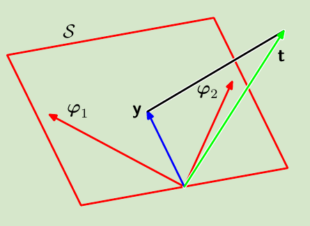
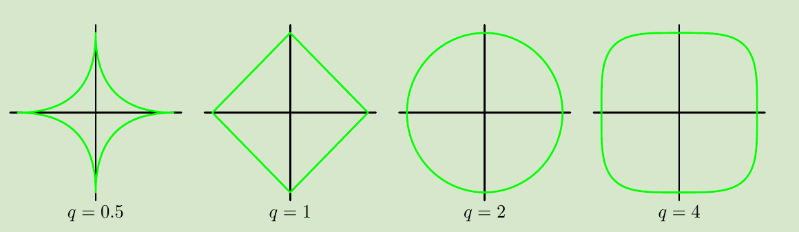
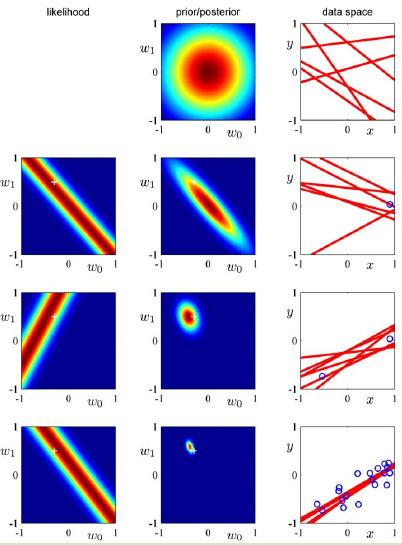
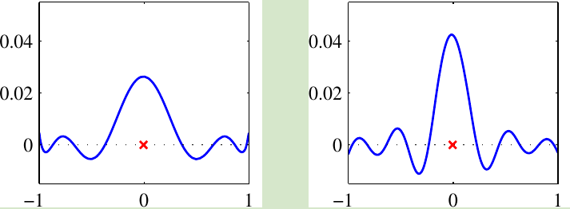
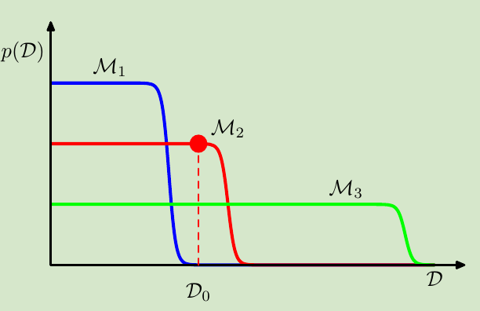

<!-- #! https://zhuanlan.zhihu.com/p/371376164 -->
<!--
 * @Author: ZhangLei mathcoder.zl@gmail.com
 * @Date: 2021-05-07 09:28:13
 * @LastEditors: ZhangLei mathcoder.zl@gmail.com
 * @LastEditTime: 2021-05-20 21:34:46
-->
# PRML学习笔记——第三章

- [PRML学习笔记——第三章](#prml学习笔记第三章)
  - [Linear Models for Regression](#linear-models-for-regression)
    - [3.1 Linear Basis Function Models](#31-linear-basis-function-models)
      - [3.1.1 Maximum likelihood and least squares](#311-maximum-likelihood-and-least-squares)
      - [3.1.2 Geometry of least squares](#312-geometry-of-least-squares)
      - [3.1.3 Sequential learning](#313-sequential-learning)
      - [3.1.4 Regularized least squares](#314-regularized-least-squares)
      - [3.1.5 Multiple outputs](#315-multiple-outputs)
    - [3.2. The Bias-Variance Decomposition](#32-the-bias-variance-decomposition)
    - [3.3. Bayesian Linear Regression](#33-bayesian-linear-regression)
      - [3.3.1 Parameter distribution](#331-parameter-distribution)
      - [3.3.2 Predictive distribution](#332-predictive-distribution)
      - [3.3.3 Equivalent kernel](#333-equivalent-kernel)
    - [3.4. Bayesian Model Comparison](#34-bayesian-model-comparison)
    - [3.5. The Evidence Approximation](#35-the-evidence-approximation)

## Linear Models for Regression

### 3.1 Linear Basis Function Models

最简单的用于回归的线性模型：
$$y(\mathbf{x}, \mathbf{w})=w_{0}+w_{1} x_{1}+\ldots+w_{D} x_{D}$$
被称为*linear regression*.这个model关于parameter是linear的，关于input variable也是linear的。一个一般的linear model只需要关于parameter线性：
$$y(\mathbf{x}, \mathbf{w})=w_{0}+\sum_{j=1}^{M-1} w_{j} \phi_{j}(\mathbf{x})$$
其中的$\phi_i(\mathbf{x})$可以是non-linear的，被称为basis funtion.这里的$w_0$是'bias'，我们也可以改写成：
$$y(\mathbf{x}, \mathbf{w})=\sum_{j=0}^{M-1} w_{j} \phi_{j}(\mathbf{x})=\mathbf{w}^{\mathrm{T}} \boldsymbol{\phi}(\mathbf{x})$$

#### 3.1.1 Maximum likelihood and least squares

假设target $t$有确定的函数$y(\mathbf{x}, \mathbf{w})$给出：
$$t=y(\mathbf{x}, \mathbf{w})+\epsilon$$
其中$\epsilon$是一个服从mean是0,precision是$\beta$的gaussian random noise.可以写成：
$$p(t \mid \mathbf{x}, \mathbf{w}, \beta)=\mathcal{N}\left(t \mid y(\mathbf{x}, \mathbf{w}), \beta^{-1}\right)$$
对于一个dataset，$\{\mathbf{x}_1,\ldots,\mathbf{x}_N\}$，target $t_1,\ldots,t_N$,基于i.i.d Gaussian的假设，有：
$$p(\mathbf{t} \mid \mathbf{X}, \mathbf{w}, \beta)=\prod_{n=1}^{N} \mathcal{N}\left(t_{n} \mid \mathbf{w}^{\mathrm{T}} \boldsymbol{\phi}\left(\mathbf{x}_{n}\right), \beta^{-1}\right)$$
求使该表达式最大的$\mathbf{w}$等价于least square:
$$E_{D}(\mathbf{w})=\frac{1}{2} \sum_{n=1}^{N}\left\{t_{n}-\mathbf{w}^{\mathrm{T}} \boldsymbol{\phi}\left(\mathbf{x}_{n}\right)\right\}^{2}$$
可以解出：
$$\mathbf{w}_{\mathrm{ML}}=\left(\boldsymbol{\Phi}^{\mathrm{T}} \boldsymbol{\Phi}\right)^{-1} \boldsymbol{\Phi}^{\mathrm{T}} \mathbf{t}$$
这被称为*normal equations* for least squares problem，$\boldsymbol{\Phi}$被称为*design matrix*.其中
$$\boldsymbol{\Phi}^{\dagger} \equiv\left(\boldsymbol{\Phi}^{\mathrm{T}} \boldsymbol{\Phi}\right)^{-1} \boldsymbol{\Phi}^{\mathrm{T}}$$
被称为*Moore-Penrose pseudo-inverse*.

#### 3.1.2 Geometry of least squares

*在一个N-dimensional space（axes是$t_1,\ldots,t_N$）*，least-square regression function就是找一个orthogonal projection，把data vector $\mathbf{t}$投影到由basis function所span得到的subspace上。

#### 3.1.3 Sequential learning

当data多的时候，用Sequential method就变得值得。假设我们现在要minimize SSE：$E = \sum_n{E_n}$,使用stochastic gradient descent(*sequential gradient descent*)求最优parameters $\mathbf{w}$的一般形式：

$$\mathbf{w}^{(\tau+1)}=\mathbf{w}^{(\tau)}-\eta \nabla E_{n}$$
对于SSE最小的问题来说就是：
$$\mathbf{w}^{(\tau+1)}=\mathbf{w}^{(\tau)}+\eta\left(t_{n}-\mathbf{w}^{(\tau) \mathrm{T}} \boldsymbol{\phi}_{n}\right) \boldsymbol{\phi}_{n}$$

这也被称为*least-mean-squares*(LMS) algorithm.

#### 3.1.4 Regularized least squares

在第一章的时候已经谈过在error function上增加regularization term防止over-fitting，总的error function是$E_{D}(\mathbf{w})+\lambda E_{W}(\mathbf{w})$,其中的$\lambda$用来控制两者的relative importance.一个SSE问题带正则项的最简单形式是：
$$\frac{1}{2} \sum_{n=1}^{N}\left\{t_{n}-\mathbf{w}^{\mathrm{T}} \boldsymbol{\phi}\left(\mathbf{x}_{n}\right)\right\}^{2}+\frac{\lambda}{2} \mathbf{w}^{\mathrm{T}} \mathbf{w}$$
这个问题有closed-form solution:
$$\mathbf{w}=\left(\lambda \mathbf{I}+\mathbf{\Phi}^{\mathrm{T}} \mathbf{\Phi}\right)^{-1} \mathbf{\Phi}^{\mathrm{T}} \mathbf{t}$$
更一般的正则化是：
$$\frac{1}{2} \sum_{n=1}^{N}\left\{t_{n}-\mathbf{w}^{\mathrm{T}} \boldsymbol{\phi}\left(\mathbf{x}_{n}\right)\right\}^{2}+\frac{\lambda}{2} \sum_{j=1}^{M}\left|w_{j}\right|^{q}$$

*对$q$取不同值时，regular term的contours*

#### 3.1.5 Multiple outputs

当我们需要predict $K>1$的target的时候，我们可以选择对每个$K$选择相同的basis function：
$$\mathbf{y}(\mathbf{x}, \mathbf{w})=\mathbf{W}^{\mathrm{T}} \boldsymbol{\phi}(\mathbf{x})$$
假设conditional distribution是isotropic Gaussian:
$$p(\mathbf{t} \mid \mathbf{x}, \mathbf{W}, \beta)=\mathcal{N}\left(\mathbf{t} \mid \mathbf{W}^{\mathrm{T}} \boldsymbol{\phi}(\mathbf{x}), \beta^{-1} \mathbf{I}\right)$$
同样maximum likelihood可以得到解：
$$\mathbf{W}_{\mathrm{ML}}=\left(\boldsymbol{\Phi}^{\mathrm{T}} \boldsymbol{\Phi}\right)^{-1} \boldsymbol{\Phi}^{\mathrm{T}} \mathbf{T}$$

### 3.2. The Bias-Variance Decomposition

在已知$p(t|\mathbf{x})$下，$h(\mathbf{x})$是最优Regression function：
$$h(\mathbf{x})=\mathbb{E}[t \mid \mathbf{x}]=\int t p(t \mid \mathbf{x}) \mathrm{d} t$$
但实际中并不知道$p(t|\mathbf{x})$，我们可以让expected Loss 最小来选择model $y(\mathbf{x})$.
$$\mathbb{E}[L]=\int\{y(\mathbf{x})-h(\mathbf{x})\}^{2} p(\mathbf{x}) \mathrm{d} \mathbf{x}+\int\{h(\mathbf{x})-t\}^{2} p(\mathbf{x}, t) \mathrm{d} \mathbf{x} \mathrm{d} t$$
这里面第二项与model无关，是data上的intrinsic noise.

假设我们在data $\mathcal{D}$下得到一个prediction function $y(\mathbf{x};\mathcal{D})$，那么expected loss中第一项的平方损失可以写成：
$$\begin{array}{l}
\left\{y(\mathbf{x} ; \mathcal{D})-\mathbb{E}_{\mathcal{D}}[y(\mathbf{x} ; \mathcal{D})]+\mathbb{E}_{\mathcal{D}}[y(\mathbf{x} ; \mathcal{D})]-h(\mathbf{x})\right\}^{2} \\
\quad\left\{y(\mathbf{x} ; \mathcal{D})-\mathbb{E}_{\mathcal{D}}[y(\mathbf{x} ; \mathcal{D})]\right\}^{2}+\left\{\mathbb{E}_{\mathcal{D}}[y(\mathbf{x} ; \mathcal{D})]-h(\mathbf{x})\right\}^{2} \\
\quad+2\left\{y(\mathbf{x} ; \mathcal{D})-\mathbb{E}_{\mathcal{D}}[y(\mathbf{x} ; \mathcal{D})]\right\}\left\{\mathbb{E}_{\mathcal{D}}[y(\mathbf{x} ; \mathcal{D})]-h(\mathbf{x})\right\}
\end{array}$$
若关于data求expectation：
$$\begin{array}{l}
\mathbb{E}_{\mathcal{D}}\left[\{y(\mathbf{x} ; \mathcal{D})-h(\mathbf{x})\}^{2}\right] \\
\quad=\underbrace{\left\{\mathbb{E}_{\mathcal{D}}[y(\mathbf{x} ; \mathcal{D})]-h(\mathbf{x})\right\}^{2}}_{\text {(bias) }^{2}}+\underbrace{\mathbb{E}_{\mathcal{D}}\left[\left\{y(\mathbf{x} ; \mathcal{D})-\mathbb{E}_{\mathcal{D}}[y(\mathbf{x} ; \mathcal{D})]\right\}^{2}\right]}_{\text {variance }} .
\end{array}$$
如此可以把开始的式子分解成三个部分：

expected loss $=(\text { bias })^{2}+$ variance $+$ noise

where
$$
\begin{aligned}
(\text { bias })^{2} &=\int\left\{\mathbb{E}_{\mathcal{D}}[y(\mathbf{x} ; \mathcal{D})]-h(\mathbf{x})\right\}^{2} p(\mathbf{x}) \mathrm{d} \mathbf{x} \\
\text { variance } &=\int \mathbb{E}_{\mathcal{D}}\left[\left\{y(\mathbf{x} ; \mathcal{D})-\mathbb{E}_{\mathcal{D}}[y(\mathbf{x} ; \mathcal{D})]\right\}^{2}\right] p(\mathbf{x}) \mathrm{d} \mathbf{x} \\
\text { noise } &=\int\{h(\mathbf{x})-t\}^{2} p(\mathbf{x}, t) \mathrm{d} \mathbf{x} \mathrm{d} t
\end{aligned}
$$
所以最终的问题是如何在$bias$和$variance$之间找一个balance，这是一个trade-off的问题。具体来说就是控制模型的complex和拟合效果。

### 3.3. Bayesian Linear Regression

#### 3.3.1 Parameter distribution

考虑一个最简单的拟合线性函数$y(x, \mathbf{w})=w_0+w_1x$的例子.

*仍然使用Gaussian和对应的共轭先验。使用sequential method估计posterior。图中可以看到随着data point增加，posterior越来越sharp.*

#### 3.3.2 Predictive distribution

实际中，我们感兴趣的是$p(t|\mathbf{t},\alpha,\beta)$,该predictive distribution的variance为
$$\sigma_{N}^{2}(\mathbf{x})=\frac{1}{\beta}+\phi(\mathbf{x})^{\mathrm{T}} \mathbf{S}_{N} \phi(\mathbf{x})$$

随着data point增加，第二项会逐渐趋向0.并且data point附近的variance会更小。

#### 3.3.3 Equivalent kernel

predictive mean($\mathbf{w}$取posterior的mean)能够写成：
$$y\left(\mathbf{x}, \mathbf{m}_{N}\right)=\mathbf{m}_{N}^{\mathrm{T}} \boldsymbol{\phi}(\mathbf{x})=\beta \boldsymbol{\phi}(\mathbf{x})^{\mathrm{T}} \mathbf{S}_{N} \boldsymbol{\Phi}^{\mathrm{T}} \mathbf{t}=\sum_{n=1}^{N} \beta \boldsymbol{\phi}(\mathbf{x})^{\mathrm{T}} \mathbf{S}_{N} \boldsymbol{\phi}\left(\mathbf{x}_{n}\right) t_{n}$$
$$y\left(\mathbf{x}, \mathbf{m}_{N}\right)=\sum_{n=1}^{N} k\left(\mathbf{x}, \mathbf{x}_{n}\right) t_{n}$$
其中$k\left(\mathbf{x}, \mathbf{x}^{\prime}\right)=\beta \boldsymbol{\phi}(\mathbf{x})^{\mathrm{T}} \mathbf{S}_{N} \boldsymbol{\phi}\left(\mathbf{x}^{\prime}\right)$被称为*smoother matrix* or *equivalent kernel*.
`note:`$K$做的就是对所有train data里的target做一个weighted sum.也可以称为*linear smoothers*.

*左边的是basis function取Gaussian，右边是取sigmoid，可以看到最终的equivalent kernel是相似的，都是在$\mathbf{x}$附近的data point具有更大的weight.*

### 3.4. Bayesian Model Comparison

假设有不同的models $\{\mathcal{M}_i\}$，evaluate不同model的posterior:
$$p\left(\mathcal{M}_{i} \mid \mathcal{D}\right) \propto p\left(\mathcal{M}_{i}\right) p\left(\mathcal{D} \mid \mathcal{M}_{i}\right)$$
帮助我们*model selection*/*model averaging*.其中的$p(\mathcal{M}_i)$是prior，$p(\mathcal{D}|\mathcal{M}_i)$是*model evidence*.*model evidence*有时也称*marginal likelihood*.

`note:`marginal 体现在：
$$p\left(\mathcal{D} \mid \mathcal{M}_{i}\right)=\int p\left(\mathcal{D} \mid \mathbf{w}, \mathcal{M}_{i}\right) p\left(\mathbf{w} \mid \mathcal{M}_{i}\right) \mathrm{d} \mathbf{w}$$
这其中$\mathcal{M}_i$是hyper parameter，$\mathbf{w}$是确定某个model类型后的parameter.我们要做的model comparison的核心就是model evidence $p(\mathcal{D}|\mathcal{M}_i)$.

*假设我们观测到的data是$\mathcal{D}_0$，现在有三种model $\{\mathcal{M}_1,\mathcal{M}_2,\mathcal{M}_3\}$,complexity依次增加。图中可以看到，小的model complexity只在小部分类型的data里可能性大，而最complex的模型虽然表达能力强，在各种data下都有概率，但是由于$p(\mathcal{D})$是normalize的，所以在某个具体观测data下，适当模型complex的是最可能的。(这也就说明了Bayes视角下对待over-fit的手段)*

### 3.5. The Evidence Approximation

由于fully Bayesian treatment需要对parameter $\mathbf{w}$和hyper-parameter $\alpha、\beta$积分，这是intractable.我们考虑一种近似手段，将hyper parameter的值由maximizing marginal likelihood先确定.predictive function为:
$$p(t \mid \mathbf{t})=\iiint p(t \mid \mathbf{w}, \beta) p(\mathbf{w} \mid \mathbf{t}, \alpha, \beta) p(\alpha, \beta \mid \mathbf{t}) \mathrm{d} \mathbf{w} \mathrm{d} \alpha \mathrm{d} \beta$$
接着approximate：
$$p(t \mid \mathbf{t}) \simeq p(t \mid \mathbf{t}, \widehat{\alpha}, \widehat{\beta})=\int p(t \mid \mathbf{w}, \widehat{\beta}) p(\mathbf{w} \mid \mathbf{t}, \widehat{\alpha}, \widehat{\beta}) \mathrm{d} \mathbf{w}$$
其中$\widehat{\alpha}、\widehat{\beta}$是$p(\alpha, \beta \mid \mathbf{t})$的尖峰.

<!-- 
---

**转载请注明出处，欢迎讨论交流。**

---

[我的Github](https://github.com/zhanglei1172)

[我的知乎](https://www.zhihu.com/people/zhang-lei-17-51)

我的Gmail：mathcoder.zl@gmail.com -->

