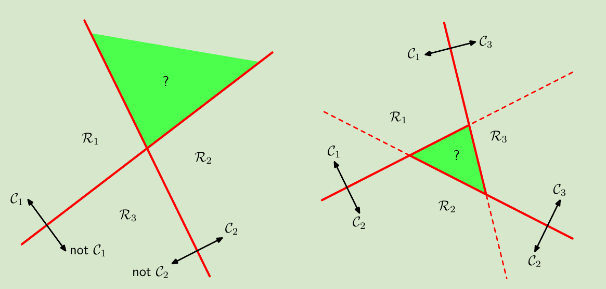
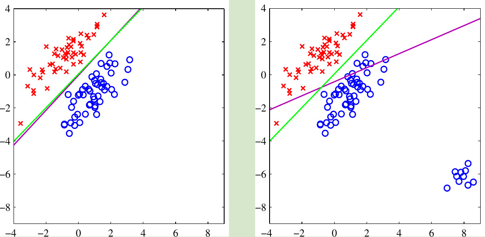

<!-- #! https://zhuanlan.zhihu.com/p/371770896 -->
<!--
 * @Author: ZhangLei mathcoder.zl@gmail.com
 * @Date: 2021-05-11 13:21:28
 * @LastEditors: ZhangLei mathcoder.zl@gmail.com
 * @LastEditTime: 2021-05-20 21:35:15
-->
# PRML学习笔记——第四章

- [PRML学习笔记——第四章](#prml学习笔记第四章)
  - [Linear Models for Classification](#linear-models-for-classification)
    - [4.1. Discriminant Functions](#41-discriminant-functions)
      - [4.1.1 Two classes](#411-two-classes)
      - [4.1.2 Multiple classes](#412-multiple-classes)
      - [4.1.3 Least squares for classification](#413-least-squares-for-classification)
      - [4.1.4 Fisher’s linear discriminant](#414-fishers-linear-discriminant)
      - [4.1.5 Relation to least squares](#415-relation-to-least-squares)
      - [4.1.6 Fisher’s discriminant for multiple classes](#416-fishers-discriminant-for-multiple-classes)
      - [4.1.7 The perceptron algorithm](#417-the-perceptron-algorithm)
    - [4.2. Probabilistic Generative Models](#42-probabilistic-generative-models)
      - [4.2.1 Continuous inputs](#421-continuous-inputs)
      - [4.2.2 Maximum likelihood solution](#422-maximum-likelihood-solution)
      - [4.2.3 Discrete features](#423-discrete-features)
    - [4.3. Probabilistic Discriminative Models](#43-probabilistic-discriminative-models)
      - [4.3.1 Fixed basis functions](#431-fixed-basis-functions)
      - [4.3.2 Logistic regression](#432-logistic-regression)
      - [4.3.3 Iterative reweighted least squares](#433-iterative-reweighted-least-squares)
      - [4.3.4 Multiclass logistic regression](#434-multiclass-logistic-regression)
      - [4.3.5 Probit regression](#435-probit-regression)
    - [4.4 The Laplace Approximation](#44-the-laplace-approximation)
    - [4.5. Bayesian Logistic Regression](#45-bayesian-logistic-regression)
      - [4.5.1 Laplace approximation](#451-laplace-approximation)
      - [4.5.2 Predictive distribution](#452-predictive-distribution)

## Linear Models for Classification

Datasets如果能被linear decision surface确切separate,就被称为*linear separable*.

### 4.1. Discriminant Functions

#### 4.1.1 Two classes

最简单的linear discriminator function可以是:
$$y(\mathbf{x})=\mathbf{w}^{\mathrm{T}} \mathbf{x}+w_{0}$$
原点到decision surface的距离为:
$$\frac{\mathbf{w}^{\mathrm{T}} \mathbf{x}}{\|\mathbf{w}\|}=-\frac{w_{0}}{\|\mathbf{w}\|}$$
空间中任一点到surface的距离为:
$$\frac{y(\mathbf{x})}{\|\mathbf{w}\|}$$

#### 4.1.2 Multiple classes

对于一个$K$分类问题,我们定义$K$个linear function:
$$y_{k}(\mathbf{x})=\mathbf{w}_{k}^{\mathrm{T}} \mathbf{x}+w_{k 0}$$
当$y_k(x)>y_j(x)$ for all $j \neq k$,就assign class $k$.并且$\mathcal{C}_k$和$\mathcal{C}_j$的decision boundary是
$$\left(\mathbf{w}_{k}-\mathbf{w}_{j}\right)^{\mathrm{T}} \mathbf{x}+\left(w_{k 0}-w_{j 0}\right)=0$$

*左图简单使用$K-1$个二分类器(one-versus-the-rest )会产生ambiguous region,右图使用$K(K-1)/2$个二分类器(one-versus-one)仍然会出现ambiguous region.*

#### 4.1.3 Least squares for classification

对于每一个类,都有一个linear model:
$$y_{k}(\mathbf{x})=\mathbf{w}_{k}^{\mathrm{T}} \mathbf{x}+w_{k 0}$$
group 起来就可以写成:$\mathbf{y}(\mathbf{x})=\widetilde{\mathbf{W}}^{\mathrm{T}} \widetilde{\mathbf{x}}$
优化目标是sum-of-square error:
$$E_{D}(\widetilde{\mathbf{W}})=\frac{1}{2} \operatorname{Tr}\left\{(\widetilde{\mathbf{X}} \widetilde{\mathbf{W}}-\mathbf{T})^{\mathrm{T}}(\widetilde{\mathbf{X}} \widetilde{\mathbf{W}}-\mathbf{T})\right\}$$
可以解出:
$$\widetilde{\mathbf{W}}=\left(\widetilde{\mathbf{X}}^{\mathrm{T}} \widetilde{\mathbf{X}}\right)^{-1} \widetilde{\mathbf{X}}^{\mathrm{T}} \mathbf{T}=\widetilde{\mathbf{X}}^{\dagger} \mathbf{T}$$

*这样的模型很大的问题就是no robustness,如图上的紫色线受右下角蓝色data point影响.*

#### 4.1.4 Fisher’s linear discriminant

一种以dimensionality reduction为视角的linear discriminator model:
$$y=\mathbf{w}^{\mathrm{T}}\mathbf{x}$$
$y$是个scalar,只要设定个threshold就能用来classify.
基本思想是让两个class的mean在投影到一维空间后尽可能靠的远(between-class),并且两类投影后各自的covariance尽可能小(within-class).于是maximize:
$$J(\mathbf{w})=\frac{\mathbf{w}^{\mathrm{T}} \mathbf{S}_{\mathrm{B}} \mathbf{w}}{\mathbf{w}^{\mathrm{T}} \mathbf{S}_{\mathrm{W}} \mathbf{w}}$$
其中:$\mathbf{S}_{\mathrm{B}}=\left(\mathbf{m}_{2}-\mathbf{m}_{1}\right)\left(\mathbf{m}_{2}-\mathbf{m}_{1}\right)^{\mathrm{T}}$,$\mathbf{S}_{\mathbf{W}}=\sum_{n \in \mathcal{C}_{1}}\left(\mathbf{x}_{n}-\mathbf{m}_{1}\right)\left(\mathbf{x}_{n}-\mathbf{m}_{1}\right)^{\mathrm{T}}+\sum_{n \in \mathcal{C}_{2}}\left(\mathbf{x}_{n}-\mathbf{m}_{2}\right)\left(\mathbf{x}_{n}-\mathbf{m}_{2}\right)^{\mathrm{T}} .$.对$\mathbf{w}$求微分:
$$\left(\mathbf{w}^{\mathrm{T}} \mathbf{S}_{\mathrm{B}} \mathbf{w}\right) \mathbf{S}_{\mathbf{W}} \mathbf{w}=\left(\mathbf{w}^{\mathrm{T}} \mathbf{S}_{\mathbf{W}} \mathbf{w}\right) \mathbf{S}_{\mathrm{B}} \mathbf{w}$$
又括号内是scalar,$\mathbf{S}_{\mathbf{W}}$与$(\mathbf{m_2-m_1})$同向,所以:
$$\mathbf{w} \propto \mathbf{S}_{\mathrm{W}}^{-1}\left(\mathbf{m}_{2}-\mathbf{m}_{1}\right)$$

#### 4.1.5 Relation to least squares

在least-squares的方法中,将$\mathcal{C_1}$的target设为$N/N_1$,$\mathcal{C_2}$的target设为$-N/N_2$,得到的解与Fisher solution一样.

#### 4.1.6 Fisher’s discriminant for multiple classes

考虑有$K>2$个类,可以将input space投影到$K-1$维的空间.
$$\mathbf{y}=\mathbf{W}^{\mathrm{T}}\mathbf{x}$$
类似二分类的想法,使用between-class covariance最大,within-class covariance最小的目标:
$$J(\mathbf{W})=\operatorname{Tr}\left\{\left(\mathbf{W}^{\mathrm{T}} \mathbf{S}_{\mathrm{W}} \mathbf{W}\right)^{-1}\left(\mathbf{W}^{\mathrm{T}} \mathbf{S}_{\mathrm{B}} \mathbf{W}\right)\right\}$$
其中
$$\begin{array}{c}
\mathbf{S}_{\mathrm{W}}=\sum_{k=1}^{K} \sum_{n \in \mathcal{C}_{k}}\left(\mathbf{y}_{n}-\boldsymbol{\mu}_{k}\right)\left(\mathbf{y}_{n}-\boldsymbol{\mu}_{k}\right)^{\mathrm{T}} \\
\mathbf{S}_{\mathrm{B}}=\sum_{k=1}^{K} N_{k}\left(\boldsymbol{\mu}_{k}-\boldsymbol{\mu}\right)\left(\boldsymbol{\mu}_{k}-\boldsymbol{\mu}\right)^{\mathrm{T}}
\end{array}$$

#### 4.1.7 The perceptron algorithm

perceptron 是个仅用于二分类的算法,discriminator function是
$$y(\mathbf{x})=f\left(\mathbf{w}^{\mathrm{T}} \boldsymbol{\phi}(\mathbf{x})\right)$$
这里的$f(\cdot)$是一个step function:
$$
f(a)=\left\{\begin{array}{ll}
+1, & a \geqslant 0 \\
-1, & a<0
\end{array}\right.
$$
$\boldsymbol{\phi{(x)}}$是basis function.通过minimize一个error function优化$\mathbf{w}$:
$$E_{\mathrm{P}}(\mathbf{w})=-\sum_{n \in \mathcal{M}} \mathbf{w}^{\mathrm{T}} \boldsymbol{\phi}_{n} t_{n}$$
使用stochastic gradient descent去优化这个function:
$$\mathbf{w}^{(\tau+1)}=\mathbf{w}^{(\tau)}-\eta \nabla E_{\mathrm{P}}(\mathbf{w})=\mathbf{w}^{(\tau)}+\eta \boldsymbol{\phi}_{n} t_{n}$$

### 4.2. Probabilistic Generative Models

现在我们来考虑二分类的posterior:
$$\begin{aligned}
p\left(\mathcal{C}_{1} \mid \mathbf{x}\right) &=\frac{p\left(\mathbf{x} \mid \mathcal{C}_{1}\right) p\left(\mathcal{C}_{1}\right)}{p\left(\mathbf{x} \mid \mathcal{C}_{1}\right) p\left(\mathcal{C}_{1}\right)+p\left(\mathbf{x} \mid \mathcal{C}_{2}\right) p\left(\mathcal{C}_{2}\right)} \\
&=\frac{1}{1+\exp (-a)}=\sigma(a)
\end{aligned}$$
其中$a=\ln \frac{p\left(\mathbf{x} \mid \mathcal{C}_{1}\right) p\left(\mathcal{C}_{1}\right)}{p\left(\mathbf{x} \mid \mathcal{C}_{2}\right) p\left(\mathcal{C}_{2}\right)}$,$\sigma(a)$被称为*logistic sigmoid*.

但多分类的时候:
$$\begin{aligned}
p\left(\mathcal{C}_{k} \mid \mathbf{x}\right) &=\frac{p\left(\mathbf{x} \mid \mathcal{C}_{k}\right) p\left(\mathcal{C}_{k}\right)}{\sum_{j} p\left(\mathbf{x} \mid \mathcal{C}_{j}\right) p\left(\mathcal{C}_{j}\right)} \\
&=\frac{\exp \left(a_{k}\right)}{\sum_{j} \exp \left(a_{j}\right)}
\end{aligned}$$
其中$a_{k}=\ln p\left(\mathbf{x} \mid \mathcal{C}_{k}\right) p\left(\mathcal{C}_{k}\right)$.式中的normalized exponential也被称为*softmax function*.

#### 4.2.1 Continuous inputs

假设input variable服从同covariance的Gaussian:
$$p\left(\mathbf{x} \mid \mathcal{C}_{k}\right)=\frac{1}{(2 \pi)^{D / 2}} \frac{1}{|\mathbf{\Sigma}|^{1 / 2}} \exp \left\{-\frac{1}{2}\left(\mathbf{x}-\boldsymbol{\mu}_{k}\right)^{\mathrm{T}} \boldsymbol{\Sigma}^{-1}\left(\mathbf{x}-\boldsymbol{\mu}_{k}\right)\right\} .
$$
posterior是:
$$p\left(\mathcal{C}_{1} \mid \mathbf{x}\right)=\sigma\left(\mathbf{w}^{\mathrm{T}} \mathbf{x}+w_{0}\right)$$
其中
$$\begin{aligned}
\mathbf{w} &=\boldsymbol{\Sigma}^{-1}\left(\boldsymbol{\mu}_{1}-\boldsymbol{\mu}_{2}\right) \\
w_{0} &=-\frac{1}{2} \boldsymbol{\mu}_{1}^{\mathrm{T}} \boldsymbol{\Sigma}^{-1} \boldsymbol{\mu}_{1}+\frac{1}{2} \boldsymbol{\mu}_{2}^{\mathrm{T}} \boldsymbol{\Sigma}^{-1} \boldsymbol{\mu}_{2}+\ln \frac{p\left(\mathcal{C}_{1}\right)}{p\left(\mathcal{C}_{2}\right)}
\end{aligned}$$
观察到quadratic消失了,也就意味着decision boundary是linear的.若不假设不同class covariance一致,那么得到的decision boundary是曲面.

#### 4.2.2 Maximum likelihood solution

仍然假设data关于类别服从共covariance的Gaussian.二分类为例,$t_n=1$是$\mathcal{C}_1$,$t_n=0$是$\mathcal{C}_2$,设prior是$p(\mathcal{C}_1)=\pi$,$p(\mathcal{C}_2)=1-\pi$,则posterior:
$$p\left(\mathbf{x}_{n}, \mathcal{C}_{1}\right)=p\left(\mathcal{C}_{1}\right) p\left(\mathbf{x}_{n} \mid \mathcal{C}_{1}\right)=\pi \mathcal{N}\left(\mathbf{x}_{n} \mid \boldsymbol{\mu}_{1}, \mathbf{\Sigma}\right) .$$
$$p\left(\mathbf{x}_{n}, \mathcal{C}_{2}\right)=p\left(\mathcal{C}_{2}\right) p\left(\mathbf{x}_{n} \mid \mathcal{C}_{2}\right)=(1-\pi) \mathcal{N}\left(\mathbf{x}_{n} \mid \boldsymbol{\mu}_{2}, \mathbf{\Sigma}\right)$$
可以计算likelihood:
$$p\left(\mathbf{t} \mid \pi, \boldsymbol{\mu}_{1}, \boldsymbol{\mu}_{2}, \boldsymbol{\Sigma}\right)=\prod_{n=1}^N\left[\pi \mathcal{N}\left(\mathbf{x}_{n} \mid \boldsymbol{\mu}_{1}, \boldsymbol{\Sigma}\right)\right]^{t_{n}}\left[(1-\pi) \mathcal{N}\left(\mathbf{x}_{n} \mid \boldsymbol{\mu}_{2}, \boldsymbol{\Sigma}\right)\right]^{1-t_{n}}$$
MLE的结果:
$$\boldsymbol{\mu}_{1}=\frac{1}{N_{1}} \sum_{n=1}^{N} t_{n} \mathbf{x}_{n}\\
\mu_{2}=\frac{1}{N_{2}} \sum_{n=1}^{N}\left(1-t_{n}\right) \mathbf{x}_{n}$$
$$\begin{array}{l}
-\frac{1}{2} \sum_{n=1}^{N} t_{n} \ln |\mathbf{\Sigma}|-\frac{1}{2} \sum_{n=1}^{N} t_{n}\left(\mathbf{x}_{n}-\boldsymbol{\mu}_{1}\right)^{\mathrm{T}} \boldsymbol{\Sigma}^{-1}\left(\mathbf{x}_{n}-\boldsymbol{\mu}_{1}\right) \\
-\frac{1}{2} \sum_{n=1}^{N}\left(1-t_{n}\right) \ln |\boldsymbol{\Sigma}|-\frac{1}{2} \sum_{n=1}^{N}\left(1-t_{n}\right)\left(\mathbf{x}_{n}-\boldsymbol{\mu}_{2}\right)^{\mathrm{T}} \boldsymbol{\Sigma}^{-1}\left(\mathbf{x}_{n}-\boldsymbol{\mu}_{2}\right) \\
=-\frac{N}{2} \ln |\boldsymbol{\Sigma}|-\frac{N}{2} \operatorname{Tr}\left\{\boldsymbol{\Sigma}^{-1} \mathbf{S}\right\}
\end{array}$$
其中
$$\begin{aligned}
\mathbf{S} &=\frac{N_{1}}{N} \mathbf{S}_{1}+\frac{N_{2}}{N} \mathbf{S}_{2} \\
\mathbf{S}_{1} &=\frac{1}{N_{1}} \sum_{n \in \mathcal{C}_{1}}\left(\mathbf{x}_{n}-\boldsymbol{\mu}_{1}\right)\left(\mathbf{x}_{n}-\boldsymbol{\mu}_{1}\right)^{\mathrm{T}} \\
\mathbf{S}_{2} &=\frac{1}{N_{2}} \sum_{n \in \mathcal{C}_{2}}\left(\mathbf{x}_{n}-\boldsymbol{\mu}_{2}\right)\left(\mathbf{x}_{n}-\boldsymbol{\mu}_{2}\right)^{\mathrm{T}} .
\end{aligned}$$
最终$\boldsymbol{\Sigma}=\mathbf{S}$.也就是两类的weighted average of covariance.

#### 4.2.3 Discrete features

当input是discrete时,考虑变量是binary,做*naive bayes*假设:所有变量都是independent,所以class-conditional distribution:
$$p\left(\mathbf{x} \mid \mathcal{C}_{k}\right)=\prod_{i=1}^{D} \mu_{k i}^{x_{i}}\left(1-\mu_{k i}\right)^{1-x_{i}}$$

### 4.3. Probabilistic Discriminative Models

#### 4.3.1 Fixed basis functions

目前的model都是关于parameter是linear的,但由于basis function(可以是nonlinear)的存在,尽管decision boundary在feature space中是linear,关于input space可以是nonlinear.

#### 4.3.2 Logistic regression

考虑二分类的情况,sigmoid有个微分性质:
$$\frac{d \sigma}{d a}=\sigma(1-\sigma)$$
设$t_n\in \{0,1\}$,likelihood function可写成:
$$p(\mathbf{t} \mid \mathbf{w})=\prod_{n=1}^{N} y_{n}^{t_{n}}\left\{1-y_{n}\right\}^{1-t_{n}}$$
通过取negative logarithm of the likelihood(NLL/cross entropy error):
$$E(\mathbf{w})=-\ln p(\mathbf{t} \mid \mathbf{w})=-\sum_{n=1}^{N}\left\{t_{n} \ln y_{n}+\left(1-t_{n}\right) \ln \left(1-y_{n}\right)\right\}$$
求gradient:
$$\nabla E(\mathbf{w})=\sum_{n=1}^{N}\left(y_{n}-t_{n}\right) \phi_{n}$$
如此可以用gradient descent来解.

`note:`由于logistic regression实际是MLE,所以不可避免会引入over-fit,通过加入regularization或者求MAP最大可以解决.

#### 4.3.3 Iterative reweighted least squares

logistic regression的cross entropy error无法得到closed-form solution是因为一阶导中包含了非线性(sigmoid)的求和.利用*Newton-Raphson* iterative optimization scheme,我们可以更efficient求解:
$$\mathbf{w}^{(\text {new })}=\mathbf{w}^{(\text {old })}-\mathbf{H}^{-1} \nabla E(\mathbf{w})$$
首先求出cross entropy的一阶导和hessian matrix:
$$\begin{aligned}
\nabla E(\mathbf{w}) &=\sum_{n=1}^{N}\left(y_{n}-t_{n}\right) \phi_{n}=\mathbf{\Phi}^{\mathrm{T}}(\mathbf{y}-\mathbf{t}) \\
\mathbf{H} &=\nabla \nabla E(\mathbf{w})=\sum_{n=1}^{N} y_{n}\left(1-y_{n}\right) \boldsymbol{\phi}_{n} \boldsymbol{\phi}_{n}^{\mathrm{T}}=\mathbf{\Phi}^{\mathrm{T}} \mathbf{R} \boldsymbol{\Phi}
\end{aligned}$$
其中的$\mathbf{R}$是$n\times n$的diagonal matrix,对角元素为:
$$R_{n n}=y_{n}\left(1-y_{n}\right)$$
由于$1>y_n>0$,所以$\mathbf{H}$是正定的,也就说明logistic regression有global minimum solution.
IRLS:
$$\begin{aligned}
\mathbf{w}^{(\text {new })} &=\mathbf{w}^{(\text {old })}-\left(\mathbf{\Phi}^{\mathrm{T}} \mathbf{R} \Phi\right)^{-1} \mathbf{\Phi}^{\mathrm{T}}(\mathbf{y}-\mathbf{t}) \\
&=\left(\mathbf{\Phi}^{\mathrm{T}} \mathbf{R} \boldsymbol{\Phi}\right)^{-1}\left\{\mathbf{\Phi}^{\mathrm{T}} \mathbf{R} \Phi \mathbf{w}^{(\text {old })}-\mathbf{\Phi}^{\mathrm{T}}(\mathbf{y}-\mathbf{t})\right\} \\
&=\left(\mathbf{\Phi}^{\mathrm{T}} \mathbf{R} \boldsymbol{\Phi}\right)^{-1} \mathbf{\Phi}^{\mathrm{T}} \mathbf{R} \mathbf{z}
\end{aligned}$$

#### 4.3.4 Multiclass logistic regression

多分类的posterior为:
$$p\left(\mathcal{C}_{k} \mid \boldsymbol{\phi}\right)=y_{k}(\boldsymbol{\phi})=\frac{\exp \left(a_{k}\right)}{\sum_{j} \exp \left(a_{j}\right)}$$
其中$a_{k}=\mathbf{w}_{k}^{\mathrm{T}} \boldsymbol{\phi}$.

softmax的derivation也有性质:
$$\frac{\partial y_{k}}{\partial a_{j}}=y_{k}\left(I_{k j}-y_{j}\right)$$
使用likelihood:
$$p\left(\mathbf{T} \mid \mathbf{w}_{1}, \ldots, \mathbf{w}_{K}\right)=\prod_{n=1}^{N} \prod_{k=1}^{K} p\left(\mathcal{C}_{k} \mid \phi_{n}\right)^{t_{n k}}=\prod_{n=1}^{N} \prod_{k=1}^{K} y_{n k}^{t_{n k}}$$
NLL为:
$$E\left(\mathbf{w}_{1}, \ldots, \mathbf{w}_{K}\right)=-\ln p\left(\mathbf{T} \mid \mathbf{w}_{1}, \ldots, \mathbf{w}_{K}\right)=-\sum_{n=1}^{N} \sum_{k=1}^{K} t_{n k} \ln y_{n k}$$
类似于二分类的logistic regression,多分类有类似的优化形式:
$$\nabla_{\mathbf{w}_{j}} E\left(\mathbf{w}_{1}, \ldots, \mathbf{w}_{K}\right)=\sum_{n=1}^{N}\left(y_{n j}-t_{n j}\right) \phi_{n}\\
\nabla_{\mathbf{w}_{k}} \nabla_{\mathbf{w}_{j}} E\left(\mathbf{w}_{1}, \ldots, \mathbf{w}_{K}\right)=-\sum_{n=1}^{N} y_{n k}\left(I_{k j}-y_{n j}\right) \phi_{n} \boldsymbol{\phi}_{n}^{\mathrm{T}}$$

#### 4.3.5 Probit regression

posterior被描述为linear combination of feature后的activation输出.$p(t=1 \mid a)=f(a)$,这里的$f(\cdot)$即为activation.通过设置阈值$\theta$来给出target类别:
$$\left\{\begin{array}{ll}
t_{n}=1 & \text { if } a_{n} \geqslant \theta \\
t_{n}=0 & \text { otherwise }
\end{array}\right.$$
现在把$\theta$看成从一个从$p(\theta)$的distribution里抽取得到的,那么activation function可以这样给出
$$f(a)=\int_{-\infty}^{a} p(\theta) \mathrm{d} \theta$$
当$\theta$取标准正态分布的时候:
$$\Phi(a)=\int_{-\infty}^{a} \mathcal{N}(\theta \mid 0,1) \mathrm{d} \theta$$
被称为*probit function*.使用了这个函数作为activation function时的GLM(generalize linear model)被称为*probit regression*.

`note:`由于probit带有二次项,所以比logistic regresion更易收outliers影响.

### 4.4 The Laplace Approximation

由于sigmoid等一些非线性activation function的存在,无法进行解析积分$p(z)$.Laplace approximation是使用Gaussian的$q(z)$去approximate$p(z)$,来解决这个问题.设要被近似的概率为$p(z)=\frac{1}{Z} f(z)$.其中$Z$用作normalization.我们使用概率的众数$z_0$点:
$$\left.\frac{d f(z)}{d z}\right|_{z=z_{0}}=0$$
在$z_0$使用Taylor展开:
$$\ln f(z) \simeq \ln f\left(z_{0}\right)-\frac{1}{2} A\left(z-z_{0}\right)^{2}$$
其中$A=-\left.\frac{d^{2}}{d z^{2}} \ln f(z)\right|_{z=z_{0}}$.如此可以用Gaussian去近似$p(z)$:
$$q(z)=\left(\frac{A}{2 \pi}\right)^{1 / 2} \exp \left\{-\frac{A}{2}\left(z-z_{0}\right)^{2}\right\}$$

### 4.5. Bayesian Logistic Regression

#### 4.5.1 Laplace approximation

prior用Gaussian:
$$p(\mathbf{w})=\mathcal{N}\left(\mathbf{w} \mid \mathbf{m}_{0}, \mathbf{S}_{0}\right)$$
likelihood用laplace approximate,并利用bayes' theorem $p(\mathbf{w} \mid \mathbf{t}) \propto p(\mathbf{w}) p(\mathbf{t} \mid \mathbf{w})$求posterior最大:
$$\begin{aligned}
\ln p(\mathbf{w} \mid \mathbf{t})=&-\frac{1}{2}\left(\mathbf{w}-\mathbf{m}_{0}\right)^{\mathrm{T}} \mathbf{S}_{0}^{-1}\left(\mathbf{w}-\mathbf{m}_{0}\right) \\
&+\sum_{n=1}^{N}\left\{t_{n} \ln y_{n}+\left(1-t_{n}\right) \ln \left(1-y_{n}\right)\right\}+\mathrm{const}
\end{aligned}$$
这样得到的解是MAP解:
$$q(\mathbf{w})=\mathcal{N}\left(\mathbf{w} \mid \mathbf{w}_{\mathrm{MAP}}, \mathbf{S}_{N}\right)$$

#### 4.5.2 Predictive distribution

现在考虑marginalize这一步:
$$p\left(\mathcal{C}_{1} \mid \boldsymbol{\phi}, \mathbf{t}\right)=\int p\left(\mathcal{C}_{1} \mid \boldsymbol{\phi}, \mathbf{w}\right) p(\mathbf{w} \mid \mathbf{t}) \mathrm{d} \mathbf{w} \simeq \int \sigma\left(\mathbf{w}^{\mathrm{T}} \boldsymbol{\phi}\right) q(\mathbf{w}) \mathrm{d} \mathbf{w}$$
引入$\delta$函数:
$$\sigma\left(\mathbf{w}^{\mathrm{T}} \boldsymbol{\phi}\right)=\int \delta\left(a-\mathbf{w}^{\mathrm{T}} \boldsymbol{\phi}\right) \sigma(a) \mathrm{d} a$$
最后predictive function:
$$p\left(\mathcal{C}_{1} \mid \mathbf{t}\right)=\int \sigma(a) p(a) \mathrm{d} a=\int \sigma(a) \mathcal{N}\left(a \mid \mu_{a}, \sigma_{a}^{2}\right) \mathrm{d} a$$

<!-- ---

**转载请注明出处，欢迎讨论交流。**

---

[我的Github](https://github.com/zhanglei1172)

[我的知乎](https://www.zhihu.com/people/zhang-lei-17-51)

我的Gmail：mathcoder.zl@gmail.com -->
