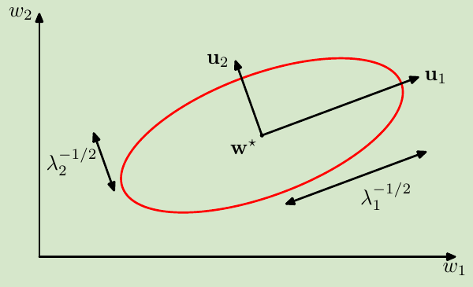
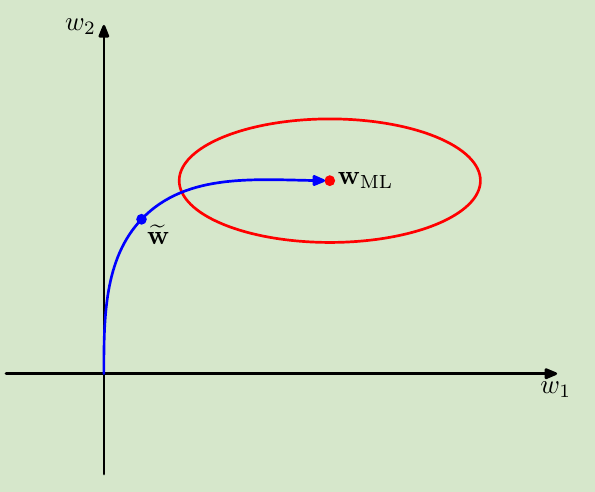
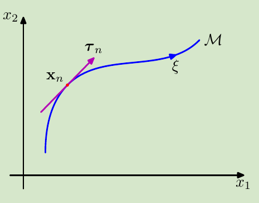

<!-- #! https://zhuanlan.zhihu.com/p/372585844 -->
<!--
 * @Author: ZhangLei mathcoder.zl@gmail.com
 * @Date: 2021-05-13 14:51:15
 * @LastEditors: ZhangLei mathcoder.zl@gmail.com
 * @LastEditTime: 2021-05-20 21:36:01
-->

# PRML学习笔记——第五章

- [PRML学习笔记——第五章](#prml学习笔记第五章)
  - [Neural Network](#neural-network)
    - [Feed-forward Network Functions](#feed-forward-network-functions)
      - [5.1.1 Weight-space symmetries](#511-weight-space-symmetries)
    - [5.2. Network Training](#52-network-training)
      - [5.2.1 Parameter optimization](#521-parameter-optimization)
      - [5.2.2 Local quadratic approximation](#522-local-quadratic-approximation)
      - [5.2.3 Use of gradient information](#523-use-of-gradient-information)
      - [5.2.4 Gradient descent optimization](#524-gradient-descent-optimization)
    - [5.3. Error Backpropagation](#53-error-backpropagation)
      - [5.3.3 Efficiency of backpropagation](#533-efficiency-of-backpropagation)
      - [5.3.4 The Jacobian matrix](#534-the-jacobian-matrix)
    - [5.4. The Hessian Matrix](#54-the-hessian-matrix)
      - [5.4.1 Diagonal approximation](#541-diagonal-approximation)
      - [5.4.2 Outer product approximation](#542-outer-product-approximation)
      - [5.4.3 Inverse Hessian](#543-inverse-hessian)
      - [5.4.4 Finite differences](#544-finite-differences)
      - [5.4.5 Exact evaluation of the Hessian](#545-exact-evaluation-of-the-hessian)
      - [5.4.6 Fast multiplication by the Hessian](#546-fast-multiplication-by-the-hessian)
    - [5.5. Regularization in Neural Networks](#55-regularization-in-neural-networks)
      - [5.5.1 Consistent Gaussian priors](#551-consistent-gaussian-priors)
      - [5.5.2 Early stopping](#552-early-stopping)
      - [5.5.3 Invariances](#553-invariances)
      - [5.5.4 Tangent propagation](#554-tangent-propagation)
      - [5.5.5 Training with transformed data](#555-training-with-transformed-data)
      - [5.5.6 Convolutional networks](#556-convolutional-networks)
      - [5.5.7 Soft weight sharing](#557-soft-weight-sharing)
    - [5.6 Mixture Density Networks](#56-mixture-density-networks)
    - [5.7 Bayesian Neural Networks](#57-bayesian-neural-networks)

## Neural Network

### Feed-forward Network Functions

前面讨论的model的一般形式:
$$y(\mathbf{x}, \mathbf{w})=f\left(\sum_{j=1}^{M} w_{j} \phi_{j}(\mathbf{x})\right)$$
其中的$\phi$是fix的basis function,如果考虑把basis function也引入parameter,这就是neural network.
$$y_{k}(\mathbf{x}, \mathbf{w})=\sigma\left(\sum_{j=0}^{M} w_{k j}^{(2)} h\left(\sum_{i=0}^{D} w_{j i}^{(1)} x_{i}\right)\right)$$
这是两层network.

#### 5.1.1 Weight-space symmetries

对于一个general network,同样的从input到output的mapping function可以用不同的$\mathbf{w}$来实现,这被称为weight-space symmetries.

### 5.2. Network Training

1. 对于regression,activation取identity function, loss取SSE.
2. 对于one-class classification,activation取一个logistic sigmoid output, loss取NLL(cross entropy).
3. 对于multiclass classification,activation取softmax, loss取multiclass cross entropy.

#### 5.2.1 Parameter optimization

Neural network无法保证loss在参数空间上是convex的.满足$\nabla E(\mathbf{w})=0$的weight可能到达minimum,maximum,saddle points.因此一般来说只期望找到一个local minimum(并且general来说也无法知道是不是global minimum).

好在neural network是连续的,所以可以通过迭代的方法,每次更新搜索方向,得到一个较好的解.

#### 5.2.2 Local quadratic approximation

考虑$E(\mathbf{w})$在$\hat{\mathbf{w}}$的Taylor展开:
$$E(\mathbf{w}) \simeq E(\widehat{\mathbf{w}})+(\mathbf{w}-\widehat{\mathbf{w}})^{\mathrm{T}} \mathbf{b}+\frac{1}{2}(\mathbf{w}-\widehat{\mathbf{w}})^{\mathrm{T}} \mathbf{H}(\mathbf{w}-\widehat{\mathbf{w}})$$
为了从几何上看,考虑$\mathbf{H}$的eigenvalue:
$$\mathbf{H u}_{i}=\lambda_{i} \mathbf{u}_{i}$$
那么空间中任意一个$\mathbf{w}$ vector都可以表示成:$\mathbf{w}-\mathbf{w}^{\star}=\sum_{i} \alpha_{i} \mathbf{u}_{i}$,想当于先将坐标origin平移到$\mathbf{w^\star}$,然后再将坐标轴旋转align到每个$\mathbf{H}$的eigenvector.

那么:
$$E(\mathbf{w})=E\left(\mathbf{w}^{\star}\right)+\frac{1}{2} \sum_{i} \lambda_{i} \alpha_{i}^{2}$$
现在:$\mathbf{H}$正定$\iff$所有eigenvalue大于0$\iff E(\mathbf{w^\star})$是local minimum.

#### 5.2.3 Use of gradient information

不使用Gradient information,每次求minimum都需要$O\left(W^{3}\right)$.使用gradient information,可以降为$O\left(W^{2}\right)$.

#### 5.2.4 Gradient descent optimization

Optimize neural network parameter的一个简单且有效的method就是gradient descent:
$$\mathbf{w}^{(\tau+1)}=\mathbf{w}^{(\tau)}-\eta \nabla E\left(\mathbf{w}^{(\tau)}\right)$$
当使用whole dataset 更新一次weight时被称为*batch* methods.

另一个版本是on-line 的gradient descent:
$$\mathbf{w}^{(\tau+1)}=\mathbf{w}^{(\tau)}-\eta \nabla E_{n}\left(\mathbf{w}^{(\tau)}\right)$$
也被称为sequential gradient descent/ stochastic gradient descent.好处是不仅更新快,并且容易跳出local minimum.

### 5.3. Error Backpropagation

1. 首先输入input vector $\mathbf{x}_n$到network,并利用
   $$a_{j}=\sum_{i} w_{j i} z_{i}$$
   $$z_{j}=h\left(a_{j}\right) .$$
   直到计算得到output
2. Evaluating $\delta_k$ for every **output** unit:
   $$\delta_{j} \equiv \frac{\partial E_{n}}{\partial a_{j}}=\sum_{k} \frac{\partial E_{n}}{\partial a_{k}} \frac{\partial a_{k}}{\partial a_{j}}$$
3. backpropagate $\delta$:
   $$\delta_{j}=h^{\prime}\left(a_{j}\right) \sum_{k} w_{k j} \delta_{k}$$
4. 计算所有unit的gradient:
   $$\frac{\partial E_{n}}{\partial w_{j i}}=\delta_{j} z_{i}$$

#### 5.3.3 Efficiency of backpropagation

Backpropagation的复杂度是$O(W)$.考虑若用数值差分的方法替代:
$$\frac{\partial E_{n}}{\partial w_{j i}}=\frac{E_{n}\left(w_{j i}+\epsilon\right)-E_{n}\left(w_{j i}\right)}{\epsilon}+O(\epsilon)\\
\frac{\partial E_{n}}{\partial w_{j i}}=\frac{E_{n}\left(w_{j i}+\epsilon\right)-E_{n}\left(w_{j i}-\epsilon\right)}{2 \epsilon}+O\left(\epsilon^{2}\right)$$
由于对于每个weight都需要单独计算绕动,所以导致复杂度变成了$O(W^2)$.

#### 5.3.4 The Jacobian matrix

Jacobian matrix同样可以通过反向传播来计算.
$$\begin{aligned}
J_{k i}=\frac{\partial y_{k}}{\partial x_{i}} &=\sum_{j} \frac{\partial y_{k}}{\partial a_{j}} \frac{\partial a_{j}}{\partial x_{i}} \\
&=\sum_{j} w_{j i} \frac{\partial y_{k}}{\partial a_{j}}
\end{aligned}$$
$$\begin{aligned}
\frac{\partial y_{k}}{\partial a_{j}} &=\sum_{l} \frac{\partial y_{k}}{\partial a_{l}} \frac{\partial a_{l}}{\partial a_{j}} \\
&=h^{\prime}\left(a_{j}\right) \sum_{l} w_{l j} \frac{\partial y_{k}}{\partial a_{l}}
\end{aligned}$$
这样就能递归地得到结果.

### 5.4. The Hessian Matrix

#### 5.4.1 Diagonal approximation

Hessian Matrix的element为:
$$\frac{\partial^{2} E}{\partial w_{j i} \partial w_{l k}}$$
直接求解整个matrix的每个element复杂度是$O(W)$.当假设所有非对角元素为0时能简化计算到$O(W)$.
对每个对角元素:
$$\frac{\partial^{2} E_{n}}{\partial w_{j i}^{2}}=\frac{\partial^{2} E_{n}}{\partial a_{j}^{2}} z_{i}^{2}$$
利用链式微分法则:
$$\frac{\partial^{2} E_{n}}{\partial a_{j}^{2}}=h^{\prime}\left(a_{j}\right)^{2} \sum_{k} \sum_{k^{\prime}} w_{k j} w_{k^{\prime} j} \frac{\partial^{2} E_{n}}{\partial a_{k} \partial a_{k^{\prime}}}+h^{\prime \prime}\left(a_{j}\right) \sum_{k} w_{k j} \frac{\partial E^{n}}{\partial a_{k}}$$
假设非对角元素都是0:
$$\frac{\partial^{2} E_{n}}{\partial a_{j}^{2}}=h^{\prime}\left(a_{j}\right)^{2} \sum_{k} w_{k j}^{2} \frac{\partial^{2} E_{n}}{\partial a_{k}^{2}}+h^{\prime \prime}\left(a_{j}\right) \sum_{k} w_{k j} \frac{\partial E_{n}}{\partial a_{k}}$$

#### 5.4.2 Outer product approximation

对于SSE的error function:
$$E=\frac{1}{2} \sum_{n=1}^{N}\left(y_{n}-t_{n}\right)^{2}$$
Hessian matrix可以写成:
$$\mathbf{H}=\nabla \nabla E=\sum_{n=1}^{N} \nabla y_{n} \nabla y_{n}+\sum_{n=1}^{N}\left(y_{n}-t_{n}\right) \nabla \nabla y_{n}$$
前面谈到过对于一个最优的Regression solution就是$\mathbb{E}[\mathbf{t}|\mathbf{x}]$.这也就意味着$\nabla\nabla y_n$项可以被忽略.所以:
$$\mathbf{H} \simeq \sum_{n=1}^{N} \mathbf{b}_{n} \mathbf{b}_{n}^{\mathrm{T}}$$
其中$\mathbf{b}_{n}=\nabla y_{n}=\nabla a_{n}$,因为activation就是identity.

对于Cross entropy error function和sigmoid activation来说:
$$\mathbf{H} \simeq \sum_{n=1}^{N} y_{n}\left(1-y_{n}\right) \mathbf{b}_{n} \mathbf{b}_{n}^{\mathrm{T}}$$

#### 5.4.3 Inverse Hessian

因为$\mathbf{H}_{N}=\sum_{n=1}^{N} \mathbf{b}_{n} \mathbf{b}_{n}^{\mathrm{T}}$.我们可以sequential估计$\mathbf{H}$:
$$\mathbf{H}_{L+1}=\mathbf{H}_{L}+\mathbf{b}_{L+1} \mathbf{b}_{L+1}^{\mathrm{T}}$$
为了sequential估计Hessian的inverse,引入一个matrix identity:
$$\left(\mathbf{M}+\mathbf{v v}^{\mathrm{T}}\right)^{-1}=\mathbf{M}^{-1}-\frac{\left(\mathbf{M}^{-1} \mathbf{v}\right)\left(\mathbf{v}^{\mathrm{T}} \mathbf{M}^{-1}\right)}{1+\mathbf{v}^{\mathrm{T}} \mathbf{M}^{-1} \mathbf{v}}$$
那么:
$$\mathbf{H}_{L+1}^{-1}=\mathbf{H}_{L}^{-1}-\frac{\mathbf{H}_{L}^{-1} \mathbf{b}_{L+1} \mathbf{b}_{L+1}^{\mathrm{T}} \mathbf{H}_{L}^{-1}}{1+\mathbf{b}_{L+1}^{\mathrm{T}} \mathbf{H}_{L}^{-1} \mathbf{b}_{L+1}}$$

#### 5.4.4 Finite differences

如果直接使用finite difference 来求出Hessian matrix:
$$\begin{array}{l}
\frac{\partial^{2} E}{\partial w_{j i} \partial w_{l k}}=\frac{1}{4 \epsilon^{2}}\left\{E\left(w_{j i}+\epsilon, w_{l k}+\epsilon\right)-E\left(w_{j i}+\epsilon, w_{l k}-\epsilon\right)\right. \\
\left.-E\left(w_{j i}-\epsilon, w_{l k}+\epsilon\right)+E\left(w_{j i}-\epsilon, w_{l k}-\epsilon\right)\right\}+O\left(\epsilon^{2}\right)
\end{array}$$
这里面一共$O(W^2)$元素,每个元素需要$O(W)$的operation,所以总的复杂度是$O(W^3)$.

现在只在第二阶difference时使用一次central difference:
$$\frac{\partial^{2} E}{\partial w_{j i} \partial w_{l k}}=\frac{1}{2 \epsilon}\left\{\frac{\partial E}{\partial w_{j i}}\left(w_{l k}+\epsilon\right)-\frac{\partial E}{\partial w_{j i}}\left(w_{l k}-\epsilon\right)\right\}+O\left(\epsilon^{2}\right)$$
现在只需要perturbe一共$O(W)$个weight,从而总的开销是$O(W^2)$

#### 5.4.5 Exact evaluation of the Hessian

记:
$$\delta_{k}=\frac{\partial E_{n}}{\partial a_{k}}, \quad M_{k k^{\prime}} \equiv \frac{\partial^{2} E_{n}}{\partial a_{k} \partial a_{k^{\prime}}}$$
Hessian matrix可以精确的计算得到,考虑以最简单的一层hidden layer为例.
$$\frac{\partial^{2} E_{n}}{\partial w_{j i}^{(1)} \partial w_{k j^{\prime}}^{(2)}}=x_{i} h^{\prime}\left(a_{j^{\prime}}\right)\left\{\delta_{k} I_{j j^{\prime}}+z_{j} \sum_{k^{\prime}} w_{k^{\prime} j^{\prime}}^{(2)} H_{k k^{\prime}}\right\}$$

#### 5.4.6 Fast multiplication by the Hessian

有时候计算Hessian的目的只是为了得到$\mathbf{v}^\mathrm{T}\mathbf{H}$的结果.也就是只需要$O(W)$的storage.如此跳过计算Hessian这个中间步骤更加高效.

Take note:
$$\mathbf{v}^{\mathrm{T}} \mathbf{H}=\mathbf{v}^{\mathrm{T}} \nabla(\nabla E)\\
\mathcal{R}\{\cdot\}=\mathbf{v}^{\mathrm{T}}\nabla$$
有$\mathcal{R}\{\mathbf{w}\}=\mathbf{v}$.

类似计算weight的gradient的forward和backward propagation可以计算所有
$$\begin{array}{l}
\mathcal{R}\left\{\frac{\partial E}{\partial w_{k j}}\right\}=\mathcal{R}\left\{\delta_{k}\right\} z_{j}+\delta_{k} \mathcal{R}\left\{z_{j}\right\} \\
\mathcal{R}\left\{\frac{\partial E}{\partial w_{j i}}\right\}=x_{i} \mathcal{R}\left\{\delta_{j}\right\}
\end{array}$$
即$\mathbf{v}^{\mathrm{T}}\mathbf{H}$的element.

### 5.5. Regularization in Neural Networks

Neural network的input size和output size是由dataset决定,而hidden layer的大小代表了model的complexity.一个重要的问题是如何balance between under-fit与over-fit.

#### 5.5.1 Consistent Gaussian priors

最直接的加入regularizer:
$$\widetilde{E}(\mathbf{w})=E(\mathbf{w})+\frac{\lambda}{2} \mathbf{w}^{\mathrm{T}} \mathbf{w}$$
但这种方式破坏了consistent(假设input或者output经过线性变换,consistent的network是weight对应线性变换保持mapping function不变).这会导致network会favour某个解相比另一个等价解.

一种解决方式是给每层weight加入不同的regularizer:
$$\frac{\lambda_{1}}{2} \sum_{w \in \mathcal{W}_{1}} w^{2}+\frac{\lambda_{2}}{2} \sum_{w \in \mathcal{W}_{2}} w^{2}$$
即对应prior:
$$p\left(\mathbf{w} \mid \alpha_{1}, \alpha_{2}\right) \propto \exp \left(-\frac{\alpha_{1}}{2} \sum_{w \in \mathcal{W}_{1}} w^{2}-\frac{\alpha_{2}}{2} \sum_{w \in \mathcal{W}_{2}} w^{2}\right)$$
但是这种prior是improper的(由于bias parameter unconstrained,无法被normalize).

更general的做法是将parameter group起来,每个group有不同的prior:
$$\begin{array}{c}
p(\mathbf{w}) \propto \exp \left(-\frac{1}{2} \sum_{k} \alpha_{k}\|\mathbf{w}\|_{k}^{2}\right) \\
\|\mathbf{w}\|_{k}^{2}=\sum_{j \in \mathcal{W}_{k}} w_{j}^{2}
\end{array}$$

#### 5.5.2 Early stopping

Early stopping 旨在只保留validation set中最低error下的model.这其实和regularization类似.$\tau\eta$扮演了regularization中$\lambda$的角色($\tau$是迭代次数,$\eta$是学习率).

*类似于MAP的正则效果(MAP的先验体现在将最优的$\tilde{w}$往原点拉)*

#### 5.5.3 Invariances

许多application of neural network都需要一个property:**invariances**.例如handwriting digits recognize任务,当一张digit image作translate或rotation等一些变化后,得到的结果仍然是同一个数字.

最直接的方法是提供足够多的data,让model去adaptive这种invariance.但实际中会受data limit,这就需要考虑其他的方法:
1. Data augument.人为在origin data上加入一些transform.
2. Regularization.当input发生一个transform后,penalize model output的change(*tangent propagation*)
3. Invariance feature prepossess.将model的input替换为hand-craft的invariance feature.(这对特征要求高,即要保留足够information去recognize,又要具有invariance的property)
4. Build a neural network with invariance property.

#### 5.5.4 Tangent propagation

先做些简化假设:只考虑continuous transform(translate,rotation,not flip),transform只收一个parameter $\xi$.

当一个transform在$\mathbf{x}$上做一个连续不断的作用时,会得到一个input space上的一个manifold.

*一个example,原始的input是$x_n$,transform会沿着$\mathcal{M}$产生新的$\mathbf{x}$,其中的$\boldsymbol{\tau}_n$是$\mathcal{M}$在$\mathbf{x}_n$上的tangent.*

Tangent定义:
$$\boldsymbol{\tau}_{n}=\left.\frac{\partial \mathbf{s}\left(\mathbf{x}_{n}, \xi\right)}{\partial \xi}\right|_{\xi=0}$$

Model output关于这个transform的影响是:
$$\left.\frac{\partial y_{k}}{\partial \xi}\right|_{\xi=0}=\left.\sum_{i=1}^{D} \frac{\partial y_{k}}{\partial x_{i}} \frac{\partial x_{i}}{\partial \xi}\right|_{\xi=0}=\sum_{i=1}^{D} J_{k i} \tau_{i}$$

其中的$\mathbf{J}$是Jacobian matrix.这样就很自然的,对这个影响加上regularization就是增加model的invariance:
$$\Omega=\frac{1}{2} \sum_{n} \sum_{k}\left(\left.\frac{\partial y_{n k}}{\partial \xi}\right|_{\xi=0}\right)^{2}=\frac{1}{2} \sum_{n} \sum_{k}\left(\sum_{i=1}^{D} J_{n k i} \tau_{n i}\right)^{2}$$

#### 5.5.5 Training with transformed data

其实等价于regularization的方法.

#### 5.5.6 Convolutional networks

convolution network通过local receptive,weight share,subsampling实现invariance.
每层layer的unit以grid的形式排列.

#### 5.5.7 Soft weight sharing

Convolution是对weight加入hard constrain,让每个group的weight相等.现在考虑让每个group的weight尽可能similar,这样可以增加network的表达能力.

之前在对network加入weight decay也就是加入了对weight的Gaussian prior.现在使用多个group的Gaussian prior,每个group都是一个Gaussian,那么所有weight的probability:
$$\begin{array}{c}
p(\mathbf{w})=\prod_{i} p\left(w_{i}\right) \\
p\left(w_{i}\right)=\sum_{j=1}^{M} \pi_{j} \mathcal{N}\left(w_{i} \mid \mu_{j}, \sigma_{j}^{2}\right)
\end{array}$$
取negative logarithm可以得出对应的regularization term:
$$\Omega(\mathbf{w})=-\sum_{i} \ln \left(\sum_{j=1}^{M} \pi_{j} \mathcal{N}\left(w_{i} \mid \mu_{j}, \sigma_{j}^{2}\right)\right) .$$
最终的error function变为:
$$\widetilde{E}(\mathbf{w})=E(\mathbf{w})+\lambda \Omega(\mathbf{w})$$
为了minimize整个error function,对所有未知的parameter求derivatives再利用optimization methods就能训练model.

### 5.6 Mixture Density Networks

之前谈过,SSE function就是基于Gaussian noise的假设,但是实际中很多model并不是基于Gaussian的,强行使用就会导致范化性很差.

我们因此寻找一个conditional probability output而不是简单的mean.这样的输出$p(\mathbf{t}|\mathbf{x})$就能适用任意distribution的假设.

现在考虑使用mixture of Gaussian:
$$p(\mathbf{t} \mid \mathbf{x})=\sum_{k=1}^{K} \pi_{k}(\mathbf{x}) \mathcal{N}\left(\mathbf{t} \mid \boldsymbol{\mu}_{k}(\mathbf{x}), \sigma_{k}^{2}(\mathbf{x})\right)$$
所有未知参数都通过network的output来得到.其中的mixture coefficient满足:
$$\sum_{k=1}^{K} \pi_{k}(\mathbf{x})=1, \quad 0 \leqslant \pi_{k}(\mathbf{x}) \leqslant 1$$
这可以通过softmax的activation function实现.
error function为:
$$E(\mathbf{w})=-\sum_{n=1}^{N} \ln \left\{\sum_{k=1}^{k} \pi_{k}\left(\mathbf{x}_{n}, \mathbf{w}\right) \mathcal{N}\left(\mathbf{t}_{n} \mid \boldsymbol{\mu}_{k}\left(\mathbf{x}_{n}, \mathbf{w}\right), \sigma_{k}^{2}\left(\mathbf{x}_{n}, \mathbf{w}\right)\right)\right\}$$
只要对所有parameter微分并update,就能数值求解model.

### 5.7 Bayesian Neural Networks

1. 先利用prior和likelihood求出$\mathbf{w}$的MAP.
2. predictive function就可以写出解析形式.(由于network的非线性,用Laplace approximate)
3. 利用model evidence寻找最优hyper parameter(再次用到Laplace approximate)

<!-- ---

**转载请注明出处，欢迎讨论交流。**

---

[我的Github](https://github.com/zhanglei1172)

[我的知乎](https://www.zhihu.com/people/zhang-lei-17-51)

我的Gmail：mathcoder.zl@gmail.com -->