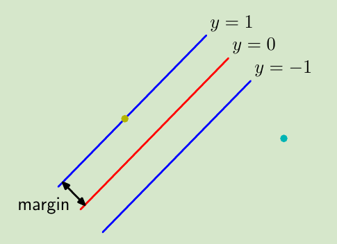
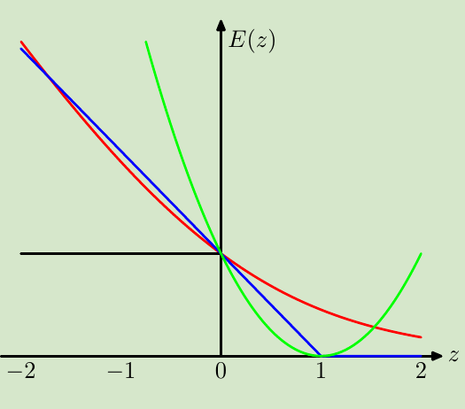

<!-- #! https://zhuanlan.zhihu.com/p/373352535 -->
<!--
 * @Author: ZhangLei mathcoder.zl@gmail.com
 * @Date: 2021-05-17 14:38:46
 * @LastEditors: ZhangLei mathcoder.zl@gmail.com
 * @LastEditTime: 2021-05-20 21:37:13
-->

# PRML学习笔记——第七章

- [PRML学习笔记——第七章](#prml学习笔记第七章)
  - [Sparse Kernel Machines](#sparse-kernel-machines)
    - [Maximum Margin Classifiers](#maximum-margin-classifiers)
      - [7.1.1 Overlapping class distributions](#711-overlapping-class-distributions)
      - [7.1.2 Relation to logistic regression](#712-relation-to-logistic-regression)
      - [7.1.3 Multiclass SVMs](#713-multiclass-svms)
      - [7.1.4 SVMs for regression](#714-svms-for-regression)
    - [7.2. Relevance Vector Machines](#72-relevance-vector-machines)
      - [7.2.1 RVM for regression](#721-rvm-for-regression)
      - [7.2.3 RVM for classification](#723-rvm-for-classification)

## Sparse Kernel Machines

### Maximum Margin Classifiers

首先以一个二分类为例,考虑一个在feature space上的linearly separable problem,定义一个linear model:
$$y(\mathbf{x})=\mathbf{w}^{\mathrm{T}} \boldsymbol{\phi}(\mathbf{x})+b$$
在SVM中将target定义为$t_n\in\{0,1\}$,优化目标为最大化*margin*.

*margin示意图,表示离超平面最近vector到超平面的距离*

空间中点到平面距离定义为$|y(\mathbf{x})| /\|\mathbf{w}\|$.在这里我们只关心那些能正确分类所有类别的model solution,所以有:
$$\frac{t_{n} y\left(\mathbf{x}_{n}\right)}{\|\mathbf{w}\|}=\frac{t_{n}\left(\mathbf{w}^{\mathrm{T}} \boldsymbol{\phi}\left(\mathbf{x}_{n}\right)+b\right)}{\|\mathbf{w}\|}$$
有个这个距离表示,我们就可以形式化的写出最大化margin的目标表示:
$$\underset{\mathbf{w}, b}{\arg \max }\left\{\frac{1}{\|\mathbf{w}\|} \min _{n}\left[t_{n}\left(\mathbf{w}^{\mathrm{T}} \boldsymbol{\phi}\left(\mathbf{x}_{n}\right)+b\right)\right]\right\}$$
考虑到$\mathbf{w}\rightarrow \mathcal{k}\mathbf{w}, b\rightarrow \mathcal{k}b$并不影响目标函数值,我们可以简单设置一个约束(保证只有唯一的解):
$$t_{n}\left(\mathbf{w}^{\mathrm{T}} \boldsymbol{\phi}\left(\mathbf{x}_{n}\right)+b\right)=1$$
其中$n$是计算margin用到的point.然后自然就另一个约束:
$$t_{n}\left(\mathbf{w}^{\mathrm{T}} \boldsymbol{\phi}\left(\mathbf{x}_{n}\right)+b\right) \geqslant 1, \quad n=1, \ldots, N$$
现在,优化目标就可以表示为:
$$\arg \min _{\mathbf{w}, b} \frac{1}{2}\|\mathbf{w}\|^{2}$$
这是个带约束的优化问题.利用lagrange multipliers $a_n\geq 0$:
$$L(\mathbf{w}, b, \mathbf{a})=\frac{1}{2}\|\mathbf{w}\|^{2}-\sum_{n=1}^{N} a_{n}\left\{t_{n}\left(\mathbf{w}^{\mathrm{T}} \boldsymbol{\phi}\left(\mathbf{x}_{n}\right)+b\right)-1\right\}$$
求偏导令为0:
$$\begin{aligned}
\mathbf{w} &=\sum_{n=1}^{N} a_{n} t_{n} \boldsymbol{\phi}\left(\mathbf{x}_{n}\right) \\
0 &=\sum_{n=1}^{N} a_{n} t_{n}
\end{aligned}$$
结果回带到$L$:
$$\widetilde{L}(\mathbf{a})=\sum_{n=1}^{N} a_{n}-\frac{1}{2} \sum_{n=1}^{N} \sum_{m=1}^{N} a_{n} a_{m} t_{n} t_{m} k\left(\mathbf{x}_{n}, \mathbf{x}_{m}\right)$$
constrains:
$$\begin{aligned}
a_{n} \geqslant 0, & n=1, \ldots, N, \\
\sum_{n=1}^{N} a_{n} t_{n}=0 . &
\end{aligned}$$
其中$k\left(\mathbf{x}, \mathbf{x}^{\prime}\right)=\boldsymbol{\phi}(\mathbf{x})^{\mathrm{T}} \boldsymbol{\phi}\left(\mathbf{x}^{\prime}\right)$.至此我们就只需要解这个优化问题即可.由优化理论,这个问题的解满足KKT条件:
$$\begin{aligned}
a_{n} & \geqslant 0 \\
t_{n} y\left(\mathbf{x}_{n}\right)-1 & \geqslant 0 \\
a_{n}\left\{t_{n} y\left(\mathbf{x}_{n}\right)-1\right\} &=0 .
\end{aligned}$$

现在假设我们已经求出了上面的解(二次规划).我们的model可以这样表示:
$$y(\mathbf{x})=\sum_{n=1}^{N} a_{n} t_{n} k\left(\mathbf{x}, \mathbf{x}_{n}\right)+b$$
可以看到由于KKT条件中的互补松弛条件$a_{n}\left\{t_{n} y\left(\mathbf{x}_{n}\right)-1\right\}=0$,可以用这个公式解b:
$$b=\frac{1}{N_{\mathcal{S}}} \sum_{n \in \mathcal{S}}\left(t_{n}-\sum_{m \in \mathcal{S}} a_{m} t_{m} k\left(\mathbf{x}_{n}, \mathbf{x}_{m}\right)\right)$$
其中的$\mathcal{S}$是所有support vectors set.这就是硬间隔的SVM.

#### 7.1.1 Overlapping class distributions

很多时候classify problem并不是separable,比如两个类别的distribution有部分overlap.这时就算变换到高维的特征空间也无法做的完全可分.

为了解决这个问题,引入一个slake variable $\xi$.当data在这正确的margin上或以外时,$\xi_n=0$;反之$\xi_n=|t_n-y(\mathbf{x_n})|$.即原本hard margin的约束变成了:
$$t_{n} y\left(\mathbf{x}_{n}\right) \geqslant 1-\xi_{n}, \quad n=1, \ldots, N$$
这就被称为*soft margin*.我们的目标是maximize margin同时也要给那些分到wrong side(包括分类正确但在margin以内的)一些penalize:
$$C \sum_{n=1}^{N} \xi_{n}+\frac{1}{2}\|\mathbf{w}\|^{2}$$
其中$C>0$类似于正则项的倒数.当$C\rightarrow \infty$时,就是hard margin的svm.

同样继续使用Lagrange multipliers:
$$L(\mathbf{w}, b, \mathbf{a})=\frac{1}{2}\|\mathbf{w}\|^{2}+C \sum_{n=1}^{N} \xi_{n}-\sum_{n=1}^{N} a_{n}\left\{t_{n} y\left(\mathbf{x}_{n}\right)-1+\xi_{n}\right\}-\sum_{n=1}^{N} \mu_{n} \xi_{n}$$
对应有KKT约束:
$$\begin{aligned}
a_{n} & \geqslant 0 \\
t_{n} y\left(\mathbf{x}_{n}\right)-1+\xi_{n} & \geqslant 0 \\
a_{n}\left(t_{n} y\left(\mathbf{x}_{n}\right)-1+\xi_{n}\right) &=0 \\
\mu_{n} & \geqslant 0 \\
\xi_{n} & \geqslant 0 \\
\mu_{n} \xi_{n} &=0
\end{aligned}$$
求偏导为0,回带掉$\mathbf{w}$和$b$有:
$$\widetilde{L}(\mathbf{a})=\sum_{n=1}^{N} a_{n}-\frac{1}{2} \sum_{n=1}^{N} \sum_{m=1}^{N} a_{n} a_{m} t_{n} t_{m} k\left(\mathbf{x}_{n}, \mathbf{x}_{m}\right)$$
subject to
$$\begin{array}{l}
0 \leqslant a_{n} \leqslant C \\
\sum_{n=1}^{N} a_{n} t_{n}=0
\end{array}$$
这仍然是个二次规划问题,并且和hard margin在形式上只差在多个$a_n\leqslant C$的约束.如果$0<a_n<C$那么此时的data在margin上,标记这些data的集合为$\mathcal{M}$,可求:
$$b=\frac{1}{N_{\mathcal{M}}} \sum_{n \in \mathcal{M}}\left(t_{n}-\sum_{m \in \mathcal{S}} a_{m} t_{m} k\left(\mathbf{x}_{n}, \mathbf{x}_{m}\right)\right)$$

#### 7.1.2 Relation to logistic regression

*红:logistic regression的error curve;绿:least squares的error curve;蓝:svm的error curve.*

可以看到对于最小化误分类任务,一个单调递减的误分类误差函数是比较好的选择.

#### 7.1.3 Multiclass SVMs

使用最广的还是one-versus-the-rest方法,训练$k-1$个classifiers.尽管存在两个问题:
1. 可能存在ambiguous的region
2. 可能导致训练样本不均衡的问题

svm进一步扩展能用来做single-class problem(unsupervised learning).目标是找一个smooth boundary使得包围一个high density region.

#### 7.1.4 SVMs for regression

回忆之前的regularization linear regression的error function:
$$\frac{1}{2} \sum_{n=1}^{N}\left\{y_{n}-t_{n}\right\}^{2}+\frac{\lambda}{2}\|\mathbf{w}\|^{2}$$
为了获得*sparse solutions*,将quadratic term替换为$\epsilon$*-insensitive error function*:
$$E_{\epsilon}(y(\mathbf{x})-t)=\left\{\begin{array}{ll}
0, & \text { if }|y(\mathbf{x})-t|<\epsilon \\
|y(\mathbf{x})-t|-\epsilon, & \text { otherwise }
\end{array}\right.\\
C \sum_{n=1}^{N} E_{\epsilon}\left(y\left(\mathbf{x}_{n}\right)-t_{n}\right)+\frac{1}{2}\|\mathbf{w}\|^{2}$$
这里的$C$类似于$1/\lambda$的作用.仍然引入slack variable $\xi_n\geqslant 0,\hat{\xi}_n\geqslant 0$分别代表above和below的error:
$$\begin{array}{l}
t_{n} \leqslant y\left(\mathbf{x}_{n}\right)+\epsilon+\xi_{n} \\
t_{n} \geqslant y\left(\mathbf{x}_{n}\right)-\epsilon-\widehat{\xi}_{n} .
\end{array}$$
现在的error function就可表示为:
$$C \sum_{n=1}^{N}\left(\xi_{n}+\widehat{\xi}_{n}\right)+\frac{1}{2}\|\mathbf{w}\|^{2}$$
同样使用lagrange multipliers:
$$\begin{aligned}
L=& C \sum_{n=1}^{N}\left(\xi_{n}+\widehat{\xi}_{n}\right)+\frac{1}{2}\|\mathbf{w}\|^{2}-\sum_{n=1}^{N}\left(\mu_{n} \xi_{n}+\widehat{\mu}_{n} \widehat{\xi}_{n}\right) \\
&-\sum_{n=1}^{N} a_{n}\left(\epsilon+\xi_{n}+y_{n}-t_{n}\right)-\sum_{n=1}^{N} \widehat{a}_{n}\left(\epsilon+\widehat{\xi}_{n}-y_{n}+t_{n}\right) .
\end{aligned}$$
令偏导为0:
$$\begin{array}{l}
\frac{\partial L}{\partial \mathbf{w}}=0 \Rightarrow \mathbf{w}=\sum_{n=1}^{N}\left(a_{n}-\widehat{a}_{n}\right) \phi\left(\mathbf{x}_{n}\right) \\
\frac{\partial L}{\partial b}=0 \Rightarrow \sum_{n=1}^{N}\left(a_{n}-\widehat{a}_{n}\right)=0 \\
\frac{\partial L}{\partial \xi_{n}}=0 \Rightarrow a_{n}+\mu_{n}=C \\
\frac{\partial L}{\partial \widehat{\xi}_{n}}=0 \Rightarrow \widehat{a}_{n}+\widehat{\mu}_{n}=C
\end{array}$$
回带到$L$,得到dual形式:
$$\begin{aligned}
\widetilde{L}(\mathbf{a}, \widehat{\mathbf{a}})=&-\frac{1}{2} \sum_{n=1}^{N} \sum_{m=1}^{N}\left(a_{n}-\widehat{a}_{n}\right)\left(a_{m}-\widehat{a}_{m}\right) k\left(\mathbf{x}_{n}, \mathbf{x}_{m}\right) \\
&-\epsilon \sum_{n=1}^{N}\left(a_{n}+\widehat{a}_{n}\right)+\sum_{n=1}^{N}\left(a_{n}-\widehat{a}_{n}\right) t_{n}
\end{aligned}\\
\begin{array}{l}
0 \leqslant a_{n} \leqslant C \\
0 \leqslant \widehat{a}_{n} \leqslant C
\end{array}$$
用KKT条件:
$$\begin{aligned}
a_{n}\left(\epsilon+\xi_{n}+y_{n}-t_{n}\right) &=0 \\
\widehat{a}_{n}\left(\epsilon+\widehat{\xi}_{n}-y_{n}+t_{n}\right) &=0 \\
\left(C-a_{n}\right) \xi_{n} &=0 \\
\left(C-\widehat{a}_{n}\right) \widehat{\xi}_{n} &=0 .
\end{aligned}$$
support vector只包含那些$0<a_n$或$0<\widehat{a}_n$的point.

### 7.2. Relevance Vector Machines

#### 7.2.1 RVM for regression

假设target $t$服从Gaussian:$p(t \mid \mathbf{x}, \mathbf{w}, \beta)=\mathcal{N}\left(t \mid y(\mathbf{x}), \beta^{-1}\right)$.其中$y(\mathbf{x})=\sum_{i=1}^{M} w_{i} \phi_{i}(\mathbf{x})=\mathbf{w}^{\mathrm{T}} \boldsymbol{\phi}(\mathbf{x})$.

由此likelihood:
$$p(\mathbf{t} \mid \mathbf{X}, \mathbf{w}, \beta)=\prod_{n=1}^{N} p\left(t_{n} \mid \mathbf{x}_{n}, \mathbf{w}, \beta^{-1}\right)$$
给出weight的prior:$p(\mathbf{w} \mid \boldsymbol{\alpha})=\prod_{i=1}^{M} \mathcal{N}\left(w_{i} \mid 0, \alpha_{i}^{-1}\right)$.值得注意的是这里的precision是一个diagonal matrix,每个对角元素不一定相等.

有了prior和likelihood,利用bayes' theorem得出posterior:
$$p(\mathbf{w} \mid \mathbf{t}, \mathbf{X}, \boldsymbol{\alpha}, \beta)=\mathcal{N}(\mathbf{w} \mid \mathbf{m}, \mathbf{\Sigma})\\
\begin{aligned}
\mathbf{m} &=\beta \boldsymbol{\Sigma} \boldsymbol{\Phi}^{\mathrm{T}} \mathbf{t} \\
\boldsymbol{\Sigma} &=\left(\mathbf{A}+\beta \boldsymbol{\Phi}^{\mathrm{T}} \boldsymbol{\Phi}\right)^{-1}
\end{aligned}$$
接下来让marginal likelihood最大:
$$p(\mathbf{t} \mid \mathbf{X}, \boldsymbol{\alpha}, \beta)=\int p(\mathbf{t} \mid \mathbf{X}, \mathbf{w}, \beta) p(\mathbf{w} \mid \boldsymbol{\alpha}) \mathrm{d} \mathbf{w}$$
通过迭代可以解出$\alpha^*,\beta^*$.最后带入predict function:
$$\begin{aligned}
p\left(t \mid \mathbf{x}, \mathbf{X}, \mathbf{t}, \boldsymbol{\alpha}^{\star}, \beta^{\star}\right) &=\int p\left(t \mid \mathbf{x}, \mathbf{w}, \beta^{\star}\right) p\left(\mathbf{w} \mid \mathbf{X}, \mathbf{t}, \boldsymbol{\alpha}^{\star}, \beta^{\star}\right) \mathrm{d} \mathbf{w} \\
&=\mathcal{N}\left(t \mid \mathbf{m}^{\mathrm{T}} \boldsymbol{\phi}(\mathbf{x}), \sigma^{2}(\mathbf{x})\right)
\end{aligned}\\
\sigma^{2}(\mathbf{x})=\left(\beta^{\star}\right)^{-1}+\phi(\mathbf{x})^{\mathrm{T}} \boldsymbol{\Sigma} \phi(\mathbf{x})$$

最后的结果中$\alpha_j\rightarrow \infty$说明$\mathbf{w}_j$是0,所以只有部分$\mathbf{w}$其作用,也就对应着sparse solution.

#### 7.2.3 RVM for classification

对于classify problem,只需要再套一个sigmoid function:
$$y(\mathbf{x}, \mathbf{w})=\sigma\left(\mathbf{w}^{\mathrm{T}} \boldsymbol{\phi}(\mathbf{x})\right)$$
由于无法得出解析形式的posterior,使用laplace approximate.求mode of posterior:
$$\begin{array}{l}
\ln p(\mathbf{w} \mid \mathbf{t}, \boldsymbol{\alpha})=\ln \{p(\mathbf{t} \mid \mathbf{w}) p(\mathbf{w} \mid \boldsymbol{\alpha})\}-\ln p(\mathbf{t} \mid \boldsymbol{\alpha}) \\
\quad=\sum_{n=1}^{N}\left\{t_{n} \ln y_{n}+\left(1-t_{n}\right) \ln \left(1-y_{n}\right)\right\}-\frac{1}{2} \mathbf{w}^{\mathrm{T}} \mathbf{A} \mathbf{w}+\mathrm{const}
\end{array}$$

$$\begin{aligned}
\nabla \ln p(\mathbf{w} \mid \mathbf{t}, \boldsymbol{\alpha}) &=\boldsymbol{\Phi}^{\mathrm{T}}(\mathbf{t}-\mathbf{y})-\mathbf{A} \mathbf{w} \\
\nabla \nabla \ln p(\mathbf{w} \mid \mathbf{t}, \boldsymbol{\alpha}) &=-\left(\mathbf{\Phi}^{\mathrm{T}} \mathbf{B} \Phi+\mathbf{A}\right)
\end{aligned}$$
利用gradient形式解出mode,然后用Gaussian去approximate posterior(mean i.e. mode),可以得到approximate result:
$$\begin{aligned}
\mathbf{w}^{\star} &=\mathbf{A}^{-1} \mathbf{\Phi}^{\mathrm{T}}(\mathbf{t}-\mathbf{y}) \\
\boldsymbol{\Sigma} &=\left(\mathbf{\Phi}^{\mathrm{T}} \mathbf{B} \mathbf{\Phi}+\mathbf{A}\right)^{-1} .
\end{aligned}$$
然后再用laplace approximate to evaluate marginal likelihood:
$$\begin{aligned}
p(\mathbf{t} \mid \boldsymbol{\alpha}) &=\int p(\mathbf{t} \mid \mathbf{w}) p(\mathbf{w} \mid \boldsymbol{\alpha}) \mathrm{d} \mathbf{w} \\
& \simeq p\left(\mathbf{t} \mid \mathbf{w}^{\star}\right) p\left(\mathbf{w}^{\star} \mid \boldsymbol{\alpha}\right)(2 \pi)^{M / 2}|\boldsymbol{\Sigma}|^{1 / 2}
\end{aligned}$$
然后可以解出maximum marginal likelihood的hyper parameter $\alpha^*$

多分类只需要将sigmoid换成softmax即可.

<!-- ---

**转载请注明出处，欢迎讨论交流。**

---

[我的Github](https://github.com/zhanglei1172)

[我的知乎](https://www.zhihu.com/people/zhang-lei-17-51)

我的Gmail：mathcoder.zl@gmail.com -->