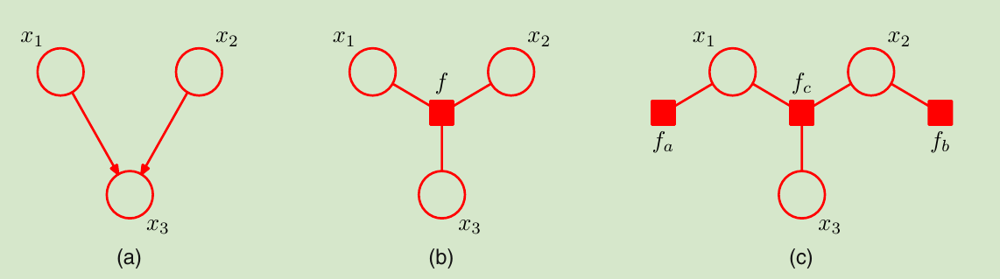

<!--
 * @Author: ZhangLei mathcoder.zl@gmail.com
 * @Date: 2021-05-18 19:42:08
 * @LastEditors: ZhangLei mathcoder.zl@gmail.com
 * @LastEditTime: 2021-05-28 21:13:50
-->

# PRML学习笔记——第八章

- [PRML学习笔记——第八章](#prml学习笔记第八章)
  - [Graphical Models](#graphical-models)
    - [8.1. Bayesian Networks](#81-bayesian-networks)
      - [8.1.1 Example: Polynomial regression](#811-example-polynomial-regression)
      - [8.1.2 Generative models](#812-generative-models)
      - [8.1.3 Discrete variables](#813-discrete-variables)
      - [8.2.1 Three example graphs](#821-three-example-graphs)
      - [8.2.2 D-separation](#822-d-separation)
    - [8.3. Markov Random Fields](#83-markov-random-fields)
      - [8.3.1 Conditional independence properties](#831-conditional-independence-properties)
      - [8.3.2 Factorization properties](#832-factorization-properties)
    - [8.4. Inference in Graphical Models](#84-inference-in-graphical-models)
      - [8.4.1 Inference on a chain](#841-inference-on-a-chain)
      - [8.4.3 Factor graphs](#843-factor-graphs)
      - [8.4.4 The sum-product algorithm](#844-the-sum-product-algorithm)

## Graphical Models

将random variable间的概率关系用图来表示.node:random variable,edge:probabilistic relation.

*Bayesian networks*:directed graphical models.

*Markov random fields*:undirected graphical models.

### 8.1. Bayesian Networks

一个joint distribution对应一个图.设$x_i$是一个node,其直接前躯的集合为$pa_i$,表示$x_i$的概率dependent$pa_i
$.

*上图就是一个概率图,对应一个joint distribution: $p\left(x_{1}\right) p\left(x_{2}\right) p\left(x_{3}\right) p\left(x_{4} \mid x_{1}, x_{2}, x_{3}\right) p\left(x_{5} \mid x_{1}, x_{3}\right) p\left(x_{6} \mid x_{4}\right) p\left(x_{7} \mid x_{4}, x_{5}\right) .$*

一个概率图表示的joint distribution,generally可表示:
$$p(\mathbf{x})=\prod_{k=1}^{K} p\left(x_{k} \mid \mathrm{pa}_{k}\right)$$

#### 8.1.1 Example: Polynomial regression

对多项式回归中:
$$p(\mathbf{t}, \mathbf{w})=p(\mathbf{w}) \prod_{n=1}^{N} p\left(t_{n} \mid \mathbf{w}\right) .$$
对应的概率图

可以把$n$个node用一个plate简记:

当把一些parameter也explicits写出来的时候:
$$p\left(\widehat{t}, \mathbf{t}, \mathbf{w} \mid \widehat{x}, \mathbf{x}, \alpha, \sigma^{2}\right)=\left[\prod_{n=1}^{N} p\left(t_{n} \mid x_{n}, \mathbf{w}, \sigma^{2}\right)\right] p(\mathbf{w} \mid \alpha) p\left(\widehat{t} \mid \widehat{x}, \mathbf{w}, \sigma^{2}\right)$$
概率图中对应可以用solid cycle来表示:

#### 8.1.2 Generative models

当按照概率图的arrow先后顺序来sample variable后得到的就是整个joint distribution的sample.

在probabilistic models的实际应用中,往往higher numbered variable代表observation,lower numbered variable代表latent variable.

如果一个graphical model capture了observed data generate的*causal* process,那么这个model就被称为*generative model*.

#### 8.1.3 Discrete variables

定义conditional independent:如果$a$ is conditional independent of $b$ given $c$,就记$a \perp b \mid c$.也即
$$\begin{aligned}
p(a, b \mid c) &=p(a \mid b, c) p(b \mid c) \\
&=p(a \mid c) p(b \mid c)
\end{aligned}$$

#### 8.2.1 Three example graphs

*第一种tail-to-tail,在$c$被观测之前,a与b不独立,在观测了$c$之后,$a$与$b$关于$c$条件独立*

*第二种head-to-tail,在$c$被观测之前,a与b不独立,在观测了$c$之后,$a$与$b$关于$c$条件独立*

*第三种head-to-head,在$c$被观测之前,a与b独立,在观测了$c$之后,$a$与$b$关于$c$条件不独立*

#### 8.2.2 D-separation

*ABC是三个包含nodes的set,为了有条件独立关系:$A\perp C|B$,tail-to-tail和head-to-tail都必须在set $B$内,而head-to-head及其所有后继都得在set $B$之外.*

考虑conditional probability $p(\mathbf{x}_i|\mathbf{x}_{-i})$:
$$\begin{aligned}
p\left(\mathbf{x}_{i} \mid \mathbf{x}_{\{j \neq i\}}\right)=& \frac{p\left(\mathbf{x}_{1}, \ldots, \mathbf{x}_{D}\right)}{\int p\left(\mathbf{x}_{1}, \ldots, \mathbf{x}_{D}\right) \mathrm{d} \mathbf{x}_{i}} \\
=& \frac{\prod_{k} p\left(\mathbf{x}_{k} \mid \mathrm{pa}_{k}\right)}{\int \prod_{k} p\left(\mathbf{x}_{k} \mid \mathrm{pa}_{k}\right) \mathrm{d} \mathbf{x}_{i}}
\end{aligned}$$
分母中与$p(\mathbf{x}_i)$无关的项提出积分外可与分子相约,最后得到只剩几项node.

*$x_i$最后依赖的只是图示部分6个nodes,被称为markov blanket*

### 8.3. Markov Random Fields

#### 8.3.1 Conditional independence properties

global markov:对于无向图,$A\perp B|C$当$A,B$间的所有path都经过set $C$.

*local markov*

*成对markov*
$$p\left(x_{i}, x_{j} \mid \mathbf{x}_{\backslash\{i, j\}}\right)=p\left(x_{i} \mid \mathbf{x}_{\backslash\{i, j\}}\right) p\left(x_{j} \mid \mathbf{x}_{\backslash\{i, j\}}\right)$$
其中$x_i$和$x_j$不是邻居

#### 8.3.2 Factorization properties

首先定义一个clique概念.一个clique是指图中的一个子集内的所有nodes之间都有link关系.一个*maximal clique*是再包含图中任何其他node都会不满足clique.

无向图对应的factor表达式:
$$p(\mathbf{x})=\frac{1}{Z} \prod_{C} \psi_{C}\left(\mathbf{x}_{C}\right)$$
其中$C$是所有图中的maximal clique,$\psi_{C}\left(\mathbf{x}_{C}\right)$是定义在maximal clique上的*potential function*.$Z$被称为*partition function*:
$$Z=\sum_{\mathbf{x}} \prod_{C} \psi_{C}\left(\mathbf{x}_{C}\right)$$
由于概率的性质,要求potential function必须严格大于0.所以用指数表示是件很自然的事:
$$\psi_{C}\left(\mathbf{x}_{C}\right)=\exp \left\{-E\left(\mathbf{x}_{C}\right)\right\}$$
其中的$E$可称为*energy function*.这样的指数表示被称为*Boltzmann distribution*

### 8.4. Inference in Graphical Models

Graph中一些nodes为observations,我们需要由此计算一些其他nodes的distribution,这就是Inference.

#### 8.4.1 Inference on a chain

*一个链式无向图*

考虑有$K$个states的discrete variable.上图中的joint distribution可以表示为:
$$p(\mathbf{x})=\frac{1}{Z} \psi_{1,2}\left(x_{1}, x_{2}\right) \psi_{2,3}\left(x_{2}, x_{3}\right) \cdots \psi_{N-1, N}\left(x_{N-1}, x_{N}\right)$$
如果要求某个marginal distribution $p(x_n)$的distribution:
$$p\left(x_{n}\right)=\sum_{x_{1}} \cdots \sum_{x_{n-1}} \sum_{x_{n+1}} \cdots \sum_{x_{N}} p(\mathbf{x})$$
直接这么算复杂度是$O(K^N)$.得利用conditional independent性质和分配率:

进一步地,这个式子具有递推关系:
$$\begin{aligned}
\mu_{\alpha}\left(x_{n}\right) &=\sum_{x_{n-1}} \psi_{n-1, n}\left(x_{n-1}, x_{n}\right)\left[\sum_{x_{n-2}} \cdots\right] \\
&=\sum_{x_{n-1}} \psi_{n-1, n}\left(x_{n-1}, x_{n}\right) \mu_{\alpha}\left(x_{n-1}\right)
\end{aligned}\\
\begin{aligned}
\mu_{\beta}\left(x_{n}\right) &=\sum_{x_{n+1}} \psi_{n+1, n}\left(x_{n+1}, x_{n}\right)\left[\sum_{x_{n+2}} \cdots\right] \\
&=\sum_{x_{n+1}} \psi_{n+1, n}\left(x_{n+1}, x_{n}\right) \mu_{\beta}\left(x_{n+1}\right)
\end{aligned}$$
当需要evaluate两个neighbor nodes的joint distribution时只需要在marginal的时候省略两次求和:
$$p\left(x_{n-1}, x_{n}\right)=\frac{1}{Z} \mu_{\alpha}\left(x_{n-1}\right) \psi_{n-1, n}\left(x_{n-1}, x_{n}\right) \mu_{\beta}\left(x_{n}\right)$$

#### 8.4.3 Factor graphs

在一些集合变量上的joint distribution可以写成一些factor的乘积形式:
$$p(\mathbf{x})=\prod_{s} f_{s}\left(\mathbf{x}_{s}\right)$$
Factor graphs可以解决head-to-head的immoral问题.

*如图所示,factor graphs可以有多种,每种都表示一种factorization,并且都为二分图.*

#### 8.4.4 The sum-product algorithm

*以该因子图为例(因子图都是tree结构)该算法用来得到图的joint probability表示*

第一步先找一个root,这里把$x_3$作为root为例.

第二步从所有leaves node开始依次向根节点方向belief propagation.这里面$x_1,x_4$都是leaves node(leaves node的belief初始为1).具体计算方式是product(从变量节点到因子节点:将所有变量节点接收到的belief全乘起来)和sum(从因子节点到变量节点:将因子接收到的belief乘以因子的potential最后marginal)`node发出去的belief计算方式为product,node接收到的belief计算方式为先乘个potential再marginal`:
$$\begin{aligned}
\mu_{x_{1} \rightarrow f_{a}}\left(x_{1}\right) &=1 \\
\mu_{f_{a} \rightarrow x_{2}}\left(x_{2}\right) &=\sum_{x_{1}} f_{a}\left(x_{1}, x_{2}\right) \\
\mu_{x_{4} \rightarrow f_{c}}\left(x_{4}\right) &=1 \\
\mu_{f_{c} \rightarrow x_{2}}\left(x_{2}\right) &=\sum_{x_{4}} f_{c}\left(x_{2}, x_{4}\right) \\
\mu_{x_{2} \rightarrow f_{b}}\left(x_{2}\right) &=\mu_{f_{a} \rightarrow x_{2}}\left(x_{2}\right) \mu_{f_{c} \rightarrow x_{2}}\left(x_{2}\right) \\
\mu_{f_{b} \rightarrow x_{3}}\left(x_{3}\right) &=\sum_{x_{2}} f_{b}\left(x_{2}, x_{3}\right) \mu_{x_{2} \rightarrow f_{b}} .
\end{aligned}$$

第三步从root node开始再做一次belief propagation:
$$\begin{array}{l}
\mu_{x_{3} \rightarrow f_{b}}\left(x_{3}\right)=1 \\
\mu_{f_{b} \rightarrow x_{2}}\left(x_{2}\right)=\sum_{x_{3}} f_{b}\left(x_{2}, x_{3}\right) \\
\mu_{x_{2} \rightarrow f_{a}}\left(x_{2}\right)=\mu_{f_{b} \rightarrow x_{2}}\left(x_{2}\right) \mu_{f_{c} \rightarrow x_{2}}\left(x_{2}\right) \\
\mu_{f_{a} \rightarrow x_{1}}\left(x_{1}\right)=\sum_{x_{2}} f_{a}\left(x_{1}, x_{2}\right) \mu_{x_{2} \rightarrow f_{a}}\left(x_{2}\right) \\
\mu_{x_{2} \rightarrow f_{c}}\left(x_{2}\right)=\mu_{f_{a} \rightarrow x_{2}}\left(x_{2}\right) \mu_{f_{b} \rightarrow x_{2}}\left(x_{2}\right) \\
\mu_{f_{c} \rightarrow x_{4}}\left(x_{4}\right)=\sum_{x_{2}} f_{c}\left(x_{2}, x_{4}\right) \mu_{x_{2} \rightarrow f_{c}}\left(x_{2}\right) .
\end{array}$$

这样就可以得到所有node接受到的belief,现在可以计算任一node的marginal distribution:
$$\begin{aligned}
\widetilde{p}\left(x_{2}\right) &=\mu_{f_{a} \rightarrow x_{2}}\left(x_{2}\right) \mu_{f_{b} \rightarrow x_{2}}\left(x_{2}\right) \mu_{f_{c} \rightarrow x_{2}}\left(x_{2}\right) \\
&=\left[\sum_{x_{1}} f_{a}\left(x_{1}, x_{2}\right)\right]\left[\sum_{x_{3}} f_{b}\left(x_{2}, x_{3}\right)\right]\left[\sum_{x_{4}} f_{c}\left(x_{2}, x_{4}\right)\right] \\
&=\sum_{x_{1}} \sum_{x_{2}} \sum_{x_{4}} f_{a}\left(x_{1}, x_{2}\right) f_{b}\left(x_{2}, x_{3}\right) f_{c}\left(x_{2}, x_{4}\right) \\
&=\sum_{x_{1}} \sum_{x_{3}} \sum_{x_{4}} \tilde{p}(\mathbf{x})
\end{aligned}$$