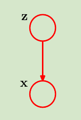
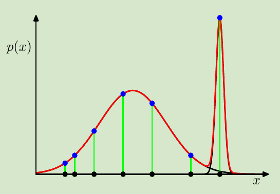
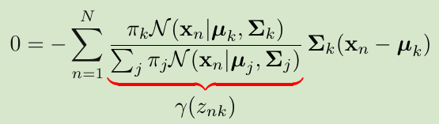
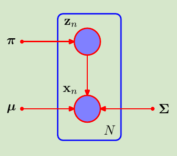
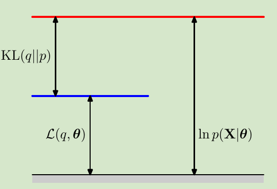
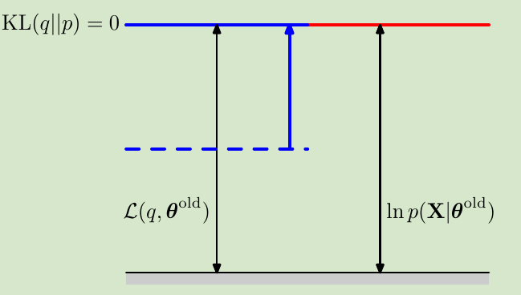
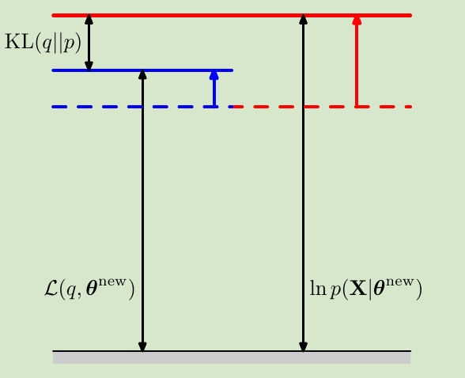

<!--
 * @Author: ZhangLei mathcoder.zl@gmail.com
 * @Date: 2021-05-20 21:22:37
 * @LastEditors: ZhangLei mathcoder.zl@gmail.com
 * @LastEditTime: 2021-05-22 11:02:07
-->

# PRML学习笔记——第九章

- [PRML学习笔记——第九章](#prml学习笔记第九章)
  - [Mixture Models and EM](#mixture-models-and-em)
    - [9.1 K-means Clustering](#91-k-means-clustering)
    - [9.2. Mixtures of Gaussians](#92-mixtures-of-gaussians)
      - [9.2.1 Maximum likelihood](#921-maximum-likelihood)
      - [9.2.2 EM for Gaussian mixtures](#922-em-for-gaussian-mixtures)
    - [9.3. An Alternative View of EM](#93-an-alternative-view-of-em)
      - [9.3.1 Gaussian mixtures revisited](#931-gaussian-mixtures-revisited)
      - [9.3.2 Relation to K-means](#932-relation-to-k-means)
      - [9.3.3 Mixtures of Bernoulli distributions](#933-mixtures-of-bernoulli-distributions)
    - [9.4. The EM Algorithm in General](#94-the-em-algorithm-in-general)

## Mixture Models and EM

### 9.1 K-means Clustering

假设现在有一笔data set$\{\mathbf{x}_1,\ldots,\mathbf{x}_N\}$,我们的目标是将dataset划分成$K$(某个数)个clusters.直觉上,同一clusters内的data之间的距离应该比较小,属于不同clusters的data会有较大的距离.我们可以引入每个custer的中心$\boldsymbol{\mu}_k$,再引入一个符号$r_{nk}$,如果第$n$个data point属于第$k$类,那么值就是1,其余为0.如此可以将我们的直觉用表达式写出:
$$J=\sum_{n=1}^{N} \sum_{k=1}^{K} r_{n k}\left\|\mathbf{x}_{n}-\boldsymbol{\mu}_{k}\right\|^{2}$$
现在的目标就是minimize $J$.

对于这个优化问题可以采用交替优化.先固定$\boldsymbol{\mu}$,关于$r_{nk}$优化;再根据固定的$r_{nk}$优化$\boldsymbol{\mu}$.

然而Kmeans有个问题是硬聚类,无法体现某个data point属于某个类的概率,后面的GMM就能解决这个问题.

### 9.2. Mixtures of Gaussians

*其中$\mathbf{z}$是一个1-of-$K$ code:$z_k\in\{0,1\}$,并且$\sum_{k}{z_k}=1$.,一个latent variable,$\mathbf{x}$是一个Gaussian.*

设$p(z_k=1)=\pi_k$,并且$\{\pi_k\}$满足:
$$\begin{array}{l}
0 \leqslant \pi_{k} \leqslant 1 \\
\sum_{k=1}^{K} \pi_{k}=1
\end{array}$$
这样就能表示$z$的marginal distribution:
$$p(\mathbf{z})=\prod_{k=1}^{K} \pi_{k}^{z_{k}}$$
$\mathbf{x}$的conditional distribution:
$$p(\mathbf{x} \mid \mathbf{z})=\prod_{k=1}^{K} \mathcal{N}\left(\mathbf{x} \mid \boldsymbol{\mu}_{k}, \mathbf{\Sigma}_{k}\right)^{z_{k}}$$
有了这两个概率就能计算$\mathbf{x}$的marginal和$\mathbf{z}$的posterior(responsibility):
$$p(\mathbf{x})=\sum_{\mathbf{z}} p(\mathbf{z}) p(\mathbf{x} \mid \mathbf{z})=\sum_{k=1}^{K} \pi_{k} \mathcal{N}\left(\mathbf{x} \mid \boldsymbol{\mu}_{k}, \mathbf{\Sigma}_{k}\right)\\
\begin{aligned}
\gamma\left(z_{k}\right) \equiv p\left(z_{k}=1 \mid \mathbf{x}\right) &=\frac{p\left(z_{k}=1\right) p\left(\mathbf{x} \mid z_{k}=1\right)}{\sum_{j=1}^{K} p\left(z_{j}=1\right) p\left(\mathbf{x} \mid z_{j}=1\right)} \\
&=\frac{\pi_{k} \mathcal{N}\left(\mathbf{x} \mid \boldsymbol{\mu}_{k}, \boldsymbol{\Sigma}_{k}\right)}{\sum_{j=1}^{K} \pi_{j} \mathcal{N}\left(\mathbf{x} \mid \boldsymbol{\mu}_{j}, \boldsymbol{\Sigma}_{j}\right)}
\end{aligned}$$

#### 9.2.1 Maximum likelihood

简单的取logarithm会得到:
$$\ln p(\mathbf{X} \mid \boldsymbol{\pi}, \boldsymbol{\mu}, \boldsymbol{\Sigma})=\sum_{n=1}^{N} \ln \left\{\sum_{k=1}^{K} \pi_{k} \mathcal{N}\left(\mathbf{x}_{n} \mid \boldsymbol{\mu}_{k}, \boldsymbol{\Sigma}_{k}\right)\right\}$$
现在要考虑maximize这个式子的问题.
1. 当某一个子Gaussian的mean正好落在了某个data point上,只要将其$\sigma\rightarrow 0$就可以使likelihood无穷大,但这显然不是我们需要的solution(严重的over-fitting)
2. 有$K!$个对称solution
3. maximize这个likelihood无法得到closed form solution

*严重over-fitting的一个demo*

#### 9.2.2 EM for Gaussian mixtures

前面已经给出了log of likelihood的表达式,如果我们直接对其关于参数($\boldsymbol{\mu}_k$)求导令为0:

$$
\boldsymbol{\mu}_{k}=\frac{1}{N_{k}} \sum_{n=1}^{N} \gamma\left(z_{n k}\right) \mathbf{x}_{n}
$$
其中$N_{k}=\sum_{n=1}^{N} \gamma\left(z_{n k}\right)$.这里的$\gamma$其实就是上节中的posterior.尽管$\gamma$中也依赖于未知参数,我们可以把这个均值理解为对所有data point的weighted average,并且weight是这个data point属于这个类的posterior.这样一看其实就是kmeans的general情况!

类似地,对于其余参数($,\boldsymbol{\Sigma}_k,\pi_k$)求导,可以得到:
$$\boldsymbol{\Sigma}_{k}=\frac{1}{N_{k}} \sum_{n=1}^{N} \gamma\left(z_{n k}\right)\left(\mathbf{x}_{n}-\boldsymbol{\mu}_{k}\right)\left(\mathbf{x}_{n}-\boldsymbol{\mu}_{k}\right)^{\mathrm{T}}\\
\pi_{k}=\frac{N_{k}}{N}
$$

虽然不能直接获得closed form solution,但用kmeans的求解过程,迭代可以解出local maximum solution.

### 9.3. An Alternative View of EM

再回顾含latent variable的MLE问题:
$$\ln p(\mathbf{X} \mid \boldsymbol{\theta})=\ln \left\{\sum_{\mathbf{Z}} p(\mathbf{X}, \mathbf{Z} \mid \boldsymbol{\theta})\right\}$$

问题的关键就在于log内的sum导致表达式的特别复杂.所以现在的出发点就在于去掉这个log内的sum.

那么sum是怎么来的?是由于要marginal这个joint distribution得到$p(\mathbf{X})$,那么我们就先不考虑marginal这一步,直接让log计算这个joint distribution.那么就会有$\ln p(\mathbf{X}, \mathbf{Z} \mid \boldsymbol{\theta})$.

**但是**不能直接求这个joint distribution最大,因为这里面的latent variable是unobversed.所以引入了一个期望函数:
$$\mathcal{Q}\left(\boldsymbol{\theta}, \boldsymbol{\theta}^{\text {old }}\right)=\sum_{\mathbf{Z}} p\left(\mathbf{Z} \mid \mathbf{X}, \boldsymbol{\theta}^{\text {old }}\right) \ln p(\mathbf{X}, \mathbf{Z} \mid \boldsymbol{\theta}) .$$
可以看到这里使用一个posterior(已知量)来求对$\ln p(\mathbf{X}, \mathbf{Z} \mid \boldsymbol{\theta})$的期望.成功消去了$\mathbf{Z}$的影响,并且现在的表达式依然是trackable的.
最后再解出$\mathcal{Q}$的maximum.由于开始用的posterior是不准的,所以还得继续交替计算和更新.这就是EM算法.

#### 9.3.1 Gaussian mixtures revisited

我们如果假设latent variable $z$也被观测,那么likelihood就变为:
$$p(\mathbf{X}, \mathbf{Z} \mid \boldsymbol{\mu}, \boldsymbol{\Sigma}, \boldsymbol{\pi})=\prod_{n=1}^{N} \prod_{k=1}^{K} \pi_{k}^{z_{n k}} \mathcal{N}\left(\mathbf{x}_{n} \mid \boldsymbol{\mu}_{k}, \boldsymbol{\Sigma}_{k}\right)^{z_{n k}}$$
如果我们对现在这个likelihood做logarithm:
$$\ln p(\mathbf{X}, \mathbf{Z} \mid \boldsymbol{\mu}, \mathbf{\Sigma}, \boldsymbol{\pi})=\sum_{n=1}^{N} \sum_{k=1}^{K} z_{n k}\left\{\ln \pi_{k}+\ln \mathcal{N}\left(\mathbf{x}_{n} \mid \boldsymbol{\mu}_{k}, \boldsymbol{\Sigma}_{k}\right)\right\} .$$
容易知道现在这个maximum问题是可以获得closed form的,其中$z_{nk}$是binary variable.

*当latent variable也被观测时对应的PG*

我们假设了$z$已被观测,但实际上$z$取值是没有被观测的,但我们可以表示$z$的posterior:
$$p(\mathbf{Z} \mid \mathbf{X}, \boldsymbol{\mu}, \boldsymbol{\Sigma}, \boldsymbol{\pi}) \propto \prod_{n=1}^{N} \prod_{k=1}^{K}\left[\pi_{k} \mathcal{N}\left(\mathbf{x}_{n} \mid \boldsymbol{\mu}_{k}, \boldsymbol{\Sigma}_{k}\right)\right]^{z_{n k}}$$
利用这个posterior可以对log likelihood取期望.利用$\{\mathbf{z}_n\}$之间是independent可以将求和的期望交换到最内层就是对$z_{nk}$求期望:
$$\begin{array}{r}
\mathbb{E}\left[z_{n k}\right]=\frac{\sum_{z_{n k}} z_{n k}\left[\pi_{k} \mathcal{N}\left(\mathbf{x}_{n} \mid \boldsymbol{\mu}_{k}, \boldsymbol{\Sigma}_{k}\right)\right]^{z_{n k}}}{\sum_{z_{n j}}\left[\pi_{j} \mathcal{N}\left(\mathbf{x}_{n} \mid \boldsymbol{\mu}_{j}, \mathbf{\Sigma}_{j}\right)\right]^{z_{n j}}} \\
=\frac{\pi_{k} \mathcal{N}\left(\mathbf{x}_{n} \mid \boldsymbol{\mu}_{k}, \boldsymbol{\Sigma}_{k}\right)}{\sum_{j=1}^{K} \pi_{j} \mathcal{N}\left(\mathbf{x}_{n} \mid \boldsymbol{\mu}_{j}, \boldsymbol{\Sigma}_{j}\right)}=\gamma\left(z_{n k}\right)
\end{array}$$
完整的maximum式子为:
$$\mathbb{E}_{\mathbf{Z}}[\ln p(\mathbf{X}, \mathbf{Z} \mid \boldsymbol{\mu}, \boldsymbol{\Sigma}, \boldsymbol{\pi})]=\sum_{n=1}^{N} \sum_{k=1}^{K} \gamma\left(z_{n k}\right)\left\{\ln \pi_{k}+\ln \mathcal{N}\left(\mathbf{x}_{n} \mid \boldsymbol{\mu}_{k}, \boldsymbol{\Sigma}_{k}\right)\right\}$$
可以看到这和之前求解GMM的式子是一样的.

#### 9.3.2 Relation to K-means

假设GMM中的每一个Gaussian component的covariance都是同样一个数量矩阵$\epsilon\mathbf{I}$,那么当这个$\epsilon\rightarrow 0$时,
$\gamma$的分母中除了$||\mathbf{x}_n-\boldsymbol{\mu}_j||$最小的项趋于0最慢,其余项都是0,所以最后$\gamma$就变成了kmeans中的$r_{nk}$.同样地,complete-data的期望也会和kmenas的目标函数等价:
$$\mathbb{E}_{\mathbf{Z}}[\ln p(\mathbf{X}, \mathbf{Z} \mid \boldsymbol{\mu}, \boldsymbol{\Sigma}, \boldsymbol{\pi})] \rightarrow-\frac{1}{2} \sum_{n=1}^{N} \sum_{k=1}^{K} r_{n k}\left\|\mathbf{x}_{n}-\boldsymbol{\mu}_{k}\right\|^{2}+\text { const. }$$

#### 9.3.3 Mixtures of Bernoulli distributions

这节将GMM的Gaussian变为discrete的bernoulli distribution:
$$p(\mathbf{x} \mid \boldsymbol{\mu})=\prod_{i=1}^{D} \mu_{i}^{x_{i}}\left(1-\mu_{i}\right)^{\left(1-x_{i}\right)}$$
引入和GMM一样的latent variable:
$$p(\mathbf{z} \mid \boldsymbol{\pi})=\prod_{k=1}^{K} \pi_{k}^{z_{k}}$$
conditional distribution为:
$$p(\mathbf{x} \mid \mathbf{z}, \boldsymbol{\mu})=\prod_{k=1}^{K} p\left(\mathbf{x} \mid \boldsymbol{\mu}_{k}\right)^{z_{k}}$$
根据EM算法的思想,首先是求complete-data的log likelihood:
$$\begin{array}{l}
\ln p(\mathbf{X}, \mathbf{Z} \mid \boldsymbol{\mu}, \boldsymbol{\pi})=\sum_{n=1}^{N} \sum_{k=1}^{K} z_{n k}\left\{\ln \pi_{k}\right. \\
\left.+\sum_{i=1}^{D}\left[x_{n i} \ln \mu_{k i}+\left(1-x_{n i}\right) \ln \left(1-\mu_{k i}\right)\right]\right\}
\end{array}$$
$\mathbf{E}$-Step:
$$\begin{array}{r}
\gamma\left(z_{n k}\right)=\mathbb{E}\left[z_{n k}\right]=\frac{\sum_{z_{n k}} z_{n k}\left[\pi_{k} p\left(\mathbf{x}_{n} \mid \boldsymbol{\mu}_{k}\right)\right]^{z_{n k}}}{\sum_{z_{n j}}\left[\pi_{j} p\left(\mathbf{x}_{n} \mid \boldsymbol{\mu}_{j}\right)\right]^{z_{n j}}} \\
=\frac{\pi_{k} p\left(\mathbf{x}_{n} \mid \boldsymbol{\mu}_{k}\right)}{\sum_{j=1}^{K} \pi_{j} p\left(\mathbf{x}_{n} \mid \boldsymbol{\mu}_{j}\right)}
\end{array}$$
$\mathbf{M}$-Step:
求maximum:
$$\begin{array}{r}
\mathbb{E}_{\mathbf{Z}}[\ln p(\mathbf{X}, \mathbf{Z} \mid \boldsymbol{\mu}, \boldsymbol{\pi})]=\sum_{n=1}^{N} \sum_{k=1}^{K} \gamma\left(z_{n k}\right)\left\{\ln \pi_{k}\right. \\
\left.+\sum_{i=1}^{D}\left[x_{n i} \ln \mu_{k i}+\left(1-x_{n i}\right) \ln \left(1-\mu_{k i}\right)\right]\right\}
\end{array}$$

### 9.4. The EM Algorithm in General

我们要优化的目标是这样一个likelihood:
$$p(\mathbf{X} \mid \boldsymbol{\theta})=\sum_{\mathbf{Z}} p(\mathbf{X}, \mathbf{Z} \mid \boldsymbol{\theta})$$

直接优化是困难的,但通过分解:
$$\ln p(\mathbf{X} \mid \boldsymbol{\theta})=\mathcal{L}(q, \boldsymbol{\theta})+\operatorname{KL}(q \| p)$$
其中
$$\begin{aligned}
\mathcal{L}(q, \boldsymbol{\theta}) &=\sum_{\mathbf{Z}} q(\mathbf{Z}) \ln \left\{\frac{p(\mathbf{X}, \mathbf{Z} \mid \boldsymbol{\theta})}{q(\mathbf{Z})}\right\} \\
\mathrm{KL}(q \| p) &=-\sum_{\mathbf{Z}} q(\mathbf{Z}) \ln \left\{\frac{p(\mathbf{Z} \mid \mathbf{X}, \boldsymbol{\theta})}{q(\mathbf{Z})}\right\}
\end{aligned}$$
其中KL的性质是大于等于0,当且仅当$q(\mathbf{Z})=p(\mathbf{Z} \mid \mathbf{X}, \boldsymbol{\theta})$时为0.

*分解图示,$\mathcal{L}$是优化目标的一个lower bound,E-step得到的posterior就是$q$,使得lower bound等于优化目标.*

*E-step结束后,KL=0了*

对于lower bound,如果将E-step得到的posterior带入$q$:
$$\begin{aligned}
\mathcal{L}(q, \boldsymbol{\theta}) &=\sum_{\mathbf{Z}} p\left(\mathbf{Z} \mid \mathbf{X}, \boldsymbol{\theta}^{\text {old }}\right) \ln p(\mathbf{X}, \mathbf{Z} \mid \boldsymbol{\theta})-\sum_{\mathbf{Z}} p\left(\mathbf{Z} \mid \mathbf{X}, \boldsymbol{\theta}^{\text {old }}\right) \ln p\left(\mathbf{Z} \mid \mathbf{X}, \boldsymbol{\theta}^{\text {old }}\right) \\
&=\mathcal{Q}\left(\boldsymbol{\theta}, \boldsymbol{\theta}^{\text {old }}\right)+\mathrm{const}
\end{aligned}$$
那么在M-step优化$\mathcal{Q}$实际就是在优化lower bound.

*M-step优化lower bound,使得$\mathcal{L}$达到最大,值得注意的是,KL项用的还是旧的$\theta$此时KL>0*

这样交替更新,确保了最终优化目标始终increase(除非达到local maximum).

EM算法还能被用于maximize posterior:
$$\ln p(\boldsymbol{\theta} \mid \mathbf{X})=\ln p(\boldsymbol{\theta}, \mathbf{X})-\ln p(\mathbf{X})$$
套用前面的分解结果:
$$\begin{aligned}
\ln p(\boldsymbol{\theta} \mid \mathbf{X}) &=\mathcal{L}(q, \boldsymbol{\theta})+\mathrm{KL}(q \| p)+\ln p(\boldsymbol{\theta})-\ln p(\mathbf{X}) \\
& \geqslant \mathcal{L}(q, \boldsymbol{\theta})+\ln p(\boldsymbol{\theta})-\ln p(\mathbf{X}) .
\end{aligned}$$
这里优化的parameter是$\theta$,$\ln p(\mathbf{x})$就可以看作constant,那么相比于之前的EM算法,这里更新的时候只会在M-step增加一项prior $p(\theta)$.

